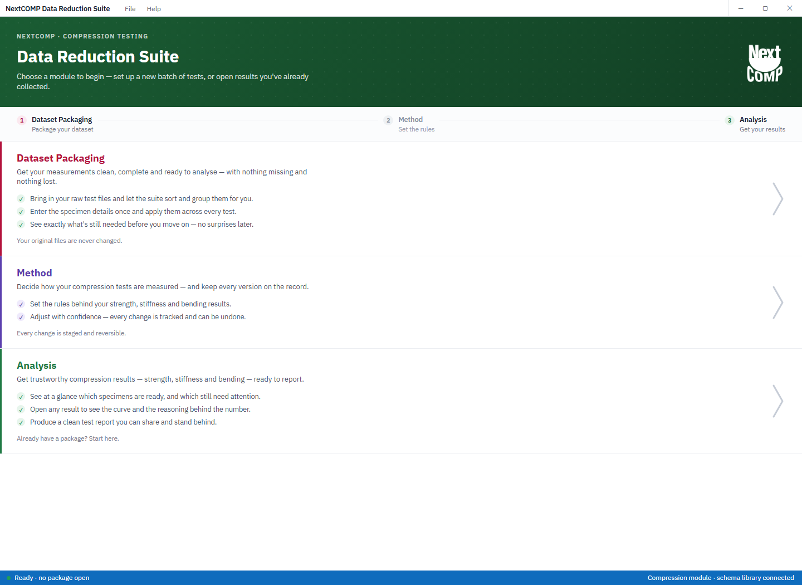
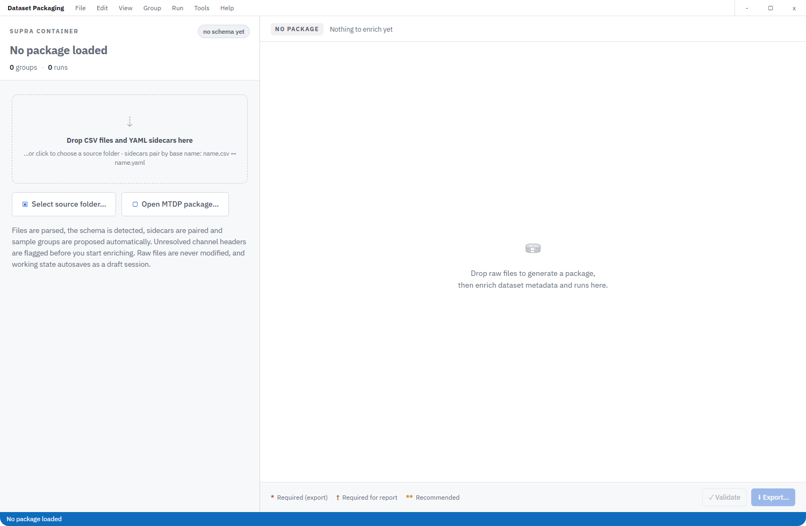
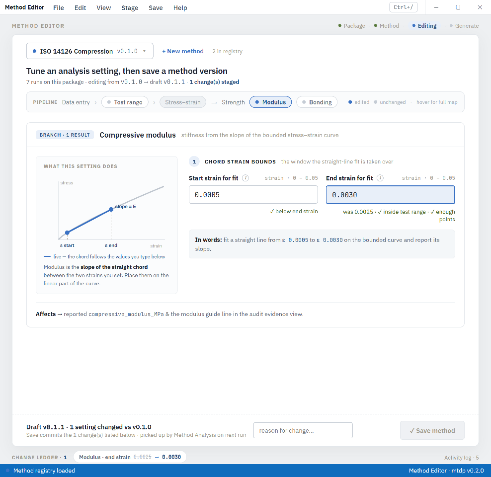
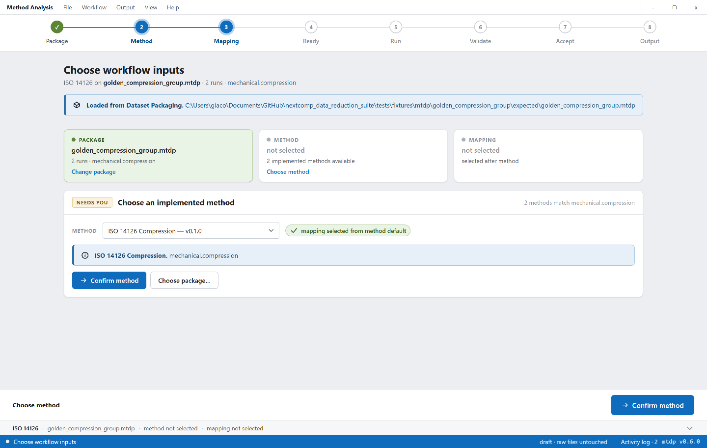
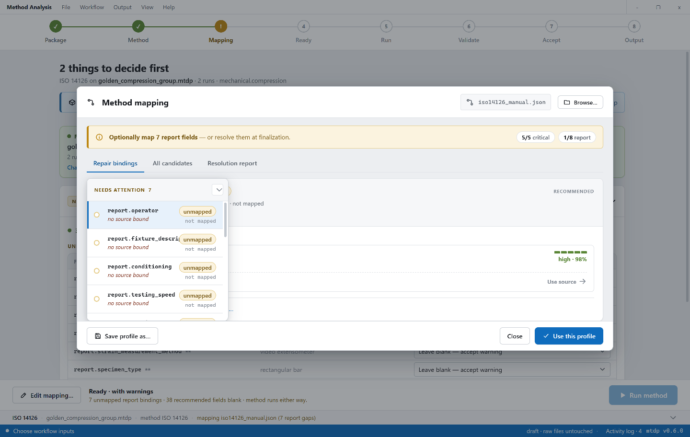
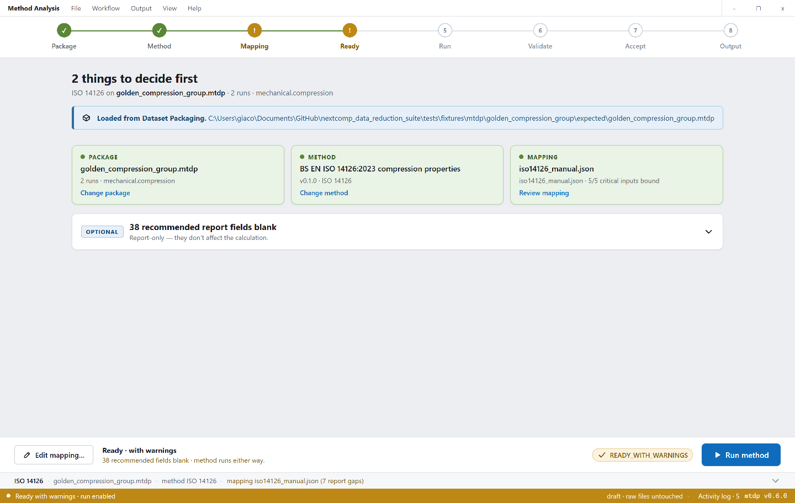
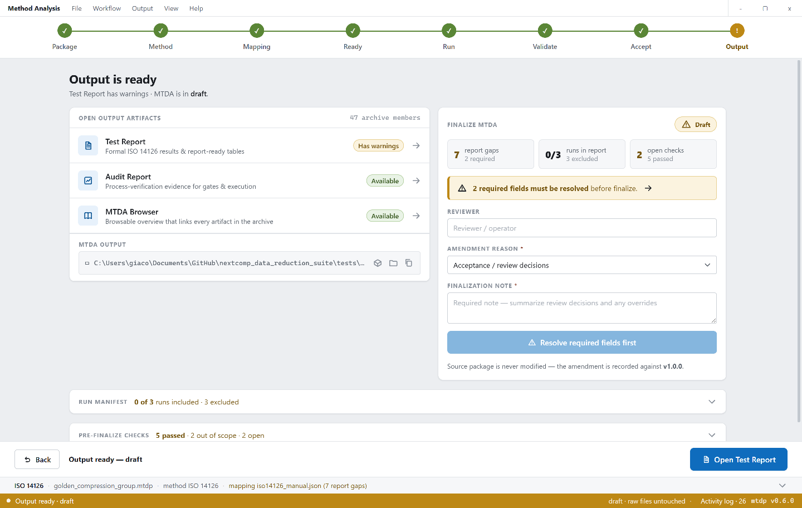

# NextCOMP Data Reduction Suite Guidelines

These guidelines are for scientists using the application to prepare,
reduce, review, and share compression-test results. They focus on what to do in
each screen, what evidence to check, and when it is reasonable to move to the
next stage.

The screenshots below show the current production desktop interface.

## Choose The Right Module

The launcher opens the three production modules.

- Dataset Packaging: create or inspect an MTDP package from raw test files.
- Method: create and manage editable method versions. The ISO reference remains
  protected.
- Analysis: run one MTDP package through one method and produce an MTDA archive.

Use Dataset Packaging first when your raw files have not yet been packaged.
Use Method when the analysis rules need a controlled editable version. Use
Analysis when you already have a complete MTDP package and are ready to reduce,
review, and export results.

Keyboard shortcuts:

- `Ctrl+D`: open Dataset Packaging.
- `Ctrl+M`: open Method.
- `Ctrl+A`: open Analysis.
- `F11` or `Alt+Enter`: maximise or restore the current window.
- `Ctrl+Shift+M`: minimise the current window.
- `Ctrl+W`: close the current window.
- `Ctrl+Q`: quit the application.
- `Esc`: close menus and dialogs.

## Dataset Packaging: Raw Files To MTDP

Dataset Packaging turns raw measurement files, sidecars, metadata, image
evidence, and supplemental files into a traceable MTDP input package. The
original files are copied into the package and are not modified.

Typical workflow:

1. Choose source files, a source folder, or an existing MTDP package.
2. Review the proposed grouping so each physical specimen maps to the correct
   run.
3. Confirm channel assignments for load, strain, time, crosshead, and any
   supporting traces.
4. Complete dataset-level and run-level metadata.
5. Attach image evidence and supplemental files where they explain the test
   context.
6. Validate the package and resolve export-blocking metadata gaps.
7. Export the MTDP package and use that package as the Analysis input.

Before moving on, confirm the package identity, run count, run names, specimen
dimensions, and required channels. If the package cannot be exported, resolve
the blocking fields before starting Analysis.

## Method: Controlled Analysis Rules

The Method module manages method definitions. The ISO reference method is the
protected baseline; generated methods can be edited, renamed, saved, exported,
imported, and deleted.

Typical workflow:

1. Start from the ISO reference or an existing generated method.
2. Create a new editable method when you need a controlled variation.
3. Review the pipeline map: data entry, test range, stress-strain, modulus,
   bending, strength, acceptance, and reports.
4. Edit controlled settings such as test range, modulus window, bending
   thresholds, and acceptance/report rules.
5. Review the change ledger so you understand what differs from the reference.
6. Save the method version before selecting it in Analysis.
7. Export or import method packages when you need to move method versions
   between workspaces.

The Save method button is intended to be active only when there are unsaved
edits. Stress-strain data are derived from the package during Analysis and are
not edited in Method.

## Analysis: MTDP To MTDA

Analysis runs one MTDP package through one selected method and creates an MTDA
analysed dataset archive. The staged pipeline keeps package selection, method
choice, mapping, readiness, execution, validation, acceptance, and output
review visible.

Workflow stages:

1. Package: choose one MTDP input package.
2. Method: choose the ISO reference method or an editable generated method.
3. Mapping: bind package channels and metadata to method inputs.
4. Ready: confirm that execution-critical inputs are resolved.
5. Run: execute the method pipeline.
6. Validate: inspect method and output checks.
7. Accept: decide flagged runs using scientific evidence.
8. Output: complete report-only metadata and open or finalise the MTDA archive.

Only an MTDP package is the input to a method run. MTDA archives are outputs and
should be opened through the MTDA browser or the report buttons in the Output
stage.

## Mapping And Readiness

Mapping connects package fields to method inputs. Critical mappings must be
resolved before execution. Report-only fields may be left blank during the run
when the software marks them as optional, but they should be reviewed before
the archive is finalised.

Use the mapping editor to inspect:

- unmapped required fields;
- recommended candidate sources;
- report fields that can be completed at finalisation;
- the selected mapping profile.

The Ready stage should make the run state clear. If execution is enabled with
warnings, read the warning summary before running. If Run is disabled, resolve
the blocking package, method, or mapping issue shown in the stage cards.

## Acceptance Cockpit

The acceptance cockpit is a scientific decision surface. It should help answer
one question: should a flagged run be kept in the final report or removed?

For each flagged run, review:

- the default decision proposed by the method;
- the defect type, such as bending or curve-shape evidence;
- the plot generated from the analysed dataset for that defect;
- the relevant threshold, metric, and comparison window;
- the consequence of keeping or removing the run;
- the justification field when you override the default decision.

Do not rely on internal diagnostic labels alone. The plotted evidence, reported
metrics, and method thresholds should support the decision. If the cockpit and
Output manifest disagree, treat that as a defect and do not finalise the
archive until it is resolved.

## Output And MTDA Review

The Output stage prepares the archive handoff. It should agree with the
acceptance decisions.

Review before sharing:

- Accept and Output list the same included and excluded runs.
- Reviewer and finalisation fields are complete.
- The MTDA output path points to the intended archive.
- Test Report, Audit Report, and MTDA Browser open from the same archive.
- Defect plots and decision-register entries match the acceptance cockpit.
- Canonical CSV and JSON evidence members are present in the archive.

The source MTDP package is not modified by Analysis. Report-only amendments and
finalisation notes are recorded against the derived MTDA output.

## What To Share

For scientific review or reporting, share the MTDA archive and retain the
source MTDP package for traceability. The MTDA archive is expected to contain
the browsable index, formal report, audit report, plot viewers, canonical
tables, evidence packets, provenance, and decision records.

Results and generated outputs remain the user's responsibility and should be
reviewed before they are used for engineering, certification, or commercial
decisions.
