# NextCOMP Data Reduction Suite Guidelines

This guide explains how to use the release-candidate interface and what each
screen is expected to help the user decide. The same guidance is summarised in
the application Help menu.

## 1. Launcher

The launcher is the entry point for the three production modules.

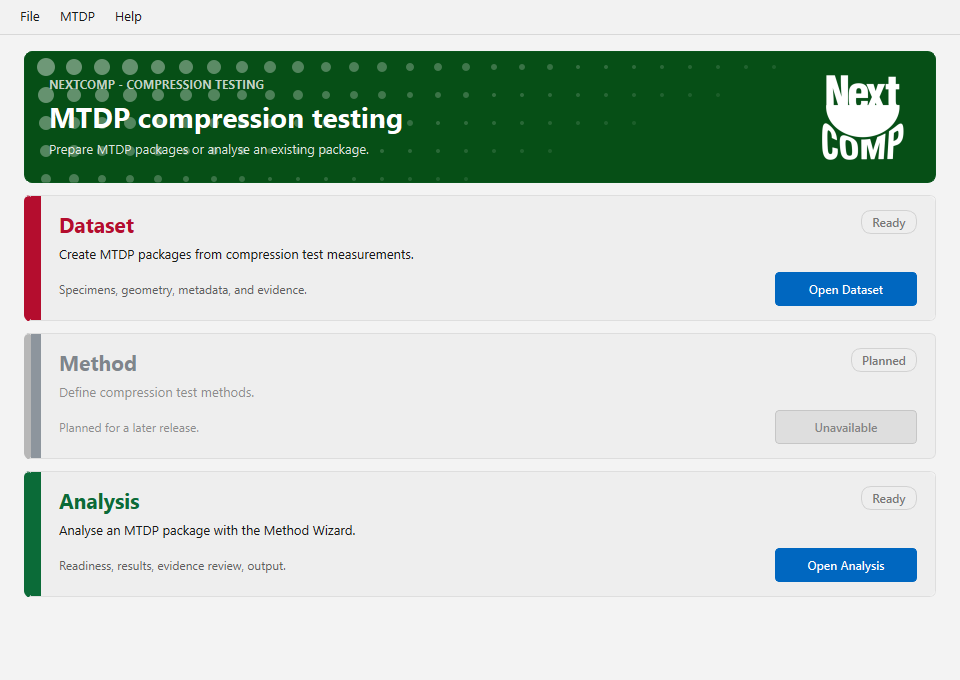

Use:

- Dataset Packaging to create or inspect an MTDP package.
- Method to create, edit, import, export, or save editable methods.
- Analysis to run a method against an MTDP package and generate an MTDA archive.

Keyboard shortcuts:

- `Ctrl+D`: open Dataset Packaging.
- `Ctrl+M`: open Method.
- `Ctrl+A`: open Analysis.
- `F11` or `Alt+Enter`: maximise or restore the current window.
- `Ctrl+Shift+M`: minimise the current window.
- `Ctrl+W`: close the current window.
- `Ctrl+Q`: quit the application.
- `Esc`: close menus and dialogs.

## 2. Dataset Packaging

Dataset Packaging turns raw measurement files into a traceable MTDP input
package. The raw files are copied into the package; they are not modified.

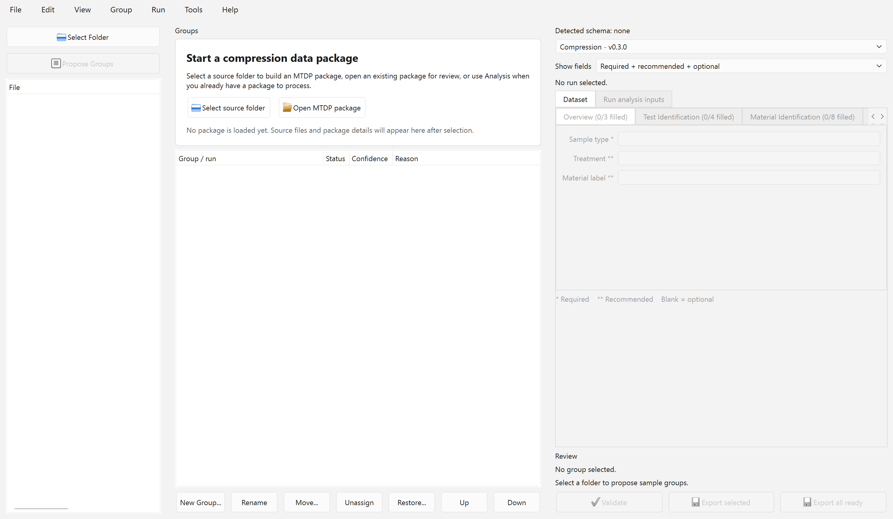

Typical use:

1. Choose the folder or files containing raw compression-test measurements.
2. Review automatic grouping.
3. Inspect each run and confirm channel interpretation.
4. Fill or import metadata.
5. Attach supplemental files where required.
6. Export the MTDP package.

The grouping view helps confirm that each physical specimen/run has been
assigned to the correct package member.

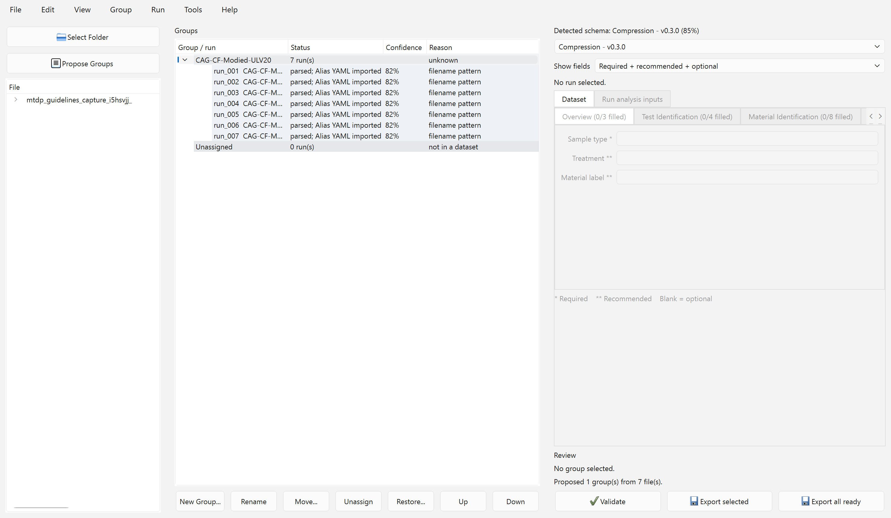

The run metadata view is where missing or inconsistent metadata is repaired
before analysis.

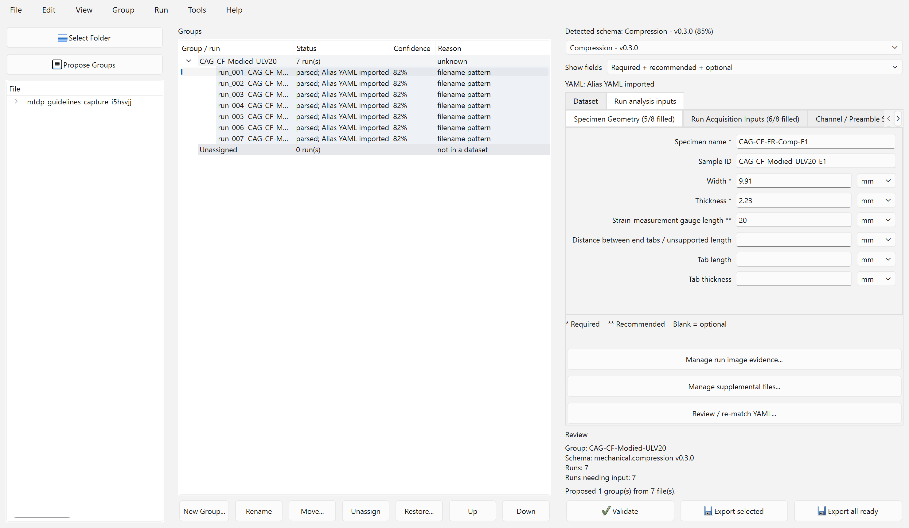

Supplemental files can be attached to preserve test-context evidence without
changing raw measurement data.

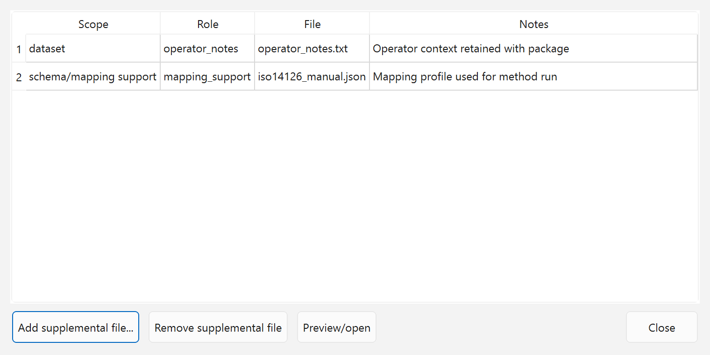

## 3. Method Editor

The Method Editor manages method definitions. The ISO 14126 reference method is
read-only and should be treated as the baseline. Editable generated methods can
be created, renamed, modified, saved, exported, imported, or deleted.

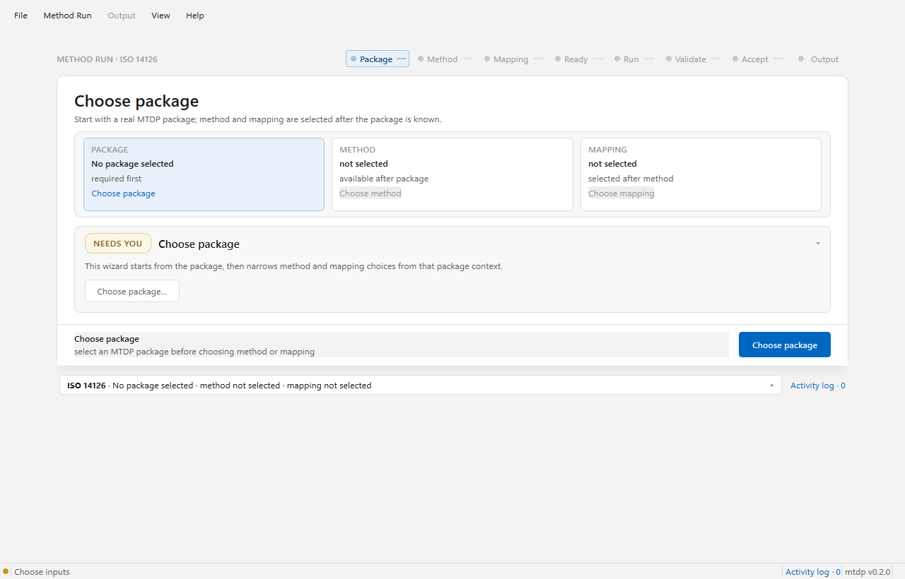

The editor separates the method into areas that affect the analysis pipeline:

- test range and boundary handling;
- modulus window and modulus calculation;
- bending assessment;
- acceptance and report generation settings.

When the editor shows warnings, resolve them before saving or using a method in
analysis.

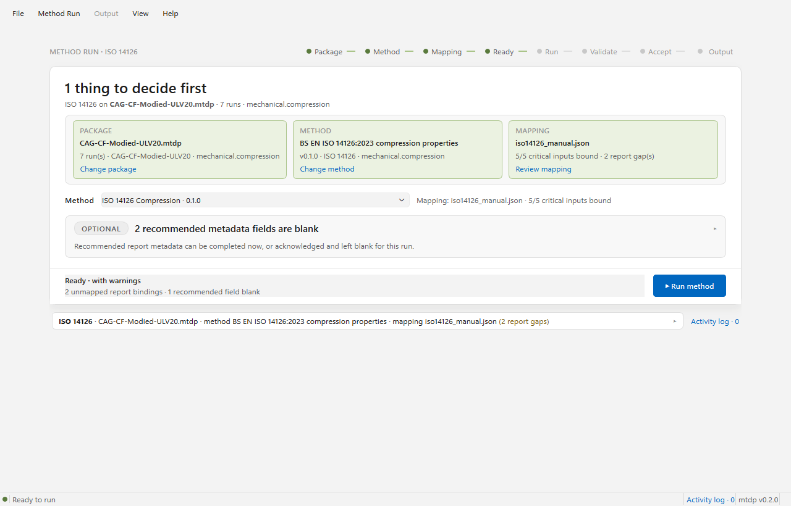

The mapping editor binds package fields to method inputs. Review these bindings
when a package has missing metadata, renamed channels, or non-standard field
labels.

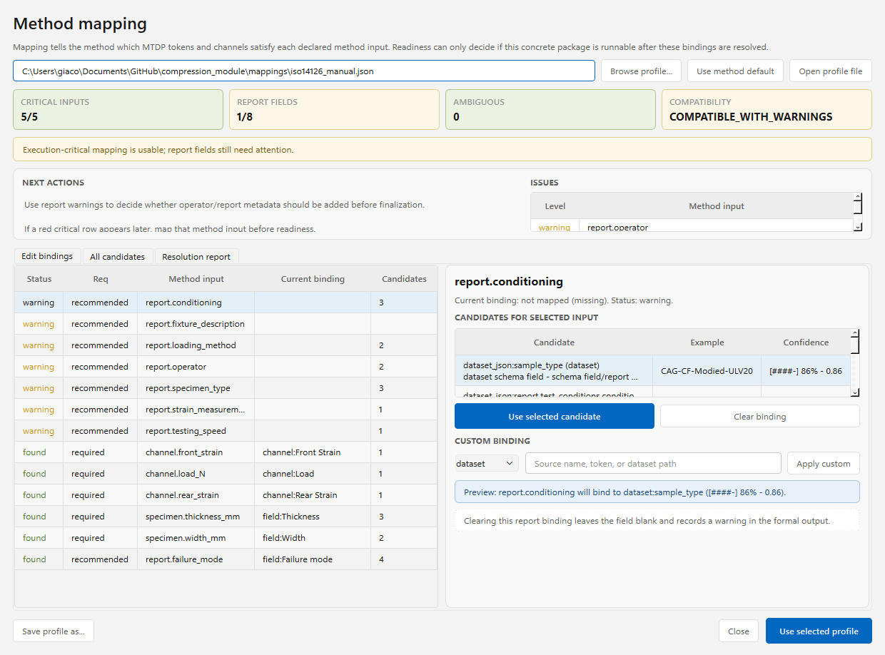

## 4. Method Analysis

Method Analysis is the run wizard. Its input is an MTDP package. The output is
an MTDA archive.

The wizard steps are:

1. Package: choose an MTDP package.
2. Method: choose the reference method or an editable generated method.
3. Mapping: bind MTDP fields to method inputs.
4. Ready: confirm readiness before execution.
5. Run: execute the method.
6. Validate: inspect validation checks.
7. Accept: make scientific inclusion/exclusion decisions.
8. Output: finalise and open reports.

During execution, the run trace should show progress and allow cancellation
where long operations expose checkpoints.

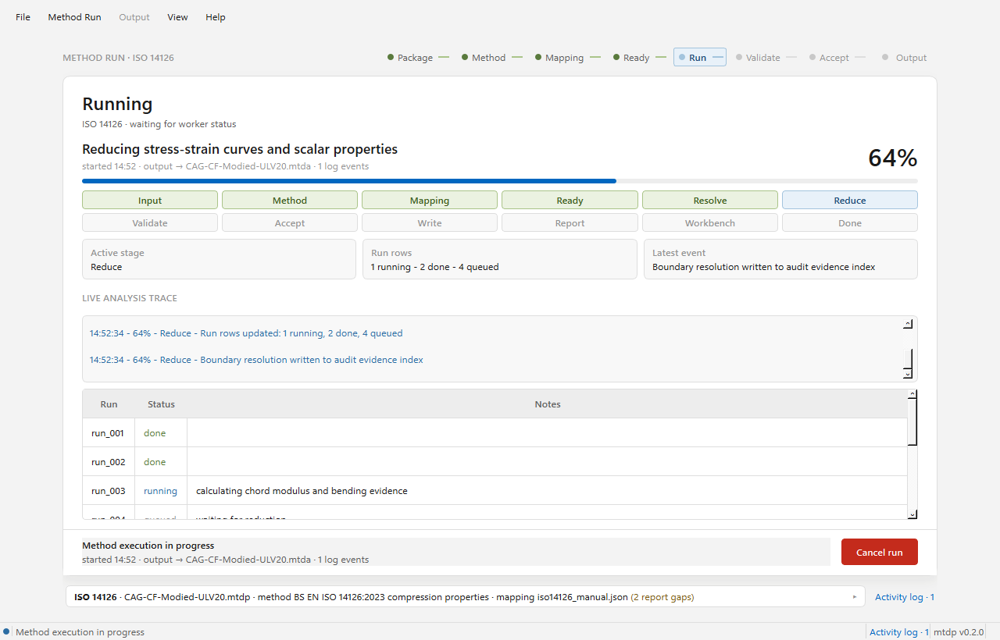

## 5. Acceptance Cockpit

The acceptance cockpit is a scientific decision surface, not an internal
software dashboard. Content belongs here only if it helps the user decide
whether a flagged run should be kept or removed.

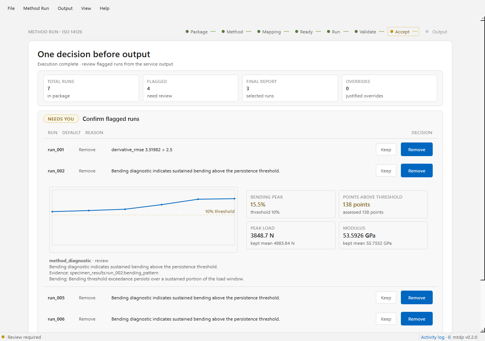

For each flagged run, inspect:

- the default decision proposed by the method;
- the defect type, such as bending or curve-shape evidence;
- the context-relevant plot hydrated from the analysed dataset;
- key metrics and thresholds;
- the reason for the default decision;
- any required justification if the default is overridden.

If a run is kept against the default removal decision, record a justification
that explains why the scientific evidence supports inclusion.

## 6. Finalise Output

The output step records report-completion metadata and opens the generated MTDA
surfaces.

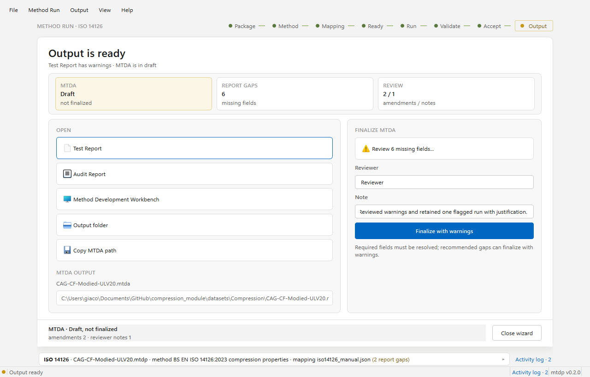

Before finalising:

- confirm the included/excluded run manifest;
- complete required reviewer and amendment fields;
- verify that the MTDA output path is the intended location;
- open the test report and audit report for review.

The source MTDP package remains unchanged. Amendments are recorded against the
derived MTDA output.

## 7. Activity Log

The activity log gives a compact audit trail of UI actions, package loading,
mapping edits, method execution, validation, acceptance decisions, and output
finalisation.

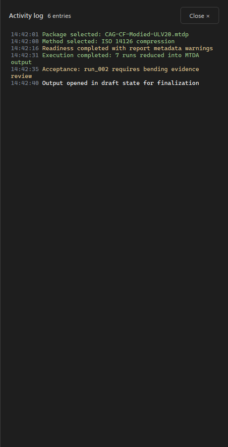

Use it to confirm the sequence of user-visible operations before saving,
exporting, or sharing the result.

## 8. MTDA Browser And Reports

Open an MTDA archive through the MTDA browser. The browser is wired to the
archive `index.html`; report navigation happens inside the page shell.

Expected report surfaces:

- Archive index: overview and artifact navigation.
- Formal test report: selected runs, results, statistics, and method context.
- Audit report: run-wise evidence packets, aggregate evidence, validation,
  acceptance, and decision register.
- Plot viewers: compact plot surfaces hydrated from archive data members.

Stale dataset summary pages and run summary pages are not production surfaces.

## 9. What To Check Before Sharing Results

Before sharing an MTDA archive:

- Open the MTDA browser and confirm the archive index loads.
- Open the formal test report and audit report.
- Confirm flagged run decisions match the acceptance screen.
- Check plots for the flagged defects.
- Confirm no required report-completion fields remain blank.
- Confirm the generated archive contains canonical CSV/JSON evidence members.
- Keep the original MTDP package for traceability.

## 10. Troubleshooting

If a module does not open:

- rebuild the React shell with `npm run build`;
- relaunch with `python -m mtdp_enrichment.react_shell_app`;
- check that the Python environment has PySide6 installed.

If analysis cannot run:

- confirm the selected input is an MTDP package, not an MTDA archive;
- confirm a method is selected;
- confirm all required mapping bindings are resolved;
- inspect readiness messages before trying again.

If output appears inconsistent:

- compare the Accept and Output run manifests;
- reopen the MTDA archive index;
- confirm the reports are loaded from the newly generated archive path rather
  than from an older extracted workbench.
