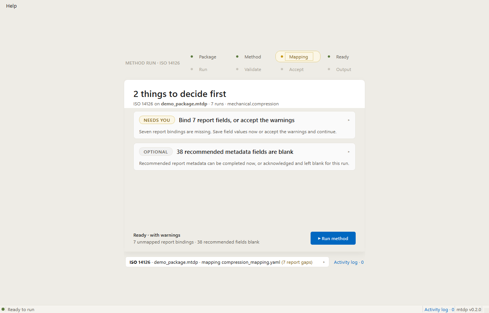
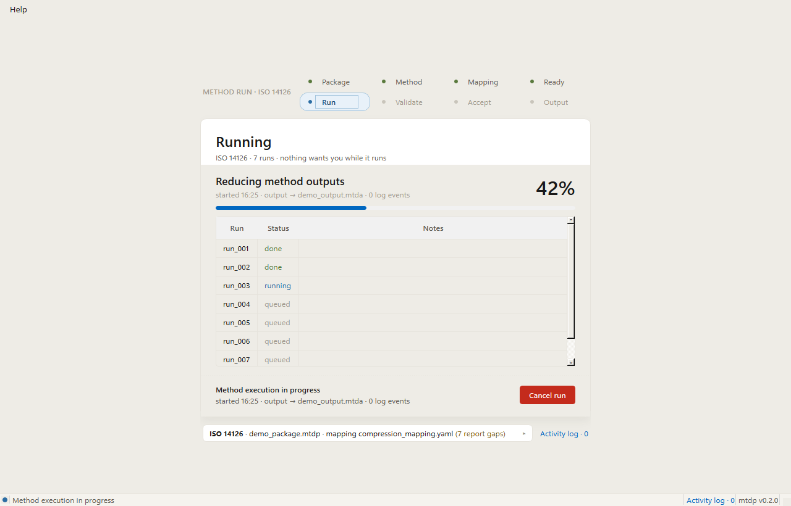
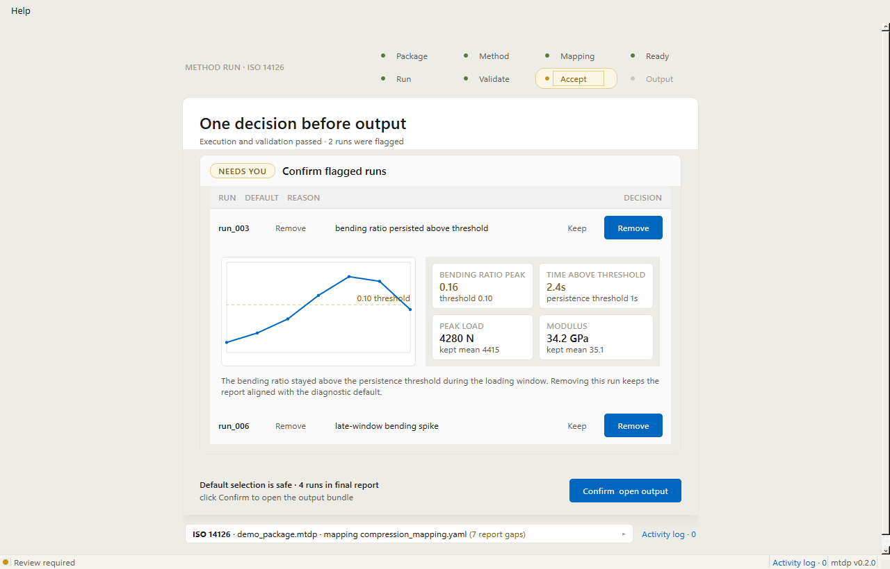
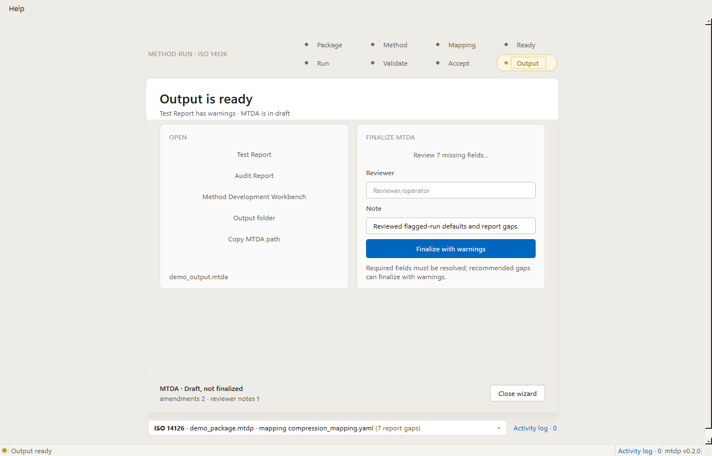

# Method Run Wizard

The Method Run Wizard runs an ISO 14126 method against an MTDP package, keeps the operator on the decisions that need judgment, and records the handoff into the output MTDA bundle.

## Setup

Setup shows readiness, mapping, and report-completion decisions before the method can run. The action bar remains the source of truth for whether the package is runnable, runnable with warnings, or blocked.

## Running

Running tracks the current phase, total progress, per-run status, and the live activity-log count. Cancel returns to setup and records the cancellation in the log.

## Review

Review presents flagged runs with the diagnostic evidence needed to confirm the default selection. Keeping a flagged run requires a reviewer justification before the output can be opened.

## Finalize

Finalize collects the output handoff actions in one place: open reports, open the workbench, open the output folder, copy the MTDA path, review report gaps, and finalize with a reviewer note.

## Keyboard Shortcuts

- `L`: Toggle the activity log drawer.
- `Esc`: Close the activity log drawer. If the drawer is already closed, collapse the expanded task.

The same shortcuts are listed in the application menu under `Help > Shortcuts`.

## Pipeline Pills

- `Package`: input MTDP package is selected and readable.
- `Method`: method package is selected and readable.
- `Mapping`: mapping profile is available, or warning if report bindings still need a decision.
- `Ready`: readiness checks have completed.
- `Run`: execution is queued, running, complete, or failed.
- `Validate`: validation diagnostics have completed.
- `Accept`: flagged-run acceptance decisions are pending or complete.
- `Output`: MTDA output is draft, finalized, or blocked by an error.

Pill colors use the same status language throughout the wizard: green means complete, amber means attention is needed, blue means active now, red means failed, and grey means not reached yet.
