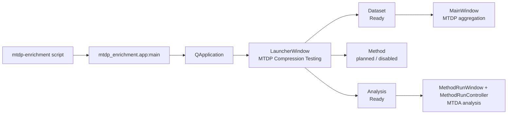
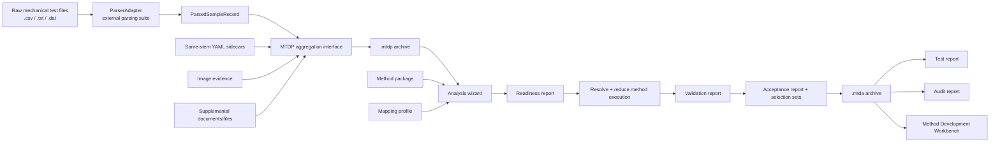
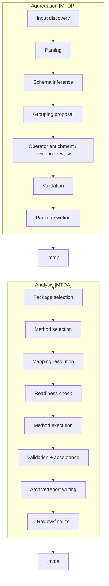

# System Overview Process Flows

## Scope

This document captures the current top-level process layout of the compression module. It is intentionally high-level and should be used as the entry point before drilling down into MTDP aggregation or MTDA analysis.

## Source anchors

Current uptake was derived from these implementation anchors:

| Area | Code anchor |
|---|---|
| Console/script entry point | `src/mtdp_enrichment/app.py` |
| Launcher window | `src/mtdp_enrichment/ui/launcher_window.py` |
| MTDP aggregation UI | `src/mtdp_enrichment/ui/main_window.py` |
| Analysis wizard controller | `src/ui/method_run_wizard/controller.py` |
| Analysis service adapter | `src/ui/method_run_wizard/service_adapter.py` |
| Method run backend service | `src/methods/core/method_run_service.py` |
| Method executor | `src/methods/core/method_executor.py` |
| MTDA writer | `src/archives/mtda/writer.py` |

## L0 — Application entry and workflow library

## L0 — Artifact lifecycle

## L1 — Major chunks

## Current architectural reading

The launcher has correctly separated the two working chunks:

- **Dataset** opens the MTDP package preparation interface.
- **Analysis** opens the method run wizard.
- **Method** is structurally present but disabled, which indicates the future place for method-definition workflows without forcing them into the Dataset or Analysis screens.

This is important because it preserves a clean future split between:

1. Data aggregation and packaging.
2. Method definition or editing.
3. Method execution and reporting.

## Known coverage limits

This overview does not yet fully document:

- The parser internals under `parsing.parsers`.
- The operation registry and individual operation implementations.
- The full method package YAML structure.
- The report builder internals.
- The validation and acceptance policy internals.
- The finalization amendment service internals.

Those should be added as scoped drill-downs rather than expanding this overview into a large unreadable diagram.
