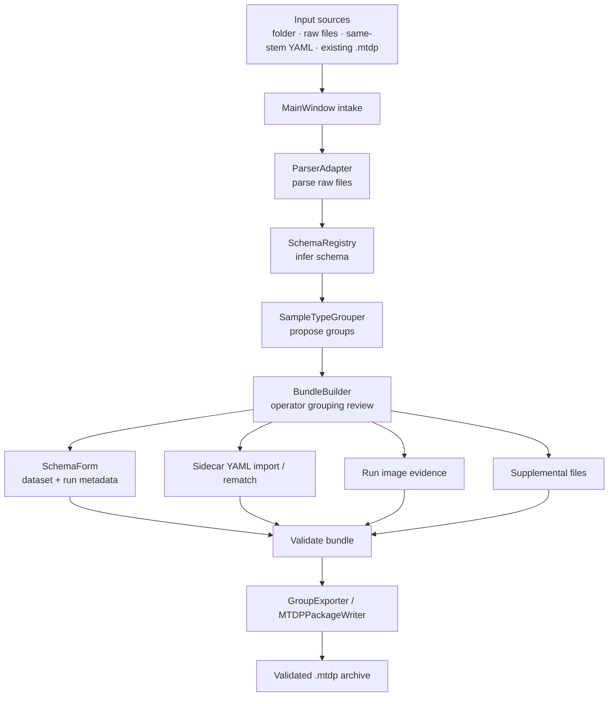
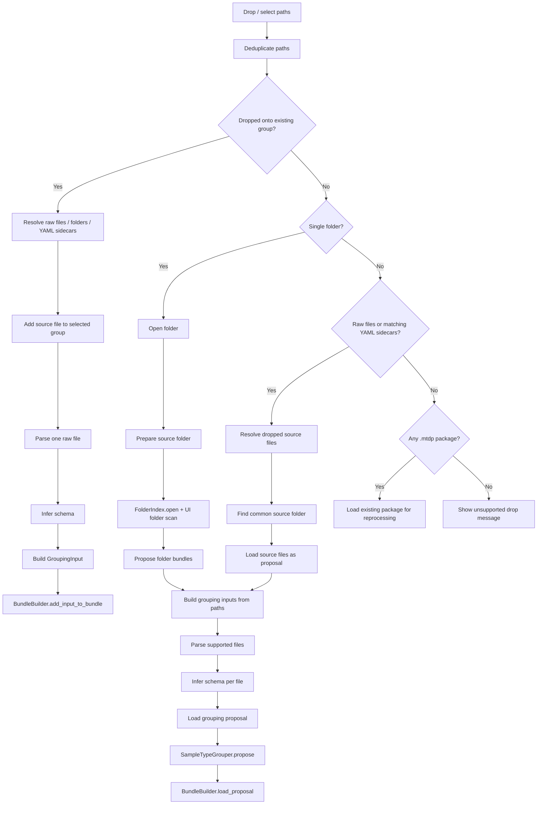
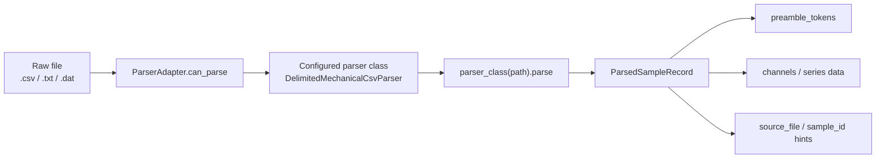
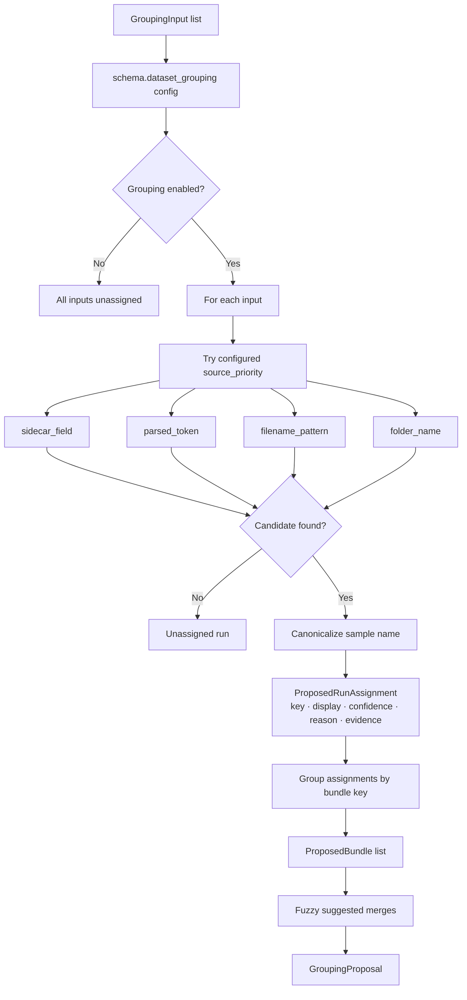
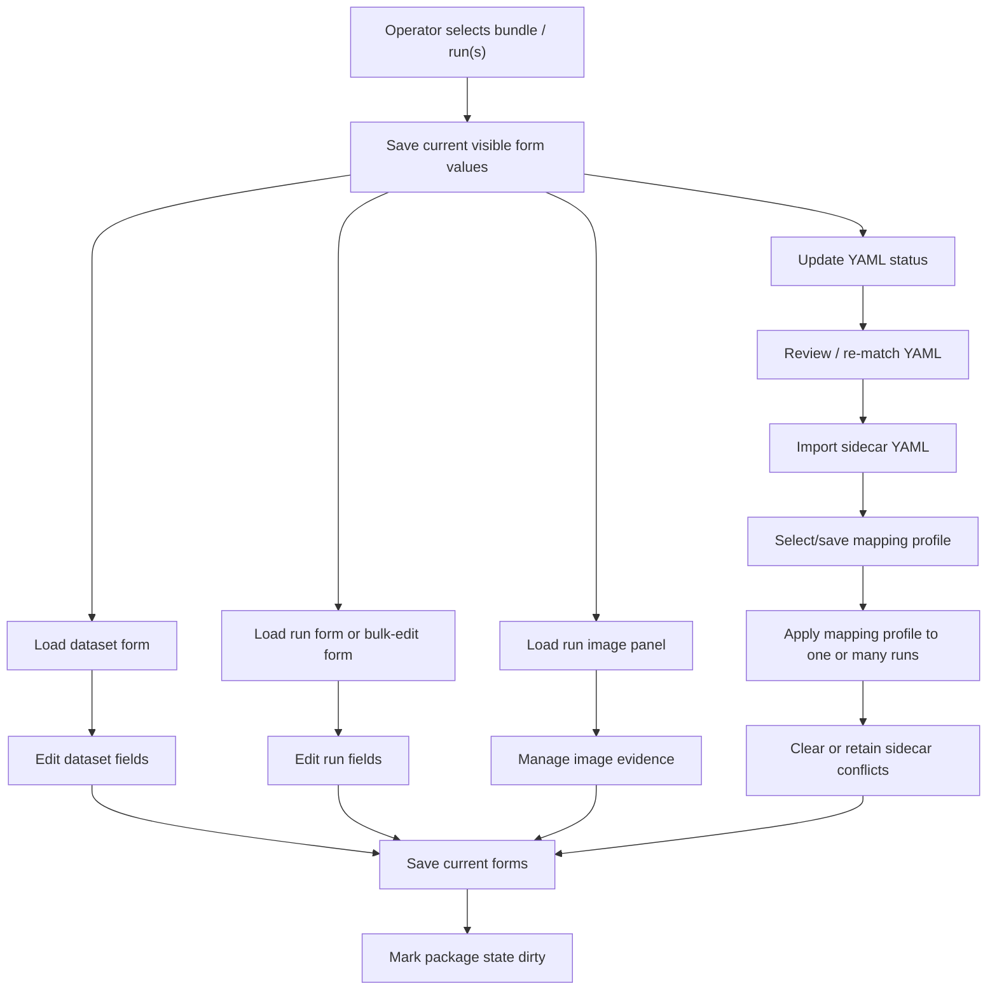
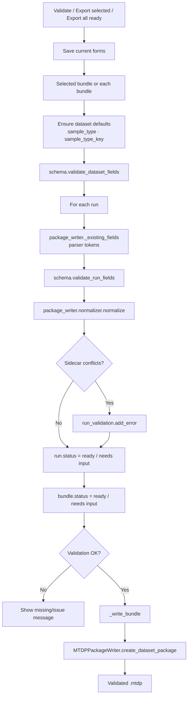
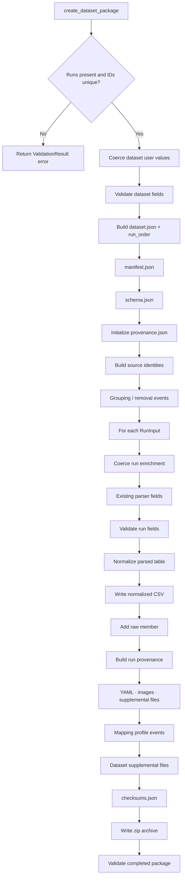

# Aggregation [MTDP] Process Flows

## Scope

This document describes the current MTDP aggregation/package-building process. The goal is to make explicit how raw inputs become a validated `.mtdp` archive.

This document should be expanded over time into finer drill-downs for parser behaviour, schema inference, sidecar reconciliation, bundle editing, validation, archive layout, and reprocessing.

## Source anchors

| Flow area | Code anchor |
|---|---|
| Main aggregation UI | `src/mtdp_enrichment/ui/main_window.py` |
| Parser gateway | `src/mtdp_enrichment/parsing_gateway/parser_adapter.py` |
| Grouping engine | `src/mtdp_enrichment/grouping/sample_type_grouper.py` |
| Bundle editing UI | `src/mtdp_enrichment/ui/bundle_builder.py` |
| Package writer | `src/mtdp_enrichment/package/mtdp_package.py` |
| Schema package model | `src/mtdp_enrichment/package/schema.py` |
| Sidecar importer | `src/mtdp_enrichment/enrichment_import/` |
| Image evidence gateway | `src/mtdp_enrichment/image_gateway/` |
| Supplemental files | `src/mtdp_enrichment/supplemental/` |

---

## L1 — MTDP aggregation overview

### Flow reading

The MTDP stage is not analysis. It is a package preparation and evidence aggregation workflow. Its main output is a portable package containing raw sources, normalized data, metadata, evidence, provenance, and checksums.

---

## L2 — Input routing and proposal generation

### Current behaviour

- Folders are scanned recursively for parser-supported raw files.
- Raw-file drops can include same-stem YAML sidecars.
- Existing `.mtdp` archives can be opened for review/reprocessing.
- Drops onto a specific group add resolved source files into that group rather than starting a new proposal.

### Follow-up drill-downs required

- Parser-supported suffix logic and parser selection.
- Same-stem YAML resolution and failure diagnostics.
- Existing `.mtdp` reprocessing extraction path.
- Folder index role and persistent suggestion behaviour.

---

## L2 — Parser gateway boundary

### Current boundary contract

The enrichment UI treats parsing as an external parsing-suite responsibility. It consumes structured `ParsedSampleRecord` outputs and does not inspect raw files directly. This boundary is important for parser-hardening work because parser changes should preserve the structured contract expected by grouping, validation, normalization, and package writing.

### Follow-up drill-downs required

- Numeric parsing strategy.
- Delimiter detection.
- Header/preamble detection.
- Channel table detection.
- Locale-aware number handling.
- Parser diagnostics and raw-value preservation.

---

## L2 — Grouping proposal

### Current responsibility

The grouping engine proposes structure; it does not finalize correctness. The operator can move, merge, unassign, restore, rename, or delete groups in the BundleBuilder.

### Follow-up drill-downs required

- BundleBuilder editing operations.
- Multi-selection drag/drop behaviour.
- Manual correction counts.
- Unassigned-run semantics.
- Suggested merge UI and evidence.

---

## L2 — Operator enrichment and evidence review

### Current responsibility

This stage enriches the package before export. It should not silently treat analysis decisions as package-preparation decisions. Human review here concerns data aggregation, source matching, metadata, YAML reconciliation, and evidence attachment.

### Follow-up drill-downs required

- Difference between package-preparation review and analysis acceptance review.
- Sidecar conflict lifecycle.
- Image evidence roles and metrology-use flags.
- Supplemental file scopes and archive destinations.

---

## L2 — Validation and export

### Current gate meaning

A bundle is exportable only if:

- Dataset fields validate.
- At least one run exists.
- Every run validates against schema requirements.
- Normalized table generation validates.
- Sidecar conflicts have been resolved or confirmed.

### Follow-up drill-downs required

- Exact schema field importance and report-importance interaction.
- Validation message grouping.
- Normalization validation events.
- Export-all behaviour and partial export reporting.

---

## L3 — MTDP archive writing

## L4 — MTDP archive contract matrix

| Member / area | Producer | Purpose |
|---|---|---|
| `manifest.json` | `build_manifest(schema)` | Identifies package/schema metadata. |
| `schema.json` | `schema.to_dict()` | Embeds the schema used for packaging. |
| `dataset.json` | `_build_dataset_json` | Stores dataset-level metadata and run order. |
| `raw/<run_id>.*` | `_add_run` | Preserves raw source files. |
| `normalized/<run_id>.csv` | `TokenizedCsvWriter.write_string` | Stores normalized run table and metadata rows. |
| `provenance.json` | `MTDPPackageWriter` | Records grouping, parsing, normalization, source identity, supplemental events. |
| `checksums.json` | `build_checksums(files)` | Provides archive integrity metadata. |
| `supplemental/<run_id>.yaml` | `_add_optional_run_evidence` | Preserves YAML sidecar used for prefill/reconciliation. |
| `images/...` | `_image_member_name` | Preserves run image evidence. |
| `supplemental/...` | `_add_general_supplemental_file` | Preserves additional documents/calibration/mapping support files. |

## Known missing drill-downs

The following should be documented next:

1. Parser internals and numeric parsing behaviour.
2. MTDP schema field lifecycle from raw token to report-role metadata.
3. YAML sidecar reconciliation and conflict resolution.
4. BundleBuilder editing operations.
5. MTDP package validation internals.
6. Reprocessing existing `.mtdp` packages.
