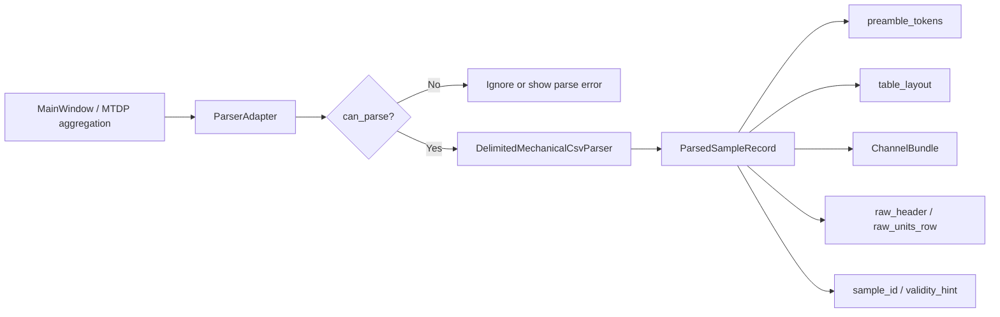
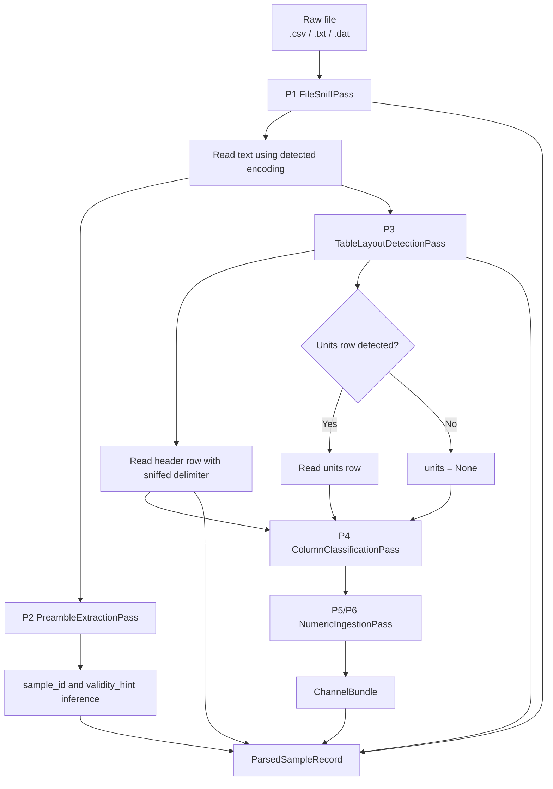
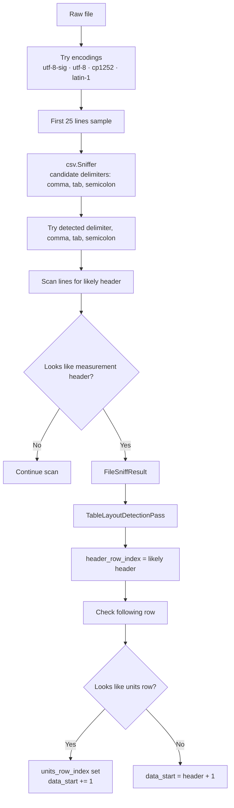
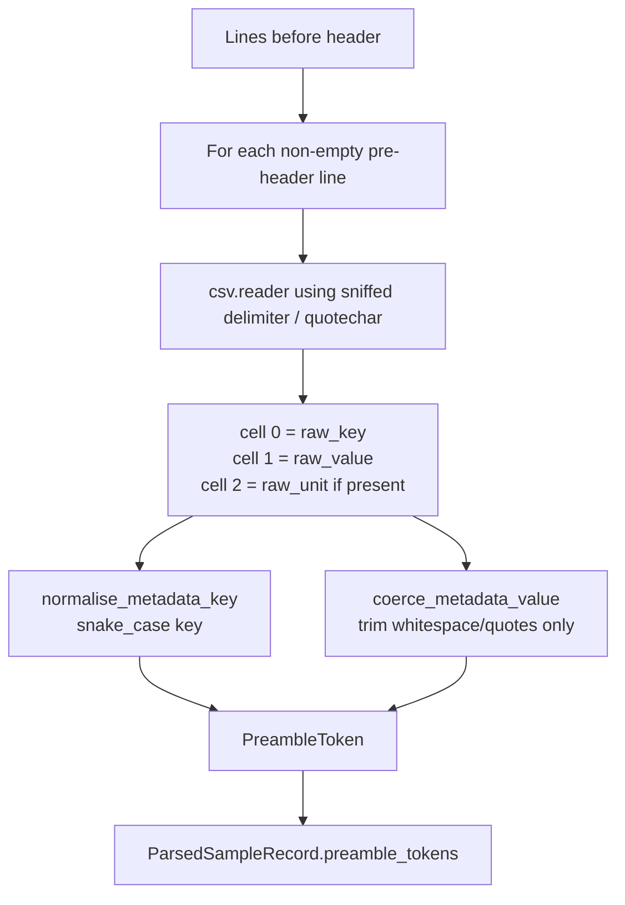
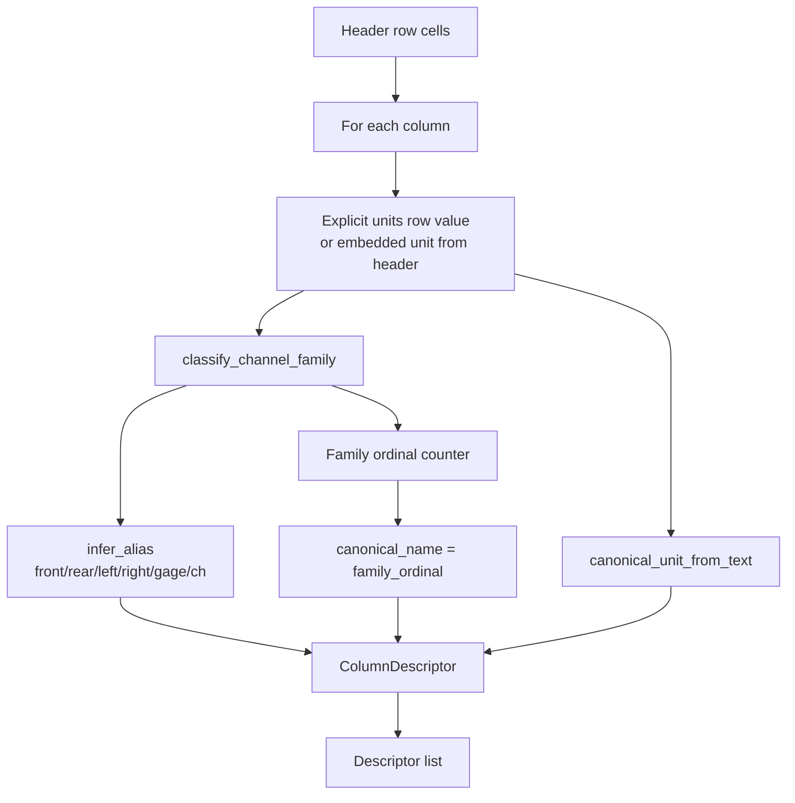
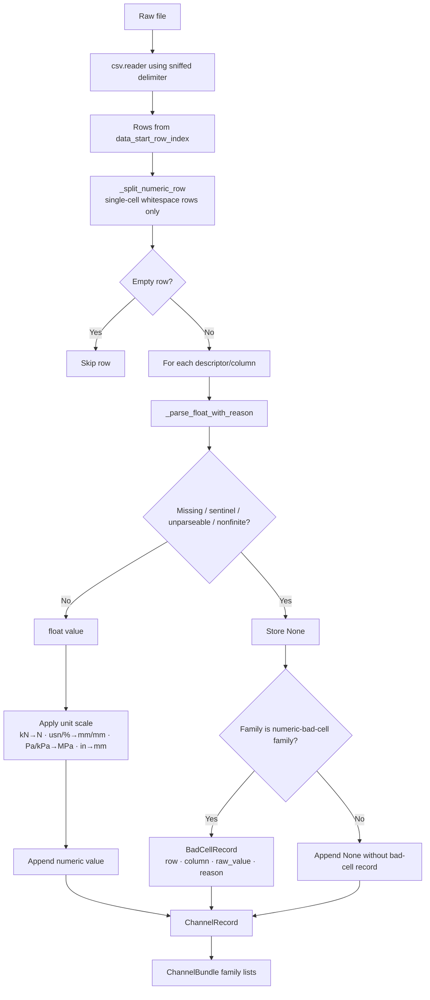

# Parser Contract and Numeric-Risk Flow

## Scope

This document drills down into the current parser route used by MTDP aggregation. It documents how a supported raw file becomes a `ParsedSampleRecord`, and where numeric-format risk currently sits.

This is a current-behaviour document, not a target parser redesign. Parser-hardening directives should use this as the baseline.

## Source anchors

| Flow area | Code anchor |
|---|---|
| Parser gateway | `src/mtdp_enrichment/parsing_gateway/parser_adapter.py` |
| Main CSV/TXT/DAT parser | `src/parsing/parsers/delimited_mechanical_csv_parser.py` |
| File sniffing | `src/parsing/sniffing/file_sniffer.py` |
| Preamble token extraction | `src/parsing/preamble/token_extractor.py` |
| Metadata token normalization | `src/parsing/preamble/token_normalizer.py` |
| Table layout detection | `src/parsing/layout/table_layout_detector.py` |
| Column classification | `src/parsing/columns/column_descriptor_builder.py` |
| Header/unit family classification | `src/parsing/columns/family_classifier.py` |
| Numeric ingestion | `src/parsing/readers/delimited_numeric_reader.py` |
| Parsed output model | `src/parsing/models/parsed_sample_record.py` |
| Channel output model | `src/parsing/models/channel_record.py` |
| Bad-cell model | `src/parsing/models/bad_cell_record.py` |

---

## L2 — Parser gateway boundary

## Current boundary contract

The enrichment layer does not parse raw file structure directly. It expects the parser to return a structured record containing:

| Contract element | Meaning |
|---|---|
| `source_file` | Original local raw file path. |
| `sample_id` | Best available specimen/sample hint from preamble tokens. |
| `file_sniff` | Encoding, delimiter, quote character, likely header row, line count. |
| `preamble_tokens` | Pre-table metadata tokens with raw key/value/unit and normalized key. |
| `table_layout` | Header row, optional units row, data start row, detected column count. |
| `channels` | Classified numeric channels grouped by family. |
| `raw_header` | Original header cells. |
| `raw_units_row` | Original units row if detected. |
| `parse_warnings` | Parser-level warnings. Currently available in model but not strongly populated by the current route. |
| `validity_hint` | Optional validity hint inferred from failure-mode-style metadata. |

---

## L2 — Current parser pipeline

---

## L3 — File sniffing and table layout

## Current layout-risk note

The units-row detector rejects a candidate units row if any non-empty cell looks numeric. Its local numeric check currently converts comma to decimal point when no period is present. This is independent from the more careful numeric ingestion parser. Therefore, table-layout detection may still need hardening for locale/thousands scenarios even if numeric ingestion has been patched.

---

## L3 — Preamble metadata token flow

## Current metadata behaviour

Preamble values are kept textual. They are not numerically coerced at parser-token extraction. Later schema validation may coerce run/dataset fields based on field type and unit rules.

---

## L3 — Column classification flow

## Classification implications

The parser reduces arbitrary vendor/header names into channel families such as load, extension, displacement, strain, stress, time, temperature, record ID, timestamp, or unknown. This classification is central because numeric ingestion later groups channels by descriptor family.

---

## L3 — Numeric ingestion and numeric-format handling

## Current numeric-format rules

| Scenario | Current behaviour |
|---|---|
| Empty cell | Stored as `None`, reason `missing`. |
| Sentinel values such as overflow/error/invalid | Stored as `None`, reason `sentinel:<value>`. |
| Comma present, no decimal point, matches thousands regex | Commas removed. Example: `-1,017` becomes `-1017`. |
| Comma present, no decimal point, not thousands regex | Comma converted to decimal point. |
| Comma and point both present, comma before point | Comma removed. Example: `1,234.56` becomes `1234.56`. |
| Comma and point both present, comma after point | Points removed and comma becomes decimal. Example: `1.234,56` becomes `1234.56`. |
| `float()` failure | Stored as `None`, reason `unparseable`. |
| Non-finite number | Stored as `None`, reason `nonfinite`. |

## Current numeric-risk register

| Risk | Current status | Why it matters | Documentation consequence |
|---|---|---|---|
| Thousands comma in numeric data | Partially handled in numeric ingestion. | Prevents `-1,017` becoming `-1.017`. | Keep numeric ingestion tests around thousands separators. |
| Decimal comma vs thousands comma ambiguity | Heuristic-based. | Values such as `1,234` are interpreted as thousands when regex matches, not decimal. | Future parser hardening should use expected column family, delimiter, and locale context. |
| Structural delimiter vs numeric comma | Delegated to `csv.Sniffer` and selected delimiter. | A comma can mean CSV delimiter or numeric formatting. | Future parser hardening should make delimiter/numeric-decimal interpretation explicitly context-aware. |
| Unit-row numeric detection | Still uses a simpler comma-to-decimal check. | Layout detection can misclassify rows before numeric ingestion receives them. | Add layout-level numeric parsing hardening. |
| Metadata numeric fields | Preamble values stay textual. | Schema validation later calls float/date/bool/enum coercion. | Document parser vs schema responsibility clearly. |
| Bad cells | Recorded only for selected numeric families. | Unknown/record columns may lose detailed bad-cell diagnostics. | Decide whether all numeric-attempt columns need bad-cell provenance. |
| Raw value auditability | BadCellRecord preserves raw cell value only for bad numeric cells. | Successful numeric normalization does not currently retain the raw cell string in each value. | Consider raw-cell provenance if full auditability is required. |

## L4 — Parser output contract matrix

| Source | Transformation | Destination | Validation / failure behaviour |
|---|---|---|---|
| File bytes | Encoding fallback | `FileSniffResult.encoding` | Falls back through known encodings. |
| First 25 lines | CSV sniffer and header scan | `FileSniffResult.delimiter`, `quotechar`, `likely_header_row_index` | Defaults to comma/quote if sniffer fails; layout raises if no header found. |
| Pre-header lines | CSV split and key normalization | `PreambleToken` list | Empty/keyless lines skipped. |
| Header row | Family/unit/alias classification | `ColumnDescriptor` list | Unknown families are allowed and routed to unknown channels. |
| Data rows | Numeric parsing and unit scaling | `ChannelRecord.values` | Bad numeric cells become `None`; reasons recorded for numeric families. |
| Parsed file | Record assembly | `ParsedSampleRecord` | Returned to MTDP enrichment layer. |

## Required future drill-downs

1. Full `FileSniffResult` model and delimiter confidence.
2. Explicit parser-diagnostic model and propagation into MTDP audit/provenance.
3. Locale-aware numeric strategy using expected content type.
4. Preamble metadata numeric/date/unit conversion strategy.
5. Tests linking parser bad cells to package validation/reporting.
6. Parser behaviour for vendor-specific file formats beyond generic delimited files.
