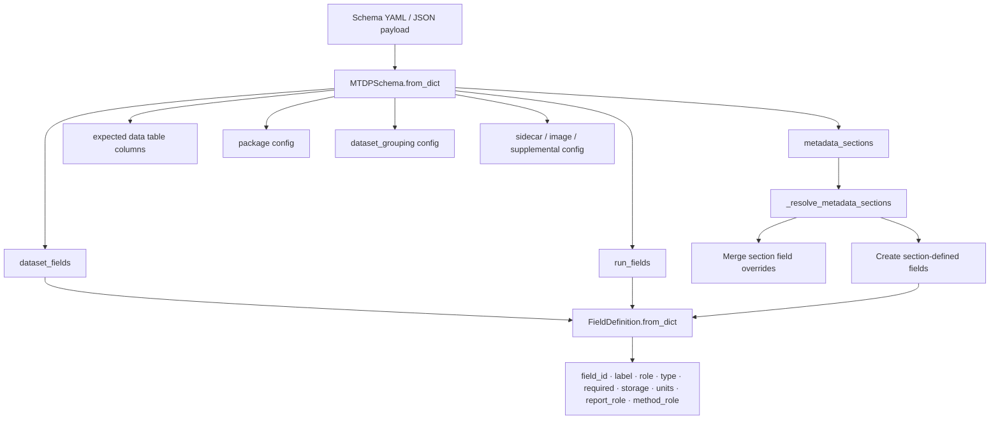
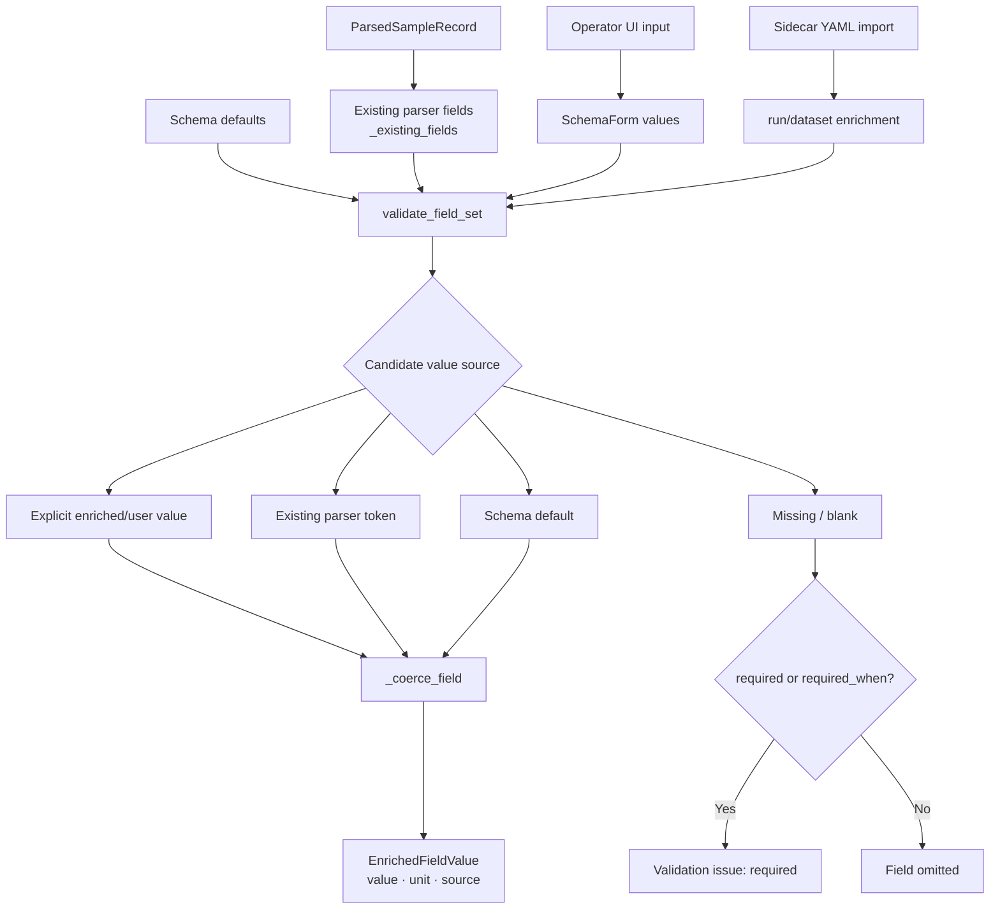
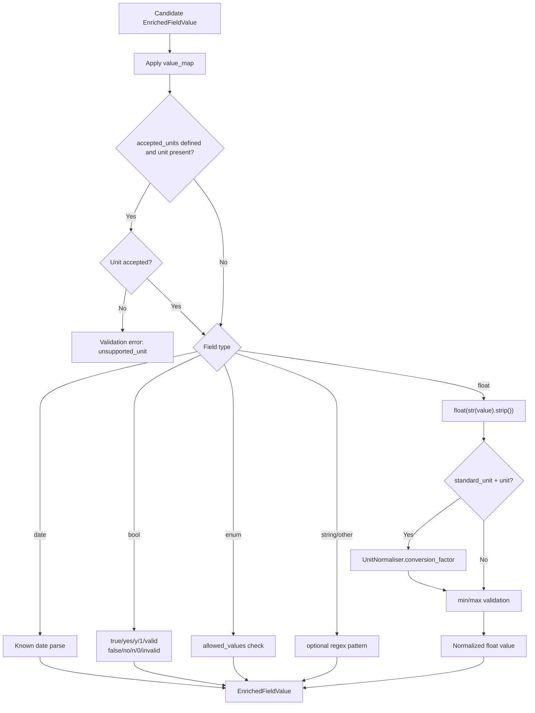
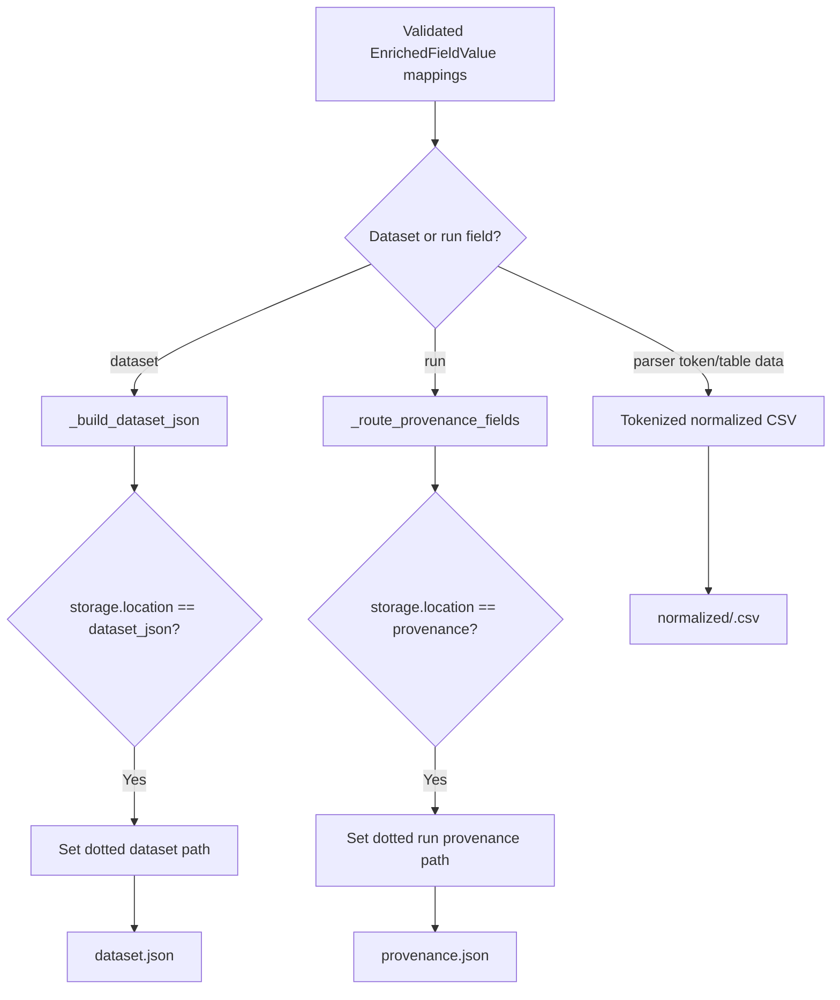
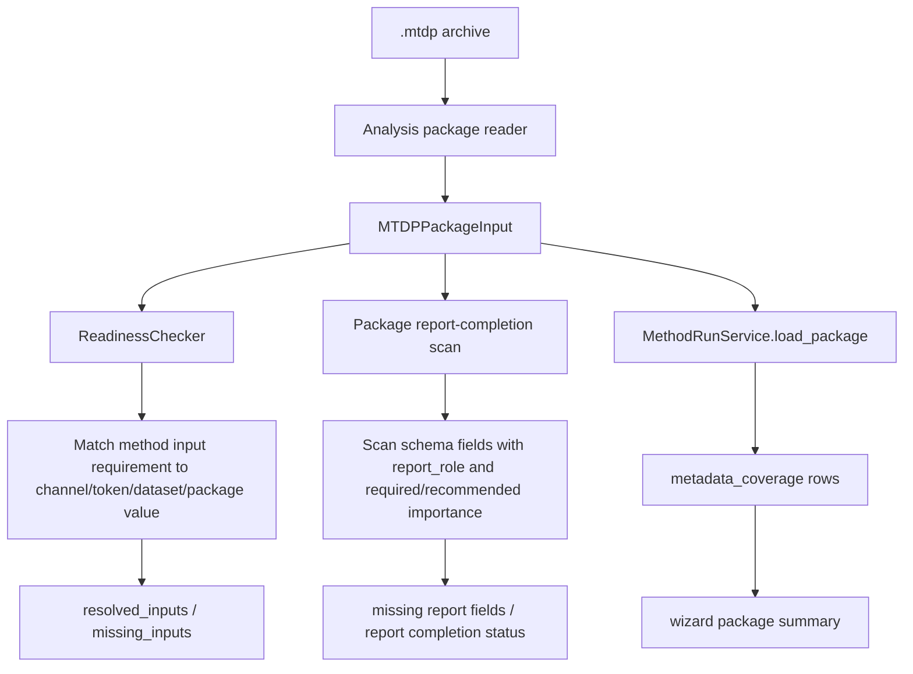

# MTDP Schema Field Lifecycle

## Scope

This document describes how MTDP schema fields move from schema declaration to UI editing, validation, package storage, later readiness/report usage, and archive persistence.

It focuses on the schema-field contract, not on the raw parser internals or report-builder internals.

## Source anchors

| Flow area | Code anchor |
|---|---|
| Schema model | `src/mtdp_enrichment/package/schema.py` |
| Field model | `src/mtdp_enrichment/models/field_definition.py` |
| MTDP package writer | `src/mtdp_enrichment/package/mtdp_package.py` |
| Aggregation UI | `src/mtdp_enrichment/ui/main_window.py` |
| Readiness checker | `src/readiness/readiness_checker.py` |
| Method run service report-completion scan | `src/methods/core/method_run_service.py` |

---

## L2 — Schema loading and field definition

## FieldDefinition contract

| Attribute | Role in lifecycle |
|---|---|
| `field_id` | Stable internal identifier used in forms, validation, package storage, mapping, and report logic. |
| `label` | Human-facing display text. |
| `role` | Broad semantic field role. |
| `required` | Always-required validation flag. |
| `required_when` | Conditional requirement gate. |
| `visible_when` | Conditional UI/validation inclusion gate. |
| `type` | Coercion target: string, float, date, bool, enum. |
| `storage.location` | Storage route such as `dataset_json`, `token_preamble`, or `provenance`. |
| `storage.token` | Parser token name used for run preamble fields. |
| `storage.path` | Dotted archive/provenance path. |
| `accepted_units` | Accepted user/source units. |
| `standard_unit` | Normalized output unit. |
| `unit_dimension` | Unit conversion dimension. |
| `allowed_values` | Enum choices. |
| `iso_compliant_values` | Values treated as ISO-compliant. |
| `deviation_values` | Values treated as deviations from standard. |
| `import_aliases` | YAML/import matching aliases. |
| `value_map` | Normalisation map for equivalent values. |
| `report_role` | Role in formal report field catalog. |
| `report_importance` | Required/recommended/optional report importance. |
| `method_role` | Role used by method/readiness mapping. |

---

## L2 — Field value sources before export

## Value-source priority

Within `validate_field_set`, the candidate value is selected in this order:

1. Explicit value from the passed `values` mapping.
2. Existing parser value when the field is present in `existing_values`.
3. Schema default when defined.
4. Missing/blank, which becomes an error if the field is required or conditionally required.

This matters because parser-derived values can satisfy run-field validation without the operator re-entering them.

---

## L3 — Field coercion and validation

## Important numeric note

Schema float coercion currently uses Python `float(str(value).strip())`. Therefore, locale/thousands parsing for metadata fields is not solved by the raw numeric channel parser. If a user or YAML sidecar supplies a float metadata field as `1,234`, schema validation will not treat it the same way as the numeric channel ingestion parser unless upstream preprocessing has already normalized it.

This is a separate hardening target from raw numeric time-series parsing.

---

## L2 — Storage routing into `.mtdp`

## Storage contract

| Storage location | Typical scope | Archive destination | Notes |
|---|---|---|---|
| `dataset_json` | Dataset fields | `dataset.json` | Dotted paths are materialised in the dataset payload. |
| `provenance` | Run fields | `provenance.json` under run payload | Path may be formatted with `{run_id}`. |
| `token_preamble` | Parser-derived run fields | Normalized CSV metadata rows / parser token fallback | Existing parsed tokens can satisfy validation. |
| Table columns | Numeric channels | `normalized/<run_id>.csv` | Built through normalizer and tokenized CSV writer. |

---

## L2 — Later analysis/report usage

## Key distinction

A field can have several different meanings at once:

- It may be required for MTDP package validity.
- It may be required or recommended for report completion.
- It may be required for method execution through `method_role` or mapping requirements.
- It may be relevant to ISO-compliance/deviation reporting through compliant/deviation values.

These are overlapping but not identical gates. Future documentation should avoid collapsing them into one generic “required metadata” concept.

## Open drill-downs

1. Exact compression schema fields and their storage paths.
2. Difference between MTDP-required, report-required, report-recommended, and method-required.
3. ISO-compliant/deviation value lifecycle into test report sections.
4. Metadata-section grouping into UI and report sections.
5. Parser-token field satisfaction versus explicit operator enrichment.
6. Locale-aware float metadata coercion.
