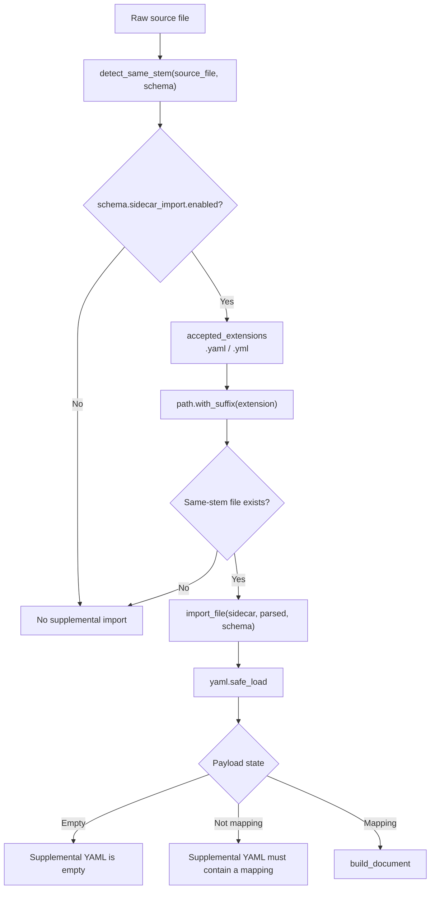
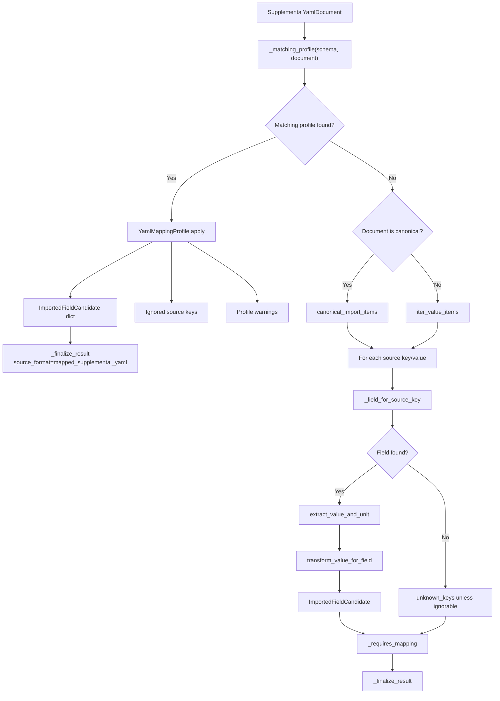
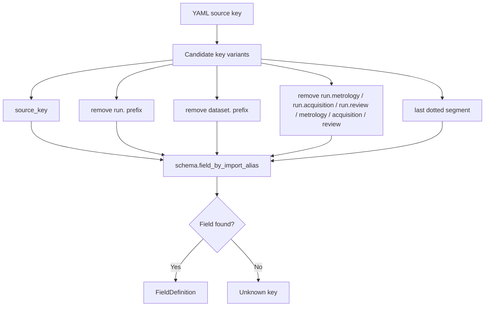
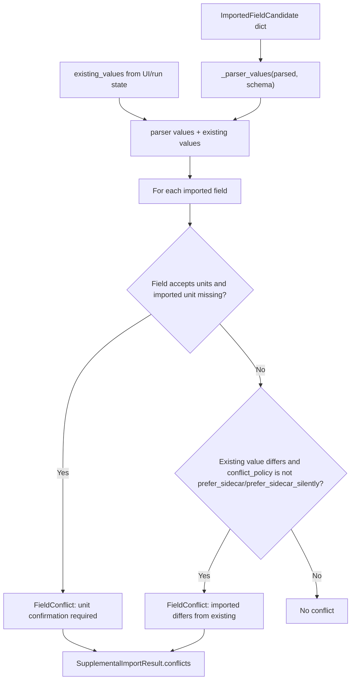
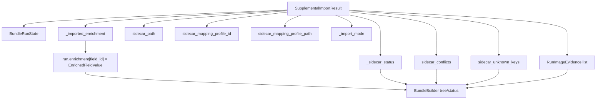
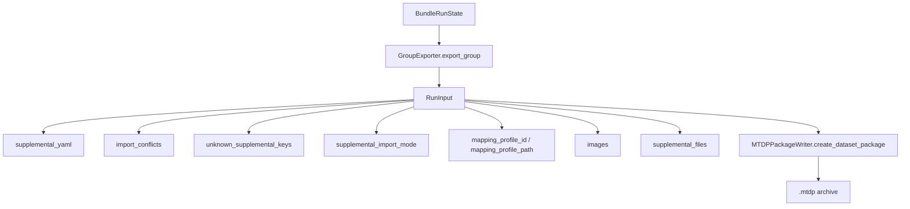

# YAML Sidecar Reconciliation Flow

## Scope

This document drills into same-stem YAML sidecar handling during MTDP aggregation. It covers detection, canonical/alias import, mapping-profile application, conflict detection, unknown-key handling, image references, and how imported values move into bundle/run state.

It does not document MTDA method mapping profiles. Sidecar YAML mapping profiles are an MTDP enrichment concern and are separate from analysis `method.mapping_profile.v0_2` files.

## Source anchors

| Flow area | Code anchor |
|---|---|
| Sidecar importer | `src/mtdp_enrichment/enrichment_import/sidecar_yaml_importer.py` |
| Sidecar import models | `src/mtdp_enrichment/enrichment_import/models.py` |
| YAML mapping profile | `src/mtdp_enrichment/enrichment_import/mapping_profile.py` |
| Canonical YAML utilities | `src/mtdp_enrichment/enrichment_import/canonical_yaml.py` |
| Value normalizers | `src/mtdp_enrichment/enrichment_import/value_normalizers.py` |
| BundleBuilder state hydration | `src/mtdp_enrichment/ui/bundle_builder.py` |
| Group reprocessor | `src/mtdp_enrichment/services/group_reprocessor.py` |
| Group exporter | `src/mtdp_enrichment/services/group_exporter.py` |
| MTDP writer sidecar preservation | `src/mtdp_enrichment/package/mtdp_package.py` |

---

## L2 — Sidecar detection and import route

## Current sidecar configuration from compression schema

| Setting | Current meaning |
|---|---|
| `enabled: true` | Sidecar import is active. |
| `same_stem: true` | Raw file `sample.csv` can match `sample.yaml` or `sample.yml`. |
| `accepted_extensions` | `.yaml`, `.yml`. |
| `canonical_versions` | Currently includes `0.1.0`. |
| `unknown_keys: prompt_mapping` | Unknown-heavy alias YAML can require mapping. |
| `conflict_policy: prefer_sidecar` | Sidecar values are preferred unless stricter policy is configured. |
| `mapping_profile.enabled: true` | Stored YAML mapping profiles can be applied. |
| `mapping_profile.apply_to_same_signature: true` | Profiles can apply to documents with the same structure signature. |

---

## L2 — Mapping-profile vs direct import

## Mapping profile contract

| Field | Meaning |
|---|---|
| `mapping_profile_id` | Stable profile identifier. |
| `target_schema_id` / `target_schema_version` | Schema the mapping applies to. |
| `source.structure_signature` | Flattened-key signature used for matching. |
| `source.applies_to.file_glob` | File-glob hint for profile scope. |
| `mappings[].source_key` | YAML source key. |
| `mappings[].action` | `map` or `ignore`. |
| `mappings[].target_field_id` | MTDP field receiving value. |
| `mappings[].value_path` | Optional dotted source path. |
| `mappings[].unit` | Unit override. |
| `mappings[].date_format` | Date parsing hint. |
| `mappings[].value_transform` | Explicit value transform. |
| `mappings[].user_corrected` | Marks operator-corrected mapping rows. |

---

## L3 — Source key to field resolution

## Ignorable keys

The importer treats these keys as ignorable rather than unknown errors:

- `mtdp_supplemental_version`
- `scope`
- `schema_hint.schema_id`
- `schema_hint.schema_version`
- `notes`
- `images`
- any key starting with `images.`

---

## L3 — Conflict detection

## Conflict implications

- Missing unit for a unit-sensitive field is always surfaced as a conflict requiring review.
- Value disagreement is policy-dependent.
- With current compression schema default `prefer_sidecar`, different sidecar values are not automatically conflicts unless a stricter policy is used.
- Conflict values preserve both existing and imported value/unit/source for review.

---

## L2 — Import result to BundleBuilder state

## Sidecar status states

| Status | Meaning |
|---|---|
| `No YAML` | No same-stem YAML found or no source path. |
| `Mapping required` | Alias/non-canonical YAML has too many unknowns and schema config asks for mapping. |
| `Mapping applied` | Matching `YamlMappingProfile` applied. |
| `YAML needs review` | Conflicts were produced. |
| `Canonical YAML imported` | Canonical document imported known fields. |
| `Alias YAML imported; unknown keys` | Import succeeded but unknown keys remain. |
| `Alias YAML imported` | Alias import succeeded. |
| `YAML detected` | YAML found but no fields imported. |

---

## L2 — Export preservation

## L4 — Sidecar data contract

| Source | Transformation | Destination | Failure/gate behaviour |
|---|---|---|---|
| Same-stem YAML file | `detect_same_stem` | Sidecar path | Disabled/missing returns empty supplemental import. |
| YAML payload | `yaml.safe_load` | Raw payload | Load/YAML errors return warning result. |
| Raw payload | `build_document` | `SupplementalYamlDocument` | Non-mapping payload rejected. |
| Document signature | `_matching_profile` | `YamlMappingProfile` | If no profile, direct canonical/alias import proceeds. |
| Mapping profile | `YamlMappingProfile.apply` | Imported fields + ignored keys | Missing target field becomes warning. |
| Alias/canonical items | `_field_for_source_key` | Imported candidates | Unknown keys can warn or trigger mapping requirement. |
| Imported fields + parser/existing values | `_conflicts_for_imported` | `FieldConflict` list | Conflicts block export through bundle validation if unresolved. |
| Import result | BundleBuilder hydration | `BundleRunState` | Status, conflicts, unknowns, profile ID/path retained. |
| Bundle run state | `GroupExporter` / `RunInput` | MTDP writer | Sidecar and mapping/profile evidence preserved in archive/provenance. |

## Open residuals

1. YAML reconciliation dialog interaction details.
2. Empirical matcher behaviour.
3. Mapping profile save/update location and folder-index persistence.
4. Exact UI action for applying a learned mapping to one run vs all matching runs.
5. Test fixtures for sidecar conflict policies other than `prefer_sidecar`.
