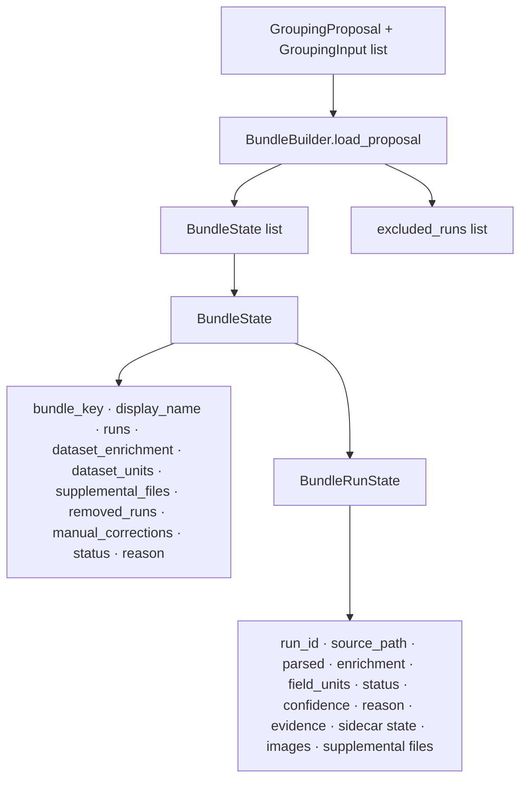
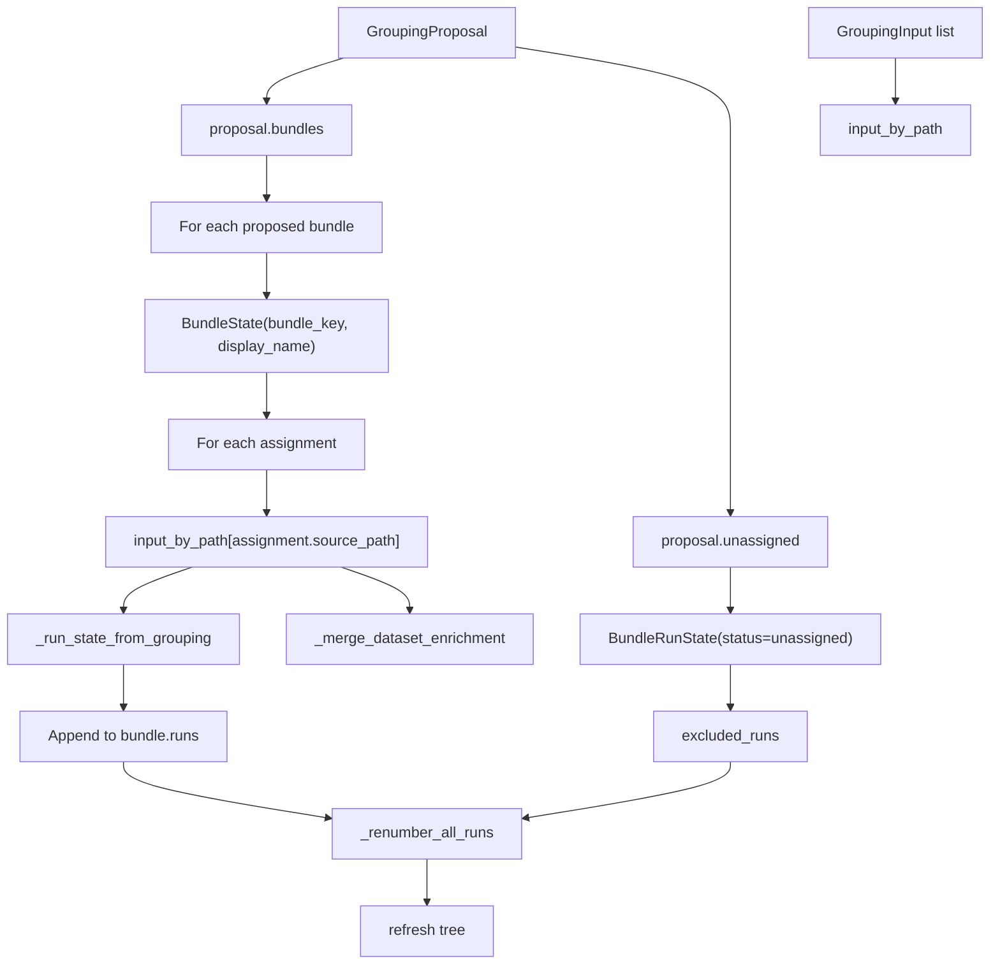
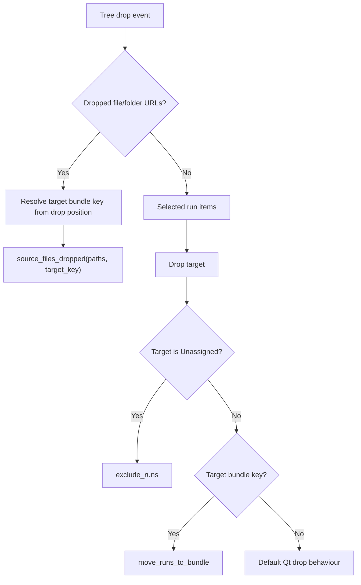
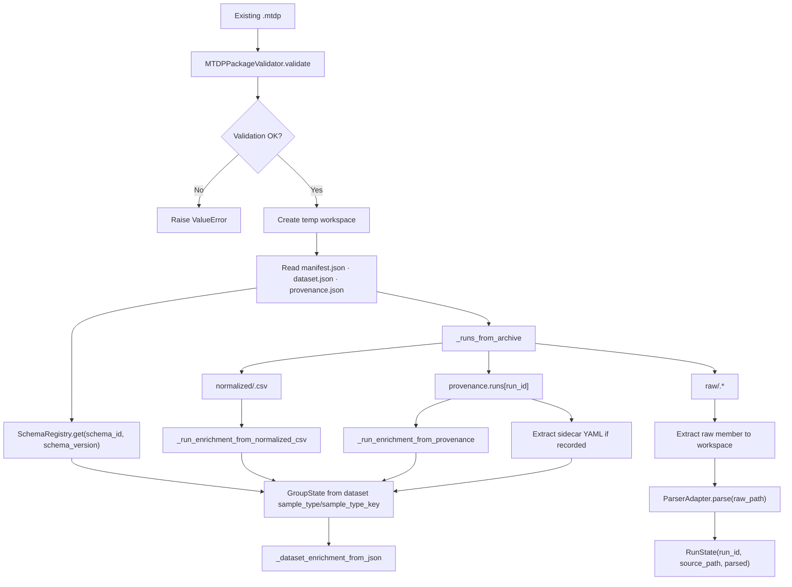
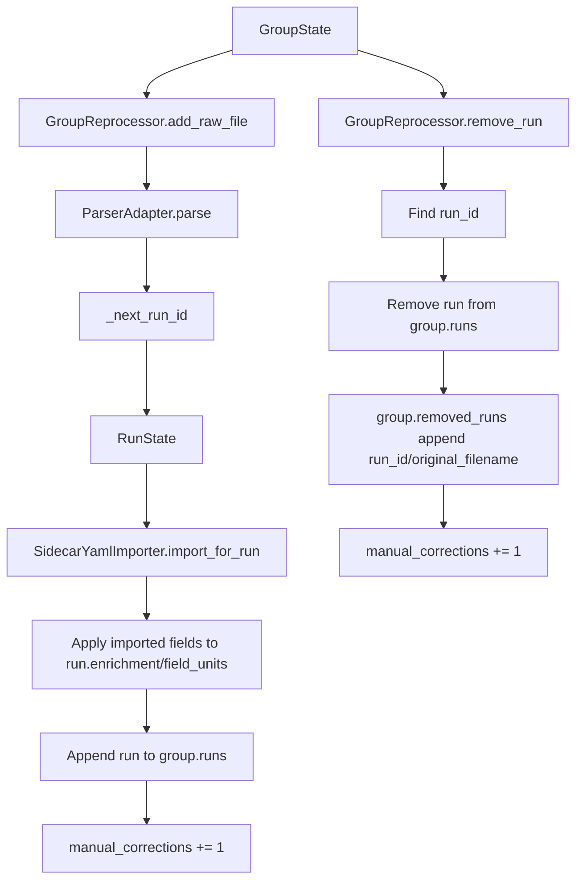
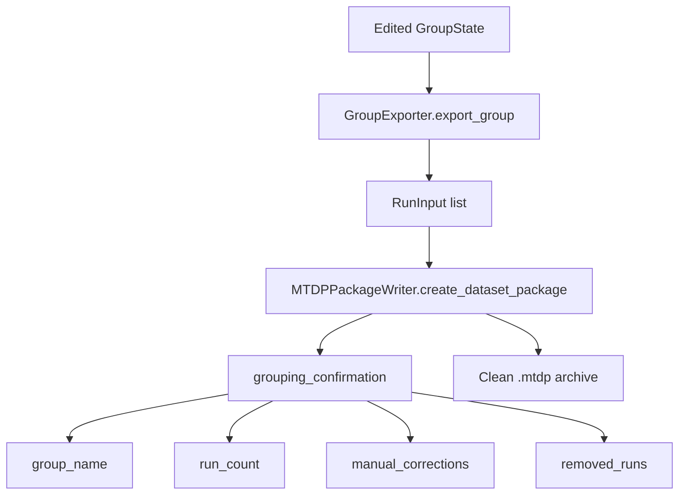

# Bundle Editing and MTDP Reprocessing Flow

## Scope

This document drills into MTDP bundle editing after grouping proposal generation and into loading/reprocessing an existing `.mtdp` archive back into editable state.

It covers the operator-facing group/run editing operations, run renumbering, manual correction counts, unassigned runs, and the backend reprocessing helpers.

## Source anchors

| Flow area | Code anchor |
|---|---|
| BundleBuilder UI/state | `src/mtdp_enrichment/ui/bundle_builder.py` |
| Bundle/group state | `src/mtdp_enrichment/services/group_state.py` |
| Existing package loader | `src/mtdp_enrichment/services/group_loader.py` |
| Headless group reprocessor | `src/mtdp_enrichment/services/group_reprocessor.py` |
| Group exporter | `src/mtdp_enrichment/services/group_exporter.py` |
| Main window load package route | `src/mtdp_enrichment/ui/main_window.py::load_existing_package` |
| MTDP package writer | `src/mtdp_enrichment/package/mtdp_package.py` |

---

## L2 — BundleBuilder state model



---

## L2 — Proposal loading



## Proposal hydration details

- Runs are initially numbered `run_001`, `run_002`, etc. within each bundle and unassigned list.
- Sidecar imports become run enrichment and sidecar status fields.
- Dataset-like sidecar fields are merged into `BundleState.dataset_enrichment` for fields such as sample type, treatment, material label, condition, and batch.
- Unassigned runs remain available for restoration into groups.

---

## L2 — Operator editing operations

```mermaid
flowchart TB
    Operator["Operator action"] --> Action{"Action type"}

    Action -->|Create group| Create["create_bundle"]
    Create --> NewBundle["BundleState(manual_corrections=1)"]

    Action -->|Rename group| Rename["rename_bundle"]
    Rename --> UniqueKey["_unique_key"]
    UniqueKey --> IncrementManual["manual_corrections += 1"]

    Action -->|Merge groups| Merge["merge_bundles"]
    Merge --> MoveRuns["target.runs.extend(source.runs)"]
    MoveRuns --> RemoveSource["remove source bundle"]

    Action -->|Split run| Split["split_run_to_new_bundle"]
    Split --> Detach["_detach_run"]
    Detach --> NewGroup["create_bundle"]
    NewGroup --> AppendSplit["append run to new bundle"]

    Action -->|Move run(s)| Move["move_runs_to_bundle"]
    Move --> DetachMany["_detach_run for each source"]
    DetachMany --> AppendTarget["append to target"]

    Action -->|Unassign run(s)| Exclude["exclude_runs"]
    Exclude --> DetachExclude["_detach_run"]
    DetachExclude --> Excluded["run.status=unassigned; append excluded_runs"]

    Action -->|Restore unassigned| Restore["include_excluded_run"]
    Restore --> RemoveExcluded["remove from excluded_runs"]
    RemoveExcluded --> RestoreTarget["append to target bundle"]

    Action -->|Reorder run| Reorder["reorder_selected_run"]
    Reorder --> MoveIndex["move run index within bundle"]

    NewBundle --> Renumber["_renumber_all_runs / _renumber_runs"]
    IncrementManual --> Renumber
    RemoveSource --> Renumber
    AppendSplit --> Renumber
    AppendTarget --> Renumber
    Excluded --> Renumber
    RestoreTarget --> Renumber
    MoveIndex --> Refresh["refresh + bundles_changed"]
    Renumber --> Refresh
```

## Editing semantics

| Operation | Behaviour | Manual correction effect |
|---|---|---|
| Create group | Adds empty group with unique canonical key. | New group starts with `manual_corrections=1`. |
| Rename group | Updates display name and unique key. | Selected bundle increments. |
| Merge groups | Moves all source runs into target and removes source bundle. | Target increments by source corrections + 1. |
| Split run | Detaches run to a new bundle. | New bundle increments. |
| Move run(s) | Detaches selected runs and appends to target bundle. | Source/target corrections increment. |
| Unassign run(s) | Moves runs into `excluded_runs` with status `unassigned`. | Source bundle increments. |
| Restore run | Moves unassigned run into a target bundle. | Target bundle increments. |
| Reorder run | Moves run up/down inside bundle. | Bundle increments. |
| Delete empty group | Removes group with no runs. | No explicit correction count retained after removal. |
| Remove group and unassign runs | Moves all group runs to unassigned, removes group. | Correction count is not transferred to removed group but state changes are reflected by unassigned runs. |

---

## L2 — Tree/drop interactions



---

## L2 — Existing `.mtdp` reprocessing load



## Reprocessing implications

- Existing packages are validated before reprocessing.
- Raw members are extracted and reparsed, so parser behaviour changes can affect reprocessed packages.
- Normalized CSV metadata and provenance fields are used to rebuild enrichment state.
- Sidecar YAML is extracted if provenance records the sidecar package path.
- Reprocessing creates a temporary workspace retained by `GroupLoader` while editing.

---

## L2 — Headless group reprocessor



---

## L2 — Export after editing/reprocessing



## Export preservation contract

The export path preserves the edited grouping state through `grouping_confirmation`, including group name, run count, manual correction count, and removed runs. This gives downstream provenance a trace that the exported package is not simply the original automated grouping proposal.

## Open residuals

1. Exact provenance rows written for each edit operation.
2. Whether unassigned/excluded runs should be explicitly preserved in exported package metadata or only omitted from exported groups.
3. UI tests for multi-select move/unassign/reorder behaviours.
4. Difference between BundleBuilder state and backend `GroupState` state should be consolidated or documented as intentional dual models.
5. Reprocessing parser drift policy: should old normalized data or new parser result be considered authoritative when parser changes?
