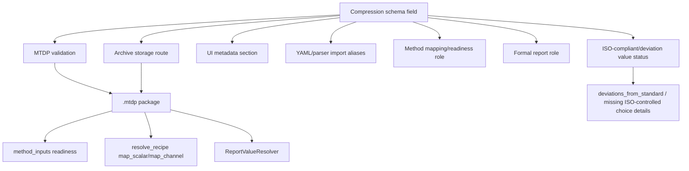
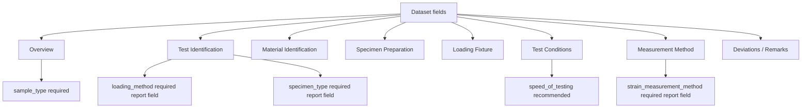
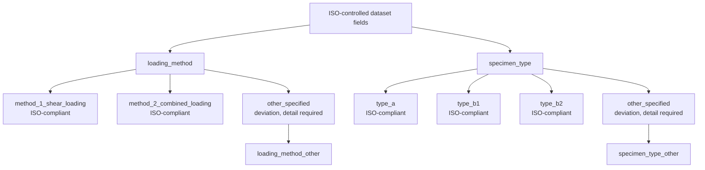
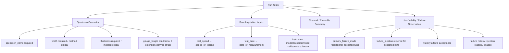
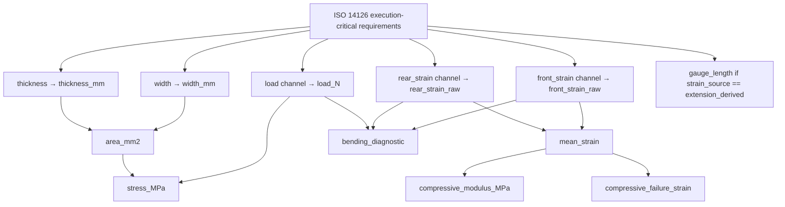
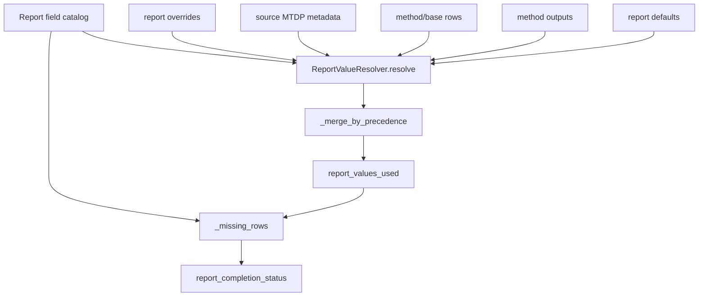

# Schema, Method, and Report Field Matrix

## Scope

This document maps the compression MTDP schema fields into their main downstream responsibilities: MTDP validity, method readiness, ISO method execution, formal report completion, ISO deviation handling, and failure-analysis reporting.

This is not a replacement for the schema YAML. It is a navigation matrix for development and review.

## Source anchors

| Flow area | Code anchor |
|---|---|
| Compression schema | `src/mtdp_enrichment/schema_library/mechanical/compression/0.3.0.yaml` |
| Schema model | `src/mtdp_enrichment/package/schema.py` |
| Field definition model | `src/mtdp_enrichment/models/field_definition.py` |
| ISO 14126 method inputs | `src/methods/iso14126/method_inputs.yaml` |
| ISO 14126 resolve recipe | `src/methods/iso14126/resolve_recipe.yaml` |
| Report value resolver | `src/reporting/completion/report_value_resolver.py` |
| Report engine ISO additions | `src/reporting/core/report_engine.py` |

---

## L2 — Field responsibility layers

## Gate distinction

| Gate | Meaning |
|---|---|
| MTDP required | Field must exist for package export. |
| Method execution-critical | Field/channel must exist for method execution. |
| Report required | Field is required for formal report completion. |
| Report recommended | Missing field is surfaced but does not necessarily block formal use. |
| ISO compliant/deviation | Specific controlled values determine whether a report value is standard-compliant or a deviation. |
| Failure-analysis required for accepted runs | Field may be required only for runs included in final report statistics. |

---

## L2 — Dataset field groups

## Dataset matrix

| Field group | Key fields | Storage | Report role / importance | Method relevance |
|---|---|---|---|---|
| Overview | `sample_type`, `treatment`, `material_label` | `dataset_json` | sample type required; treatment/material recommended | Group identity and report identity. |
| Test Identification | `test_id`, `report_operator`, `loading_method`, `loading_method_other`, `specimen_type`, `specimen_type_other` | `dataset_json.report.test_identification.*` | loading method and specimen type required; operator/test ID recommended | Loading/specimen type influence ISO report/deviation status. |
| Material Identification | material type, matrix, reinforcement, manufacturer, code, source, form, history | `dataset_json.report.material.*` | mostly recommended | Report completeness. |
| Specimen Preparation | cutting direction, fibre orientation, layup, preparation, end tabs, surface preparation, notes | `dataset_json.report.specimen_preparation.*` | mostly recommended | Report completeness; end-tab context. |
| Loading Fixture | fixture type, standard reference, manufacturer/design, alignment, notes | `dataset_json.report.fixture.*` | fixture type/design/alignment recommended | Report completeness and method context. |
| Test Conditions | conditioning, temperature, humidity, conditioning time, environment, speed | `dataset_json.report.test_conditions.*` | mostly recommended | Speed is report-completeness readiness input. |
| Measurement Method | strain measurement method, location, acquisition system, sampling rate, notes | `dataset_json.report.measurement.*` | strain measurement method required; others recommended/optional | Strain method is report-completeness readiness input. |
| Deviations / Remarks | deviations from standard, remarks | `dataset_json.report.*` | optional | ISO explanation context. |

---

## L3 — ISO-controlled dataset choices

## Controlled-choice contract

| Field | ISO-compliant values | Deviation value | Detail field |
|---|---|---|---|
| `loading_method` | `method_1_shear_loading`, `method_2_combined_loading` | `other_specified` | `loading_method_other`, required when other specified. |
| `specimen_type` | `type_a`, `type_b1`, `type_b2` | `other_specified` | `specimen_type_other`, required when other specified. |

---

## L2 — Run field groups

## Run matrix

| Field group | Key fields | Storage | Report / method role |
|---|---|---|---|
| Specimen Geometry | `specimen_name`, `sample_id`, `width`, `thickness`, `gauge_length`, unsupported/tab dimensions | `token_preamble` | specimen name, width, thickness are package/report-critical; width/thickness are method execution-critical. |
| Acquisition Inputs | `operator`, `instrument_model`, `instrument_id`, `instrument_location`, `load_cell`, `test_speed`, `test_date`, `source_software` | mostly `provenance` | report metadata, report completeness, acquisition context. |
| Channel / Preamble Summary | `run_notes` | provenance | optional report notes. |
| Failure Observation | `primary_failure_mode`, `failure_location`, `invalid_specimen_reason`, `visible_buckling_or_bending_observation`, `failure_image_reference`, `validity`, `requires_review`, `rejection_reason` | mostly `token_preamble` | failure analysis, acceptance, ISO report completion for accepted/final runs. |

---

## L3 — Method-critical fields/channels

## Method-critical matrix

| Requirement | Source role | Method field | Scope | Expected unit | Downstream use |
|---|---|---|---|---|---|
| `iso14126.geometry.width` | width | `specimen.width_mm` | per run | mm | area, stress, strength. |
| `iso14126.geometry.thickness` | thickness | `specimen.thickness_mm` | per run | mm | area, stress, strength. |
| `iso14126.channel.load` | load | `channel.load_N` | per run | N | stress curve, strength, bending window. |
| `iso14126.channel.front_strain` | front_strain | `channel.front_strain` | per run | mm/mm | mean strain, bending, modulus, failure strain. |
| `iso14126.channel.rear_strain` | rear_strain | `channel.rear_strain` | per run | mm/mm | mean strain, bending, modulus, failure strain. |
| `iso14126.geometry.gauge_length_if_extension_strain` | gauge_length | `specimen.gauge_length_mm` | per run | mm | only required when strain source is extension-derived. |

---

## L3 — Report value precedence

## Report-value precedence

1. Report overrides.
2. Source MTDP metadata.
3. Base method/report rows.
4. Method outputs.
5. Report defaults.

This precedence matters: a report override can intentionally supply or correct a formal field without mutating the source MTDP or recalculating method outputs.

---

## L4 — Field lifecycle contract

| Field class | MTDP storage | Method execution | Report use | Special risk |
|---|---|---|---|---|
| Dataset identity | `dataset.json` | Usually not execution-critical | formal identity and grouping | sample type is required for package grouping. |
| ISO controlled choices | `dataset.json.report.test_identification` | not calculation-critical | required report fields and deviation logic | other-specified requires detail. |
| Specimen geometry | token preamble | width/thickness critical | formal geometry and calculated values | numeric/unit coercion and parser-token fallback. |
| Acquisition metadata | provenance or dataset JSON | not calculation-critical | report completion | first available run may satisfy report value. |
| Failure observation | token preamble | not calculation-critical | failure analysis and acceptance | required for accepted/final runs; default not recorded can hide missing observation. |
| Numeric channels | normalized CSV channels | load/front/rear strain critical | curves/results | parser/channel classification and mapping quality. |

## Open residuals

1. A generated CSV table listing every schema field with field_id, scope, storage, report_role, report_importance, method_role, and aliases would be valuable for automated review.
2. The schema has `required_for_accepted_runs` report importance values; report-completion logic should be checked for consistent treatment.
3. First-run metadata fallback for run-scoped report fields should be reviewed where dataset-level value would be more appropriate.
4. Controlled-choice status is implemented both in schema value maps and report engine ISO helpers; ensure they remain aligned.
