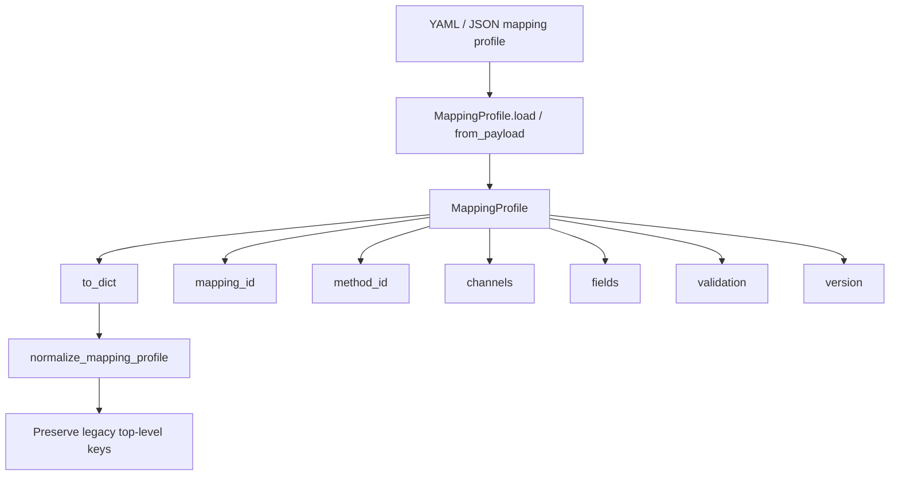
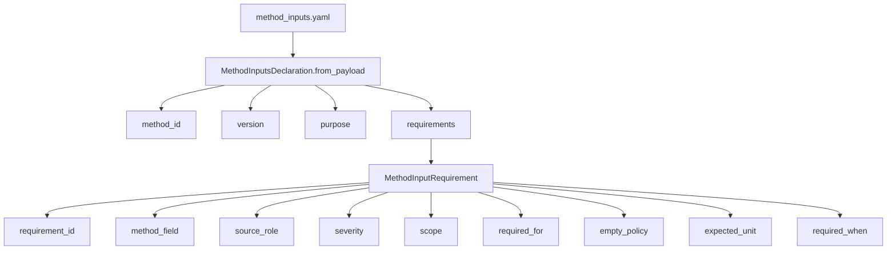
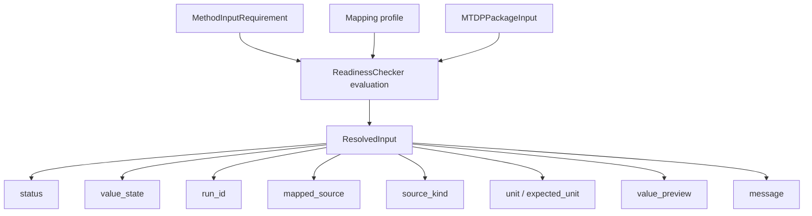
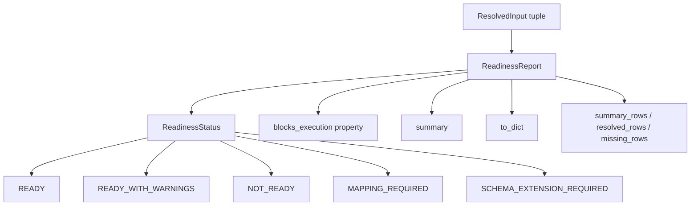

# Mapping and Readiness Schema Contracts

## Scope

This document captures the concrete data contracts behind MTDA mapping and readiness. It complements `21_mapping_to_readiness_resolution.md` by documenting the profile/declaration/report objects rather than only the process route.

## Source anchors

| Contract | Code anchor |
|---|---|
| Analysis mapping profile | `src/mapping/mapping_profile.py` |
| Mapping candidate discovery | `src/mapping/mapping_candidate_discovery.py` |
| Mapping resolution report | `src/mapping/mapping_disambiguation.py` |
| Readiness models | `src/readiness/readiness_models.py` |
| Readiness report | `src/readiness/readiness_report.py` |
| Readiness checker | `src/readiness/readiness_checker.py` |
| ISO method inputs | `src/methods/iso14126/method_inputs.yaml` |

---

## L2 — Mapping profile contract

## Mapping profile fields

| Field | Meaning |
|---|---|
| `schema_id` | Written as `method.mapping_profile.v0_2` by `to_dict`. |
| `version` | Mapping profile version; defaults to `0.2`. |
| `mapping_id` | Stable mapping identifier. |
| `method_id` | Method the mapping belongs to. |
| `channels` | Role-to-channel bindings, e.g. `load`, `front_strain`, `rear_strain`. |
| `fields` | Role-to-token/field bindings, e.g. `width`, `thickness`, `failure_mode`. |
| `validation` | Validation-specific configuration such as `reference_values_path`. |

## Mapping value forms

A mapping entry may be either a direct string value or a mapping object. Downstream code recognises object keys such as `name`, `token`, `channel`, `source`, and `field` depending on context. Ambiguous or unresolved entries must not be treated as clean mappings during readiness.

---

## L2 — Method input declaration contract

## MethodInputRequirement fields

| Field | Meaning |
|---|---|
| `requirement_id` | Stable requirement identifier. |
| `method_field` | Method-side target, e.g. `channel.load_N` or `specimen.width_mm`. |
| `source_role` | Mapping role expected in profile/candidate discovery. |
| `severity` | Usually `execution_critical` or `report_completeness`. |
| `scope` | `per_run`, `per_dataset`, or `per_package`. |
| `required_for` | Human-readable downstream purposes, e.g. stress calculation or test report. |
| `empty_policy` | Behaviour for empty values; currently commonly `fail` or `warn`. |
| `expected_unit` | Unit expected for mapped source. |
| `required_when` | Conditional expression such as `strain_source == extension_derived`. |

---

## L3 — Resolved input contract

## ResolvedInput fields

| Field | Meaning |
|---|---|
| `requirement_id`, `method_field`, `source_role` | Requirement identity. |
| `severity`, `scope`, `required_for` | Gate class and reason. |
| `run_id` | Present for per-run inputs. |
| `mapped_source` | Source selected by mapping profile. |
| `source_kind` | Channel, field/token, dataset, or package style source. |
| `status` | Pass or failure class such as mapping missing / missing / failed. |
| `value_state` | Human-readable value state. |
| `unit`, `expected_unit` | Unit comparison context. |
| `value_preview` | Preview for UI/report debugging. |
| `message` | Explanation for status. |

---

## L2 — Readiness report contract

## ReadinessStatus meanings

| Status | Blocks execution? | Meaning |
|---|---:|---|
| `READY` | No | All evaluated requirements pass. |
| `READY_WITH_WARNINGS` | No | Execution can proceed, but non-critical/report warnings exist. |
| `NOT_READY` | Yes | Critical mapped inputs are missing, empty, or failed. |
| `MAPPING_REQUIRED` | Yes | Critical mapping is missing. |
| `SCHEMA_EXTENSION_REQUIRED` | Yes | Method/schema compatibility requires extension before execution. |

## Readiness summary counts

| Summary key | Meaning |
|---|---|
| `execution_critical_total` | Count of critical execution requirements. |
| `execution_critical_passed` | Count of passing critical requirements. |
| `execution_critical_missing` | Critical requirements not passing. |
| `execution_critical_mapping_missing` | Critical requirements without mapping. |
| `report_missing_total` | Non-critical/report requirements not passing. |
| `warnings_total` | Non-critical failed rows plus explicit warnings. |
| `missing_total` | All non-pass requirements. |
| `mapping_missing_total` | All mapping-missing requirements. |
| `resolved_total` | All passing requirements. |
| `requirement_total` | Total evaluated requirements. |

---

## L4 — Contract boundary matrix

| Contract | Producer | Consumer | Failure effect |
|---|---|---|---|
| `method.mapping_profile.v0_2` | Mapping file loader / mapping dialog | Candidate discovery, readiness, method execution | Missing critical mappings block readiness/execution. |
| `MethodInputsDeclaration` | Method package `method_inputs.yaml` | Readiness checker and candidate discovery | Empty declaration creates empty ready report. |
| `MethodInputRequirement` | Declaration parser | Candidate discovery/readiness | Bad scope/source role can misroute readiness. |
| `mapping_candidate_report` | Candidate discovery | Mapping dialog/resolution report/writer | Ambiguous or missing candidates require operator review. |
| `mapping_resolution_report` | Mapping disambiguation | Wizard summary and MTDA archive | Confirms whether profile points to package-backed candidate. |
| `ReadinessReport` | Readiness checker | Wizard gate, service gate, executor gate, MTDA archive | Blocking statuses prevent execution. |

## Open residuals

1. Full mapping dialog UI state machine.
2. Compatibility checker schema-extension contract.
3. Exact row-level statuses emitted by the readiness checker should be exhaustively enumerated from tests.
4. The treatment of ambiguous/unresolved mapping entries should be tested as a hard non-pass path for critical requirements.
