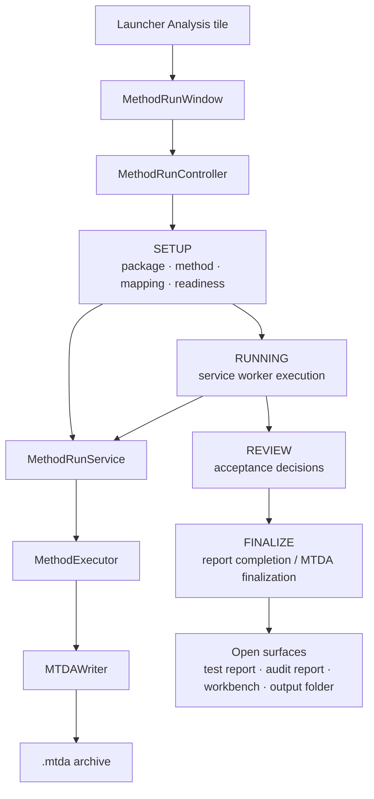
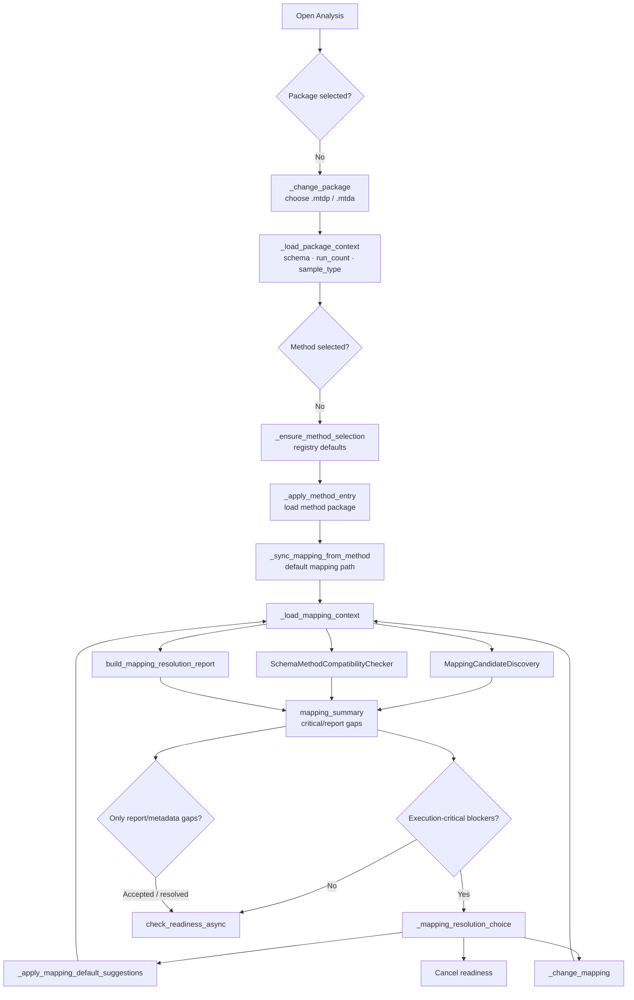
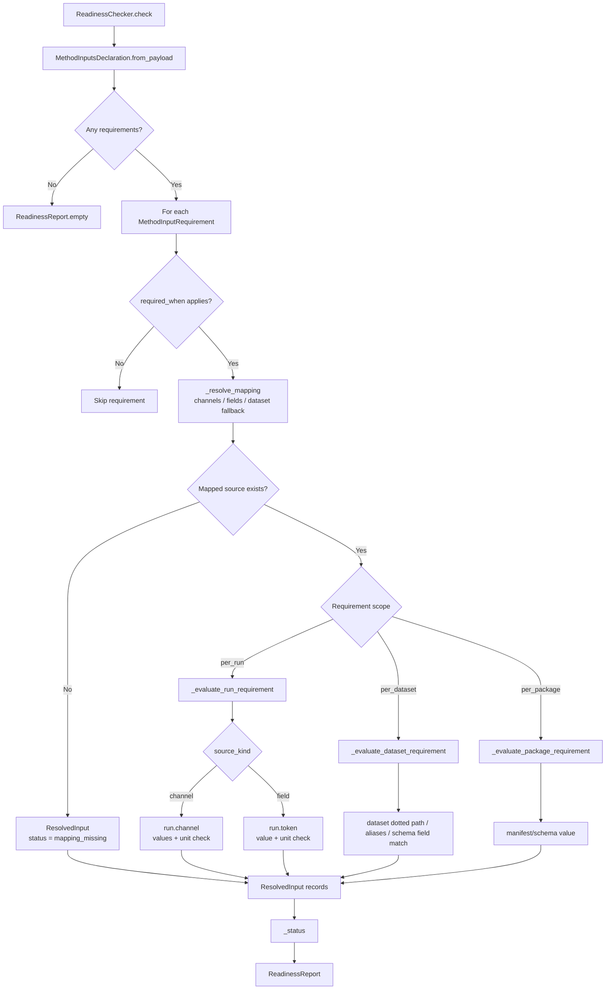
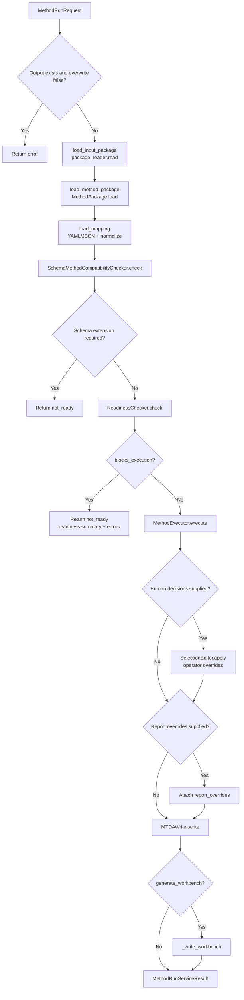
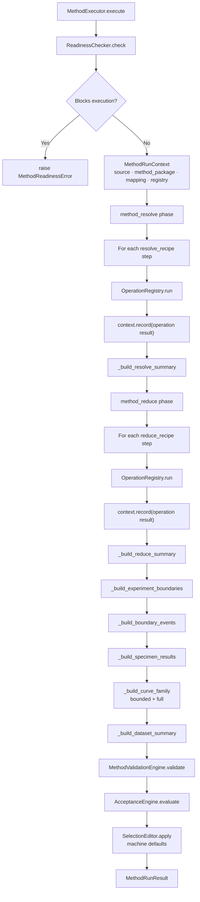
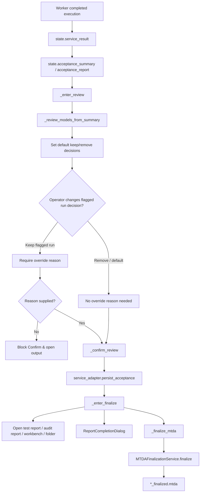
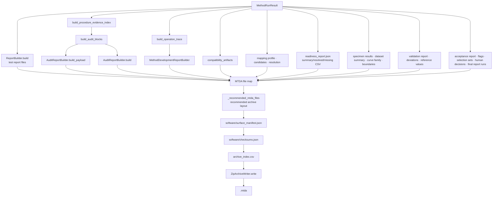

# Analysis [MTDA] Process Flows

## Scope

This document describes the current MTDA analysis process. The goal is to make explicit how a prepared `.mtdp` package becomes a `.mtda` archive with reports, audit evidence, workbench output, validation outputs, and acceptance information.

This document should be expanded over time into finer drill-downs for method packages, mapping resolution, readiness, operations, validation, acceptance, report generation, archive layout, and finalization.

## Source anchors

| Flow area | Code anchor |
|---|---|
| Method wizard controller | `src/ui/method_run_wizard/controller.py` |
| Method wizard service adapter | `src/ui/method_run_wizard/service_adapter.py` |
| Method run worker | `src/ui/method_run_wizard/worker.py` |
| Method run backend service | `src/methods/core/method_run_service.py` |
| Readiness checker | `src/readiness/readiness_checker.py` |
| Method executor | `src/methods/core/method_executor.py` |
| Method package loader | `src/methods/core/method_package.py` |
| Operation registry | `src/operations/core/operation_registry.py` |
| Validation engine | `src/validation/validation_engine.py` |
| Acceptance engine | `src/acceptance/acceptance_engine.py` |
| Selection editor | `src/acceptance/selection_editor.py` |
| MTDA writer | `src/archives/mtda/writer.py` |
| MTDA finalization | `src/mtda_finalization/` |

---

## L1 — MTDA analysis overview

---

## L2 — Wizard setup and readiness route

### Current behaviour

The wizard does not move directly from package selection to execution. It first resolves method and mapping context, exposes mapping blockers, permits suggested repair or mapping editing, and then runs readiness asynchronously.

### Follow-up drill-downs required

- Method registry defaults.
- Mapping dialog model and suggested default repair.
- Metadata/report-completion gaps vs execution-critical blockers.
- Setup task cards and action-bar logic.

---

## L2 — Readiness check

### Status meaning

| Status | Meaning |
|---|---|
| `MAPPING_REQUIRED` | At least one execution-critical requirement has no mapping. |
| `NOT_READY` | An execution-critical requirement is present in mapping but missing/empty/failed in the package. |
| `READY_WITH_WARNINGS` | Execution can proceed, but report/completeness/warning inputs are missing or imperfect. |
| `READY` | All evaluated requirements pass. |

### Follow-up drill-downs required

- Method input declaration schema.
- Mapping profile schema.
- Dataset fallback resolution.
- Unit-compatibility policy.
- Reporting of per-run vs per-dataset readiness rows.

---

## L2 — Service execution phases

### Current phase sequence

The UI adapter defines the execution phases as:

1. `load_input_package`
2. `load_method_package`
3. `load_mapping`
4. `readiness_check`
5. `method_resolve`
6. `method_reduce`
7. `validation`
8. `acceptance`
9. `write_mtda`
10. `build_audit_report`
11. `build_workbench_optional`
12. `complete`

### Follow-up drill-downs required

- Worker signal behaviour.
- Progress event payloads.
- Error and cancellation paths.
- Difference between service-level acceptance decisions and wizard review persistence.

---

## L2 — Method executor internals

### Current responsibility

The executor is the core analysis engine. It converts a source package, method package, and mapping into a structured `MethodRunResult` containing:

- Readiness report and resolved/missing inputs.
- Per-specimen results.
- Dataset summary.
- Bounded and full curve-family data.
- Operation log.
- Evidence index inputs.
- Validation report and deviations.
- Acceptance report and selection sets.
- Boundary events.
- Human-decision and final-selection structures.

### Follow-up drill-downs required

- `MethodRunContext` data model.
- Operation registry and operation contracts.
- Resolve recipe step semantics.
- Reduce recipe step semantics.
- Boundary detection and bounded/full curve-family distinction.
- Bending diagnostic data path.

---

## L2 — Review and finalization route

### Current responsibility

The review stage is an execution-output review stage, not a method-definition stage and not a package-preparation stage. Its main concern is acceptance decisions and final report membership.

### Follow-up drill-downs required

- Difference between machine selection, human override, and final report runs.
- Persistence of review decisions into MTDA.
- Finalization amendment request structure.
- Report-completion dialog behaviour.

---

## L3 — MTDA archive writing

## L4 — MTDA archive contract matrix

| Member / area | Producer | Purpose |
|---|---|---|
| `manifest.json` | `build_mtda_manifest` | Top-level MTDA archive metadata. |
| `source_reference.json` | `_source_reference` | Links MTDA output to source MTDP package. |
| `mapping_profile.json` | `MTDAWriter.write` | Captures mapping used by run. |
| `mapping/*` | Mapping report builders | Stores used mapping, candidate discovery, resolution report. |
| `readiness/*` | `ReadinessChecker` output | Stores readiness report, summary, resolved and missing inputs. |
| `method_outputs/*` | `MethodExecutor` result | Stores specimen results, dataset summary, curves, boundaries. |
| `validation/*` | `MethodValidationEngine` | Stores validation report, deviations, reference values. |
| `acceptance/*` | `AcceptanceEngine` / `SelectionEditor` | Stores acceptance report, flags, selection sets, human decisions, final report runs. |
| `audit/procedure_evidence_index.json` | `build_procedure_evidence_index` | Index from outputs/procedures to evidence. |
| `audit/audit_blocks.json` | `build_audit_blocks` | Human-facing audit block grouping. |
| `audit/audit_report.html/json` | `AuditReportBuilder` | Audit report surface and data payload. |
| `workbench/index.html` | `MethodDevelopmentReportBuilder` | Operation-level development/debug surface. |
| `report/test_report.html/json/pdf` | `ReportBuilder` / recommended layout | Formal result-facing test report. |
| `software/surface_manifest.json` | `build_surface_manifest` | Surface discovery metadata. |
| `software/checksums.json` | `build_checksums` | Archive integrity metadata. |
| `archive_index.csv` | `_archive_index_rows` | Flat archive member index. |

## Known missing drill-downs

The following should be documented next:

1. Method package structure and recipe YAML contracts.
2. Mapping profile schema and candidate/resolution report structure.
3. Readiness report row model.
4. Operation registry and individual operation flow.
5. Validation engine policies.
6. Acceptance engine policies and selection-set logic.
7. Procedure evidence index and audit block construction.
8. Test report builder structure.
9. MTDA finalization and amendment flow.
