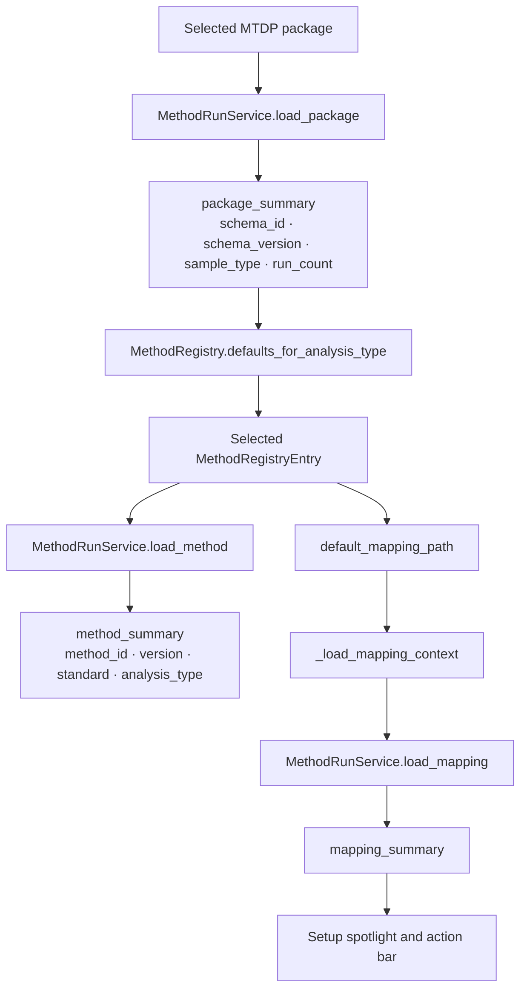
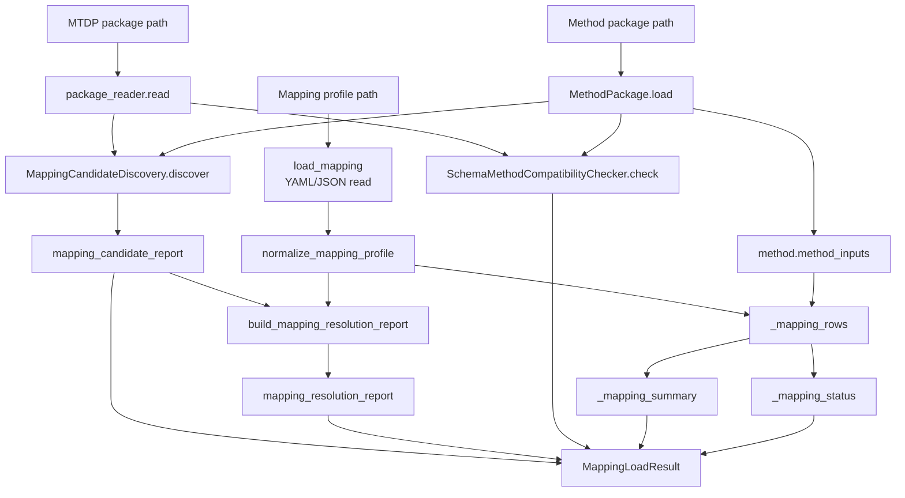
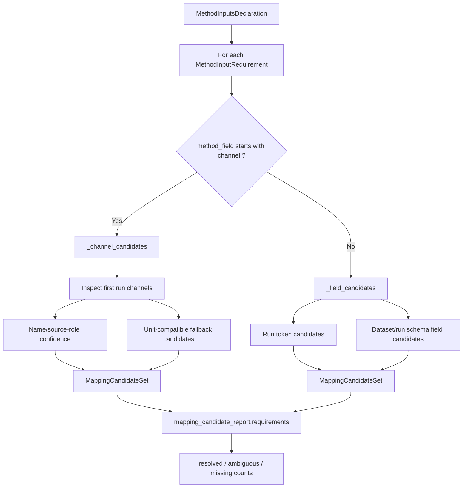
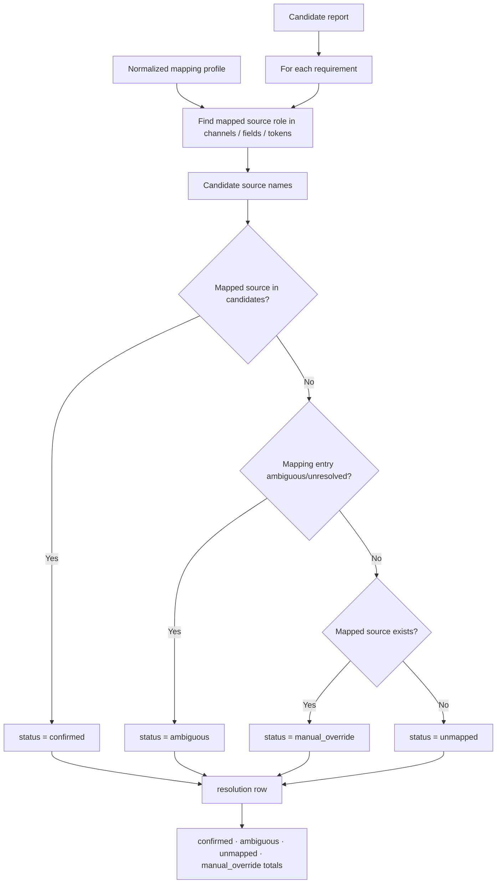
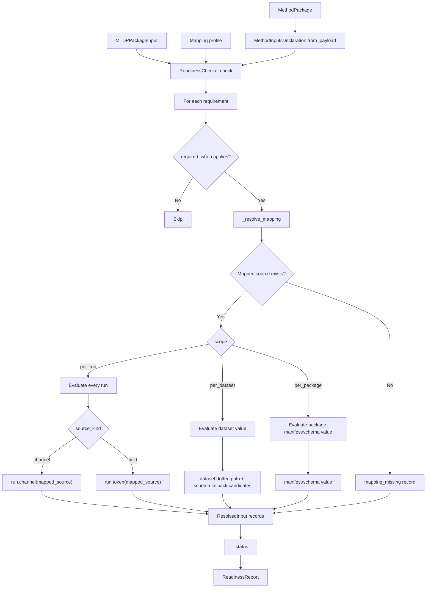
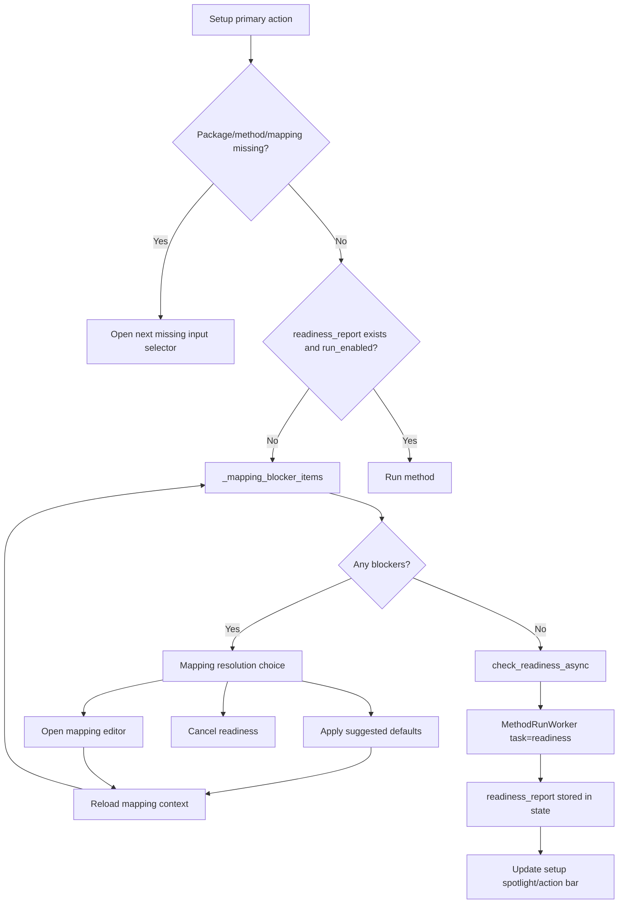

# Mapping to Readiness Resolution

## Scope

This document describes how the analysis side moves from a selected MTDP package, method package, and mapping profile into a readiness decision.

It focuses on mapping candidate discovery, mapping resolution, readiness requirement evaluation, and wizard gate behaviour. It does not document the detailed method execution operations after readiness passes.

## Source anchors

| Flow area | Code anchor |
|---|---|
| Wizard setup/controller | `src/ui/method_run_wizard/controller.py` |
| Service adapter readiness worker creation | `src/ui/method_run_wizard/service_adapter.py` |
| Backend method run service | `src/methods/core/method_run_service.py` |
| Mapping profile loading | `src/methods/core/method_run_service.py::load_mapping` |
| Candidate discovery | `src/mapping/mapping_candidate_discovery.py` |
| Mapping resolution report | `src/mapping/mapping_disambiguation.py` |
| Compatibility checker | `src/compatibility/` |
| Readiness checker | `src/readiness/readiness_checker.py` |
| Readiness models/report | `src/readiness/readiness_models.py`, `src/readiness/readiness_report.py` |
| Method package input declaration | `src/methods/core/method_package.py`, method package `method_inputs.yaml` |

---

## L2 — Wizard-side mapping context

### Current behaviour

The wizard chooses method defaults based on the selected package analysis type. Once a method entry is selected, its default mapping is loaded and analysed against both the package and the method declaration.

---

## L2 — Backend mapping load and analysis

## Mapping load output contract

| Output | Purpose |
|---|---|
| `mapped_fields` | Per-requirement mapping rows consumed by wizard summaries. |
| `status` | Complete/incomplete-style status derived from mapping rows. |
| `summary` | Counts for execution-critical and report mappings. |
| `compatibility_report` | Package/schema compatibility against method requirements. |
| `candidate_report` | Package-backed candidate sources for method inputs. |
| `resolution_report` | Whether mapped sources are confirmed, ambiguous, unmapped, or manual overrides. |

---

## L3 — Candidate discovery

### Candidate selection notes

Candidate discovery is not the same as readiness. It proposes package-backed sources for declared method roles. Readiness later checks whether the selected/mapped source is actually present, non-empty, unit-compatible enough, and scoped correctly.

### Current candidate heuristics

| Candidate type | Current basis |
|---|---|
| Channel exact match | Source role equals package channel name. |
| Channel name containment | Role appears in channel name or vice versa. |
| Front/rear strain | Name tokens include front/rear and strain, or unit-compatible strain fallback. |
| Load/force | Name or unit-compatible force dimension. |
| Extension/displacement | Unit-compatible length dimension. |
| Time | Unit-compatible time dimension. |
| Run tokens | Token name match or unit-compatible fallback. |
| Schema fields | Field id, role, report_role, aliases, unit-compatible fallback. |

---

## L3 — Mapping resolution report

## Resolution meanings

| Status | Meaning |
|---|---|
| `confirmed` | Mapping points to one of the discovered package-backed candidates. |
| `ambiguous` | Mapping entry or candidate set is ambiguous/unresolved. |
| `manual_override` | Mapping points to a source that was not among discovered candidates. |
| `unmapped` | No source is mapped for the requirement. |

---

## L2 — Readiness evaluation

## Readiness gates

| Condition | Resulting status |
|---|---|
| Execution-critical mapping missing | `MAPPING_REQUIRED` |
| Execution-critical mapped input missing/empty/failed | `NOT_READY` |
| Non-critical/report inputs missing or warning states present | `READY_WITH_WARNINGS` |
| All evaluated inputs pass | `READY` |

---

## L3 — Wizard gate behaviour after mapping/readiness

## Important distinction

The wizard currently has two categories of unresolved items:

1. **Execution blockers**: prevent readiness or execution, usually missing critical mappings or critical package inputs.
2. **Report/metadata gaps**: can allow execution with warnings, but need explicit operator handling or report-completion handling.

These should remain visually and semantically separate in future UI and documentation.

---

## L4 — Data contract matrix

| Source | Transformation | Destination | Failure/gate behaviour |
|---|---|---|---|
| Method package `method_inputs.yaml` | `MethodInputsDeclaration.from_payload` | Requirement list | Empty declaration returns empty readiness report. |
| MTDP package channels/tokens/dataset | `MappingCandidateDiscovery` | Candidate report | Missing/ambiguous candidates become mapping summary concerns, not direct readiness results. |
| Mapping profile | `normalize_mapping_profile` | Normalized mapping | Load errors block setup mapping context. |
| Mapping + candidate report | `build_mapping_resolution_report` | Resolution report | Ambiguous/unmapped statuses feed mapping summary. |
| Source + method + mapping | `ReadinessChecker.check` | Readiness report | Execution-critical missing values block execution. |
| Readiness report | Controller state | Setup action bar / run enablement | Failed readiness keeps wizard in setup. |

## Open drill-downs

1. Exact mapping profile schema.
2. Method input declaration schema.
3. Mapping dialog interaction model.
4. Suggested default mapping repair logic.
5. Compatibility checker report structure.
6. Readiness report object and row model.
7. Run-enabled calculation and warning/metadata decision handling.
