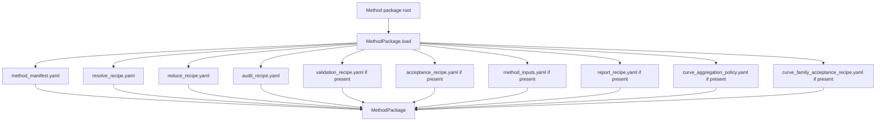
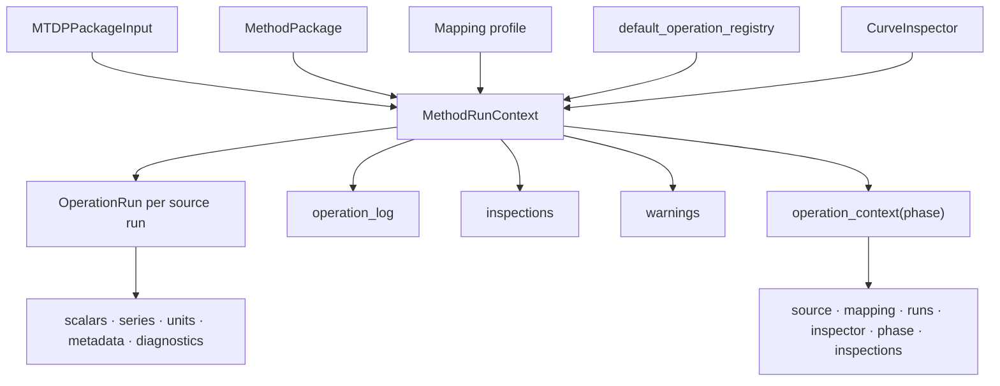
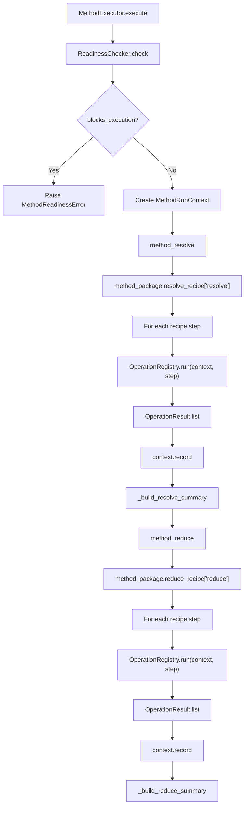
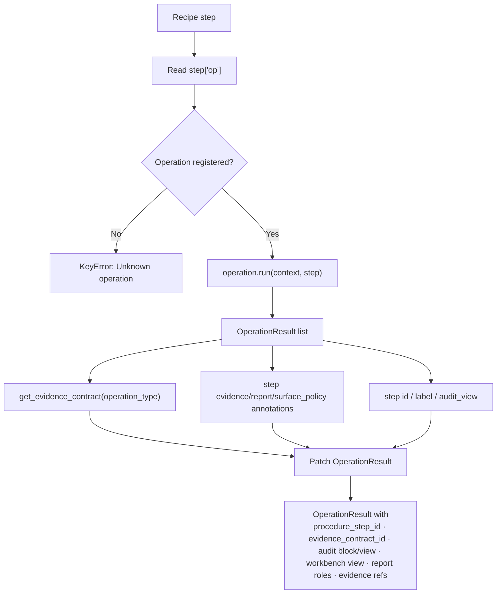
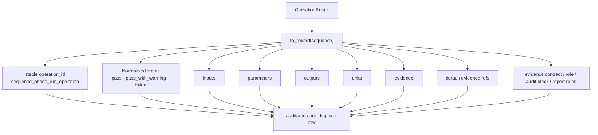
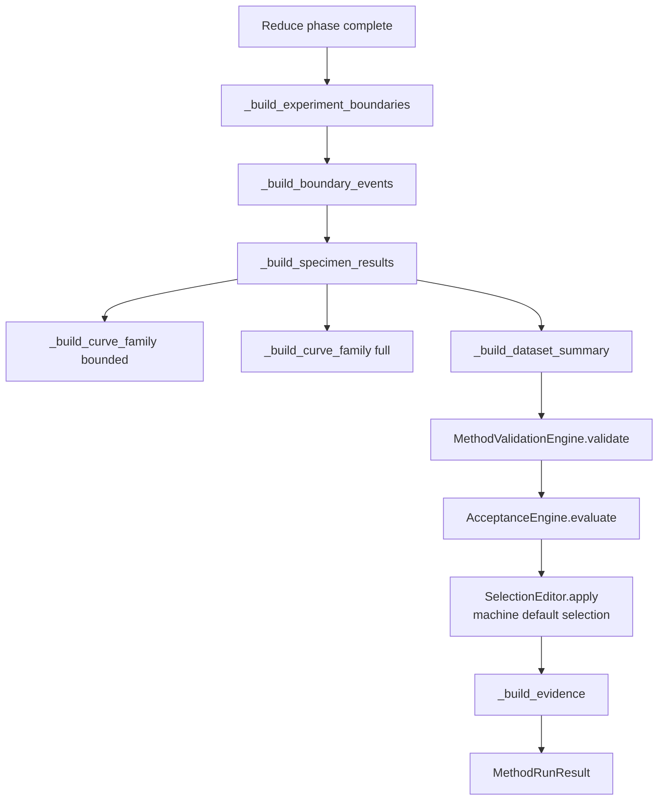
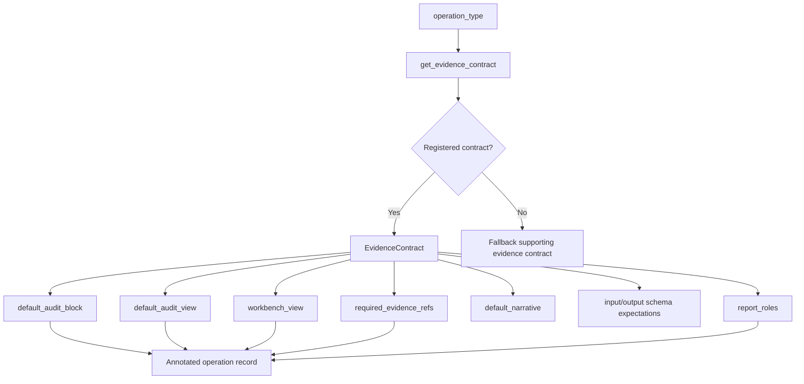

# Method Package and Operation Execution Flow

## Scope

This document describes how a method package is loaded and executed through resolve/reduce recipes, operation registry dispatch, operation result logging, evidence contracts, validation, acceptance, and `MethodRunResult` assembly.

It focuses on the computation/evidence spine after readiness has passed. It does not fully document each individual operation implementation.

## Source anchors

| Flow area | Code anchor |
|---|---|
| Method package loader | `src/methods/core/method_package.py` |
| Method executor | `src/methods/core/method_executor.py` |
| Method run context | `src/methods/core/method_context.py` |
| Operation registry | `src/operations/core/operation_registry.py` |
| Operation interface | `src/operations/core/operation.py` |
| Operation context/run model | `src/operations/core/operation_context.py` |
| Operation result model | `src/operations/core/operation_result.py` |
| Operation evidence contracts | `src/operations/core/operation_contract_registry.py` |
| Validation engine | `src/validation/validation_engine.py` |
| Acceptance engine | `src/acceptance/acceptance_engine.py` |
| Selection editor | `src/acceptance/selection_editor.py` |

---

## L2 — Method package load contract

## Method package file roles

| File | Current role |
|---|---|
| `method_manifest.yaml` | Method id, version, name, status, analysis type, standard reference, expected outputs, limitations. |
| `method_inputs.yaml` | Declares method input requirements used by mapping and readiness. |
| `resolve_recipe.yaml` | Recipe steps for binding source data and deriving prerequisite resolved inputs. |
| `reduce_recipe.yaml` | Recipe steps for reducing method outputs such as strength, modulus, strain, bending diagnostics. |
| `validation_recipe.yaml` | Validation policy input. |
| `acceptance_recipe.yaml` | Acceptance policy input. |
| `audit_recipe.yaml` | Audit/report evidence configuration input. |
| `report_recipe.yaml` | Test-report structure/input. |
| `curve_aggregation_policy.yaml` | Curve aggregation policy. |
| `curve_family_acceptance_recipe.yaml` | Curve-family acceptance and diagnostic policy. |
| Additional package files | `bending_assessment_policy.yaml`, `export_recipe.yaml`, and `plot_style_recipe.yaml` may be included in recipe_files if present. |

---

## L2 — Execution context creation

## Current context responsibility

`MethodRunContext` converts each source run into an `OperationRun` with mutable analysis state. Operations add scalars, series, units, diagnostics, metadata, warnings, inspections, and operation records as the recipes execute.

---

## L2 — Resolve/reduce recipe execution

## Recipe step contract

Each recipe step must be a mapping and must include an `op` value. The registry looks up the operation by `op`, runs it, then annotates the returned operation results with recipe/evidence/report metadata.

---

## L3 — Operation registry dispatch and evidence annotation

## Default operation registry

The current default registry registers these operations:

| Operation class | Purpose area |
|---|---|
| `MapChannelOperation` | Bind package channels into operation state. |
| `MapScalarOperation` | Bind scalar/token/package values. |
| `DeriveAreaOperation` | Derive cross-sectional area. |
| `OrientStrainChannelsOperation` | Orient strain channels. |
| `DeriveSeriesMeanOperation` | Construct mean series. |
| `ResolveExperimentBoundariesOperation` | Resolve analysis interval boundaries. |
| `DeriveSeriesByScalarOperation` | Derive series such as stress from load/area. |
| `MaxPointOperation` | Find maximum point. |
| `AcceptedPeakPointOperation` | Resolve accepted peak point. |
| `ValueAtIndexOperation` | Sample value at an index. |
| `ChordSlopeOperation` | Compute chord-slope modulus. |
| `BendingDiagnosticOperation` | Compute bending diagnostics. |

---

## L3 — Operation result and operation log record

## OperationResult record importance

Operation results are the core bridge between computation and audit/report surfaces. They carry both computational outputs and evidence routing metadata.

| Field group | Why it matters |
|---|---|
| `inputs`, `parameters`, `outputs`, `units` | Reconstructs what the operation did. |
| `warnings`, `status` | Feeds warning/failed operation evidence. |
| `evidence`, `inspection_refs` | Links operation to deeper diagnostic evidence. |
| `procedure_step_id`, `recipe_step_id`, `recipe_step_label` | Links operation back to method recipe/procedure. |
| `evidence_contract_id`, `evidence_role` | Controls audit/report interpretation. |
| `default_audit_block`, `default_audit_view`, `workbench_view` | Controls how evidence surfaces are grouped/displayed. |
| `report_roles` | Links operation evidence to formal report values. |
| `evidence_refs` | Links operation to archive members and report/workbench artifacts. |

---

## L2 — Post-operation result assembly

## Result assembly outputs

| Output | Producer | Purpose |
|---|---|---|
| `resolve_summary` | `_build_resolve_summary` | Summarises bound scalars/series and source metadata after resolve. |
| `reduce_summary` | `_build_reduce_summary` | Summarises key reduced outputs and diagnostics. |
| `experiment_boundaries` | `_build_experiment_boundaries` | Captures analysis interval definitions. |
| `boundary_events` | `_build_boundary_events` | Flattens boundary events for audit/report surfaces. |
| `specimen_results` | `_build_specimen_results` | Per-run reduced result rows. |
| `curve_family` | `_build_curve_family` | Bounded stress/strain family table. |
| `full_curve_family` | `_build_curve_family(bounded=False)` | Full curve table. |
| `dataset_summary` | `_build_dataset_summary` | Aggregate summary rows. |
| `validation_report` | `MethodValidationEngine` | Validation status and deviations. |
| `acceptance_report` | `AcceptanceEngine` | Acceptance flags, selection sets, curve-family diagnostics. |
| `final selection structures` | `SelectionEditor` | Machine/default selection and future human override structures. |
| `evidence` | `_build_evidence` | Summary evidence index inputs. |

---

## L3 — Evidence contract layer

## Evidence-contract implications

Evidence contracts are currently the key mechanism preventing the audit report from becoming just one plot per operation. They allow operations to be grouped into human-auditable blocks such as:

- run identity and status
- run stress-strain reduction
- run bending evidence
- run validation evidence
- run selection consequence
- aggregate curve family
- aggregate curve diagnostics
- aggregate statistics

---

## L4 — Operation execution data contract

| Source | Transformation | Destination | Failure/gate behaviour |
|---|---|---|---|
| Method recipe step | `OperationRegistry.run` | Operation class dispatch | Missing `op` raises `ValueError`; unknown op raises `KeyError`. |
| Operation context state | Operation implementation | OperationResult list | Operation-specific failures/warnings become result status/warnings or exceptions. |
| OperationResult | Registry evidence patching | Annotated OperationResult | Missing contract uses fallback evidence contract. |
| Annotated OperationResult | `context.record` | `operation_log` record | Warnings copied into context warnings list. |
| Operation state | Result builders | specimen/dataset/curve/evidence outputs | Missing expected scalars/series can propagate to validation/acceptance/report gaps. |
| Validation/acceptance outputs | MethodRunResult | MTDA writer inputs | Archive/report generation depends on these structured results. |

## Open drill-downs

1. Individual operation flows and input/output contracts.
2. Resolve recipe for the current ISO 14126 compression method.
3. Reduce recipe for the current ISO 14126 compression method.
4. Boundary-resolution operation internals.
5. Bending diagnostic operation internals.
6. Validation engine policy and output rows.
7. Acceptance engine policy, discharge logic, and selection-set creation.
8. Evidence contract completeness versus report/audit/workbench surfaces.
