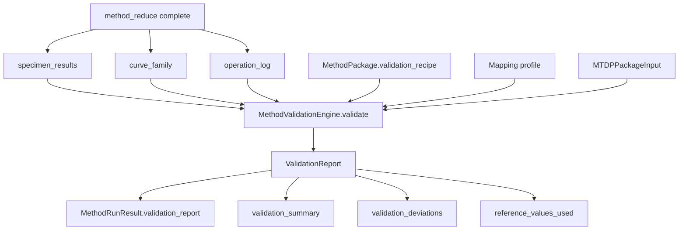
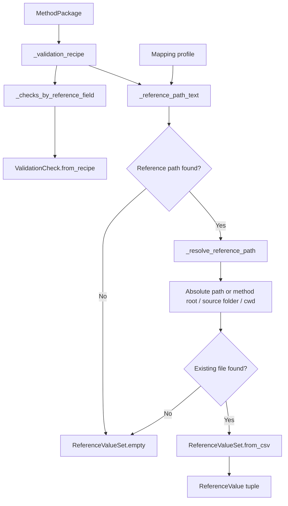
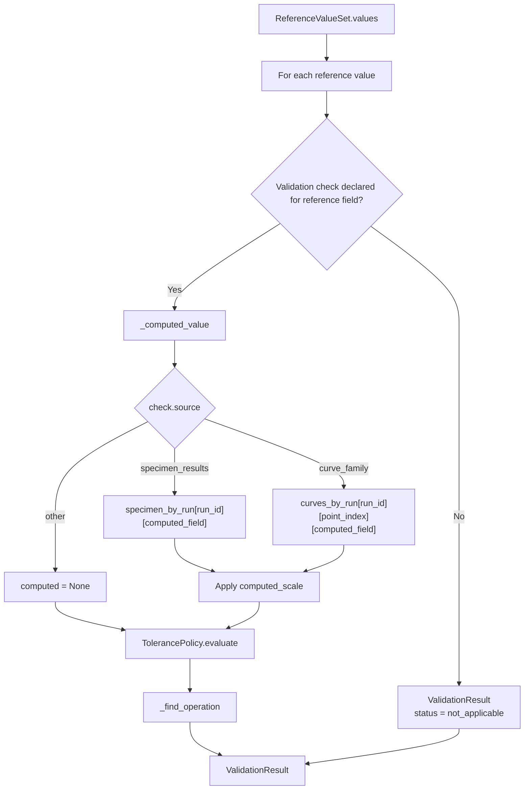
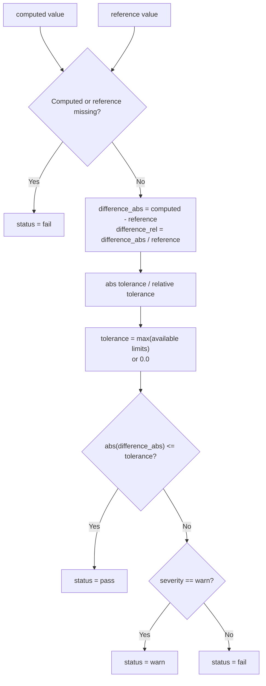
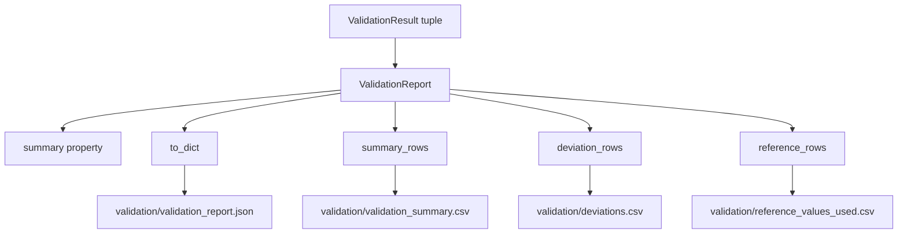

# Validation Policy Flow

## Scope

This document describes the current validation flow after method reduction has produced specimen results and curve-family rows.

Validation here means reference-value validation against declared method-package validation recipe checks. It is separate from:

- MTDP package validation before export.
- Analysis readiness checks before execution.
- Acceptance/selection decisions after validation.
- Report-completion checks for formal report fields.

## Source anchors

| Flow area | Code anchor |
|---|---|
| Validation engine | `src/validation/validation_engine.py` |
| Validation report model | `src/validation/validation_report.py` |
| Reference value loader | `src/validation/reference_values.py` |
| Validation check model | `src/validation/validation_check.py` |
| Tolerance policy | `src/validation/tolerance_policy.py` |
| Method executor call site | `src/methods/core/method_executor.py` |
| MTDA writer validation artifacts | `src/archives/mtda/writer.py` |

---

## L2 — Validation stage in method execution

## Current responsibility

Validation compares computed method outputs with external or declared reference values when a validation recipe and reference values are available. It does not decide final report inclusion directly; instead, validation failures become inputs to the later acceptance stage.

---

## L2 — Validation recipe and reference-value loading

## Reference-value path priority

| Source | Meaning |
|---|---|
| `mapping.validation.reference_values_path` | Mapping can point to a validation reference CSV. |
| `validation_recipe.validation.reference_values.path` | Method package validation recipe can point to reference values. |
| None / missing file | Validation uses an empty reference set and produces no normal comparison checks. |

---

## L3 — Per-reference validation check

## Computed-value sources

| `check.source` | Computed value source |
|---|---|
| `specimen_results` | Per-run specimen result row. |
| `curve_family` | Per-run curve-family row at `point_index`. |
| Other/unknown | Treated as missing computed value. |

---

## L3 — Tolerance policy

## Validation statuses

| Status | Meaning |
|---|---|
| `pass` | Computed value is within tolerance. |
| `warn` | Computed value is outside tolerance but check severity is warning. |
| `fail` | Computed/reference missing or computed value is outside fail-severity tolerance. |
| `not_applicable` | Reference field has no declared validation check. |
| `missing_reference` | Counted by report model if present in checks, although the current engine mainly emits empty reference sets rather than explicit rows when no references exist. |

---

## L2 — Validation report and archive outputs

## Validation output contract

| Artifact | Producer | Purpose |
|---|---|---|
| `validation/validation_report.json` | `ValidationReport.to_dict` | Complete validation report with checks and summary. |
| `validation/validation_summary.csv` | `summary_rows` | Single-row summary of validation status/counts. |
| `validation/deviations.csv` | `deviation_rows` | Non-pass checks and non-zero differences. |
| `validation/reference_values_used.csv` | `reference_rows` | Reference values loaded from CSV. |

---

## L4 — Validation data contract

| Source | Transformation | Destination | Failure/gate behaviour |
|---|---|---|---|
| `method_package.validation_recipe` | `_validation_recipe` | Recipe dictionary | Missing recipe produces empty checks. |
| Recipe checks | `ValidationCheck.from_recipe` | Check map keyed by reference field | Missing check for reference field yields `not_applicable`. |
| Mapping or recipe reference path | `_reference_path_text` and `_resolve_reference_path` | Reference CSV path | Missing path/file yields empty reference set. |
| Reference CSV | `ReferenceValueSet.from_csv` | `ReferenceValue` rows | Bad CSV/numeric parse would raise during loading. |
| Specimen results / curve family | `_computed_value` | Computed numeric value | Missing value yields fail through tolerance policy. |
| Operation log | `_find_operation` | Operation id / recipe step id | Missing operation link leaves trace fields blank. |
| Tolerance policy | `evaluate` | pass/warn/fail | Severity controls warn vs fail when outside tolerance. |

## Open drill-downs

1. Validation recipe schema and examples.
2. Reference CSV file contract and parser hardening.
3. How validation failures map into acceptance flags.
4. How validation deviations are surfaced in audit report and test report.
5. Whether missing reference values should produce explicit validation rows.
6. Unit handling between computed values and reference values.
