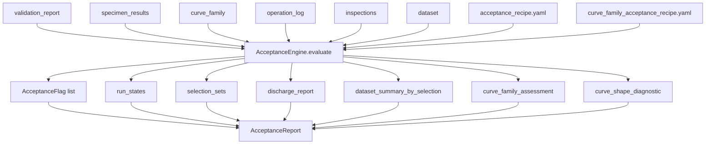
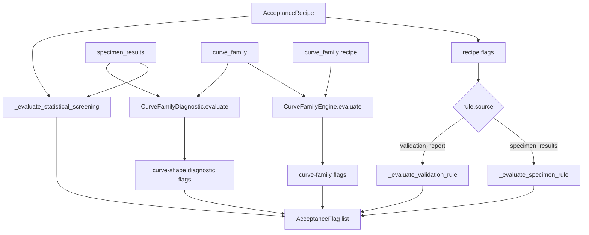
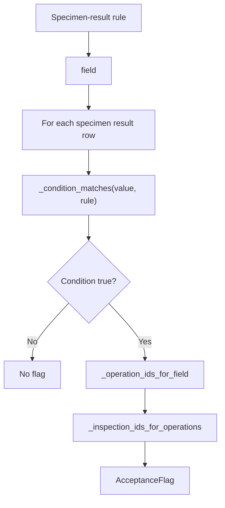
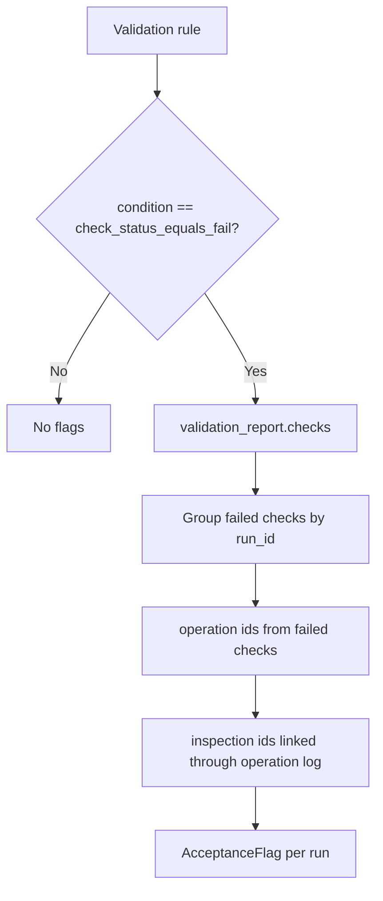
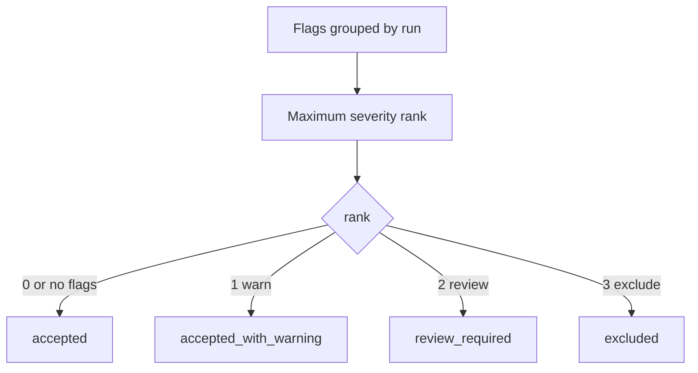
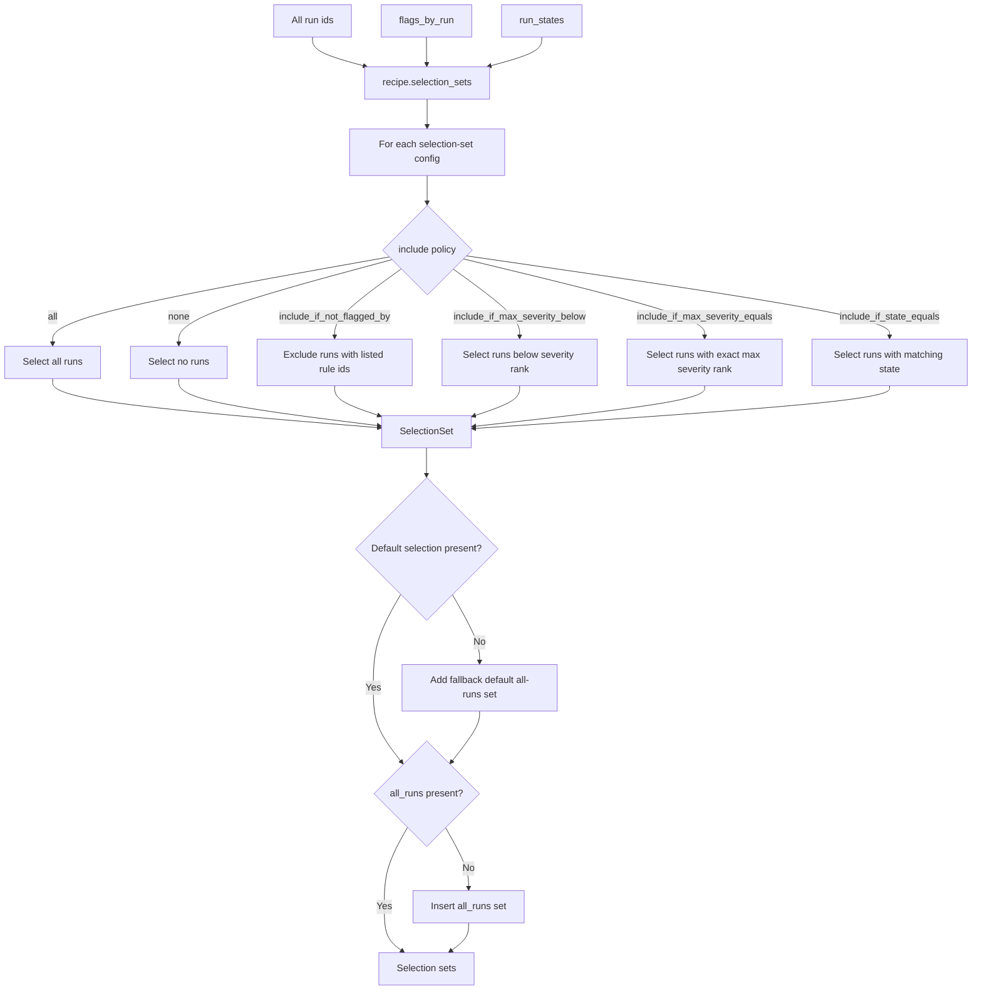
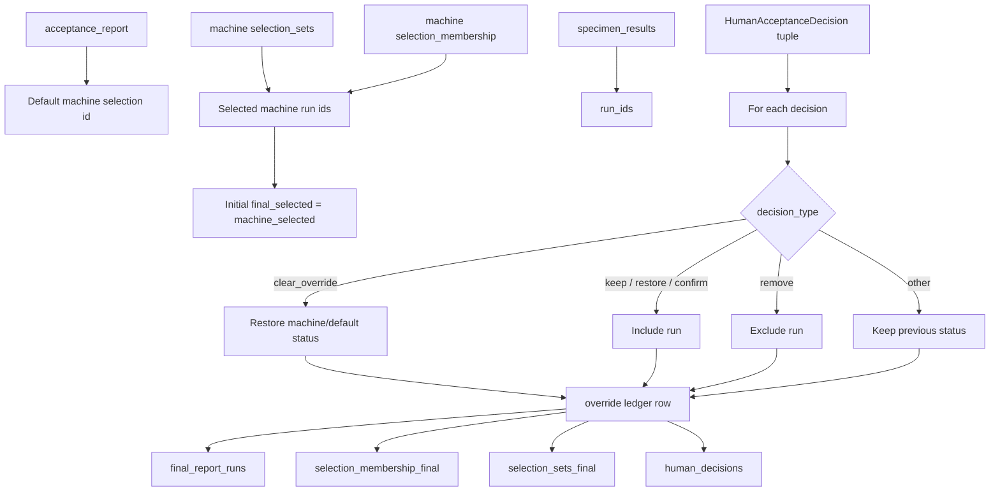

# Acceptance and Selection Flow

## Scope

This document describes the current acceptance and selection process after validation has completed.

Acceptance is not the same as validation. Validation compares outputs against reference values. Acceptance combines validation failures, specimen-result rules, statistical screening, curve-family assessment, curve-shape diagnostics, and selection-set policies to decide which runs are accepted, warned, review-required, excluded, and included in default/final report selections.

## Source anchors

| Flow area | Code anchor |
|---|---|
| Acceptance engine | `src/acceptance/acceptance_engine.py` |
| Acceptance report | `src/acceptance/acceptance_report.py` |
| Acceptance flags and run state | `src/acceptance/acceptance_flag.py` |
| Acceptance recipe | `src/acceptance/acceptance_recipe.py` |
| Selection set model | `src/acceptance/selection_set.py` |
| Selection editor | `src/acceptance/selection_editor.py` |
| Discharge report | `src/acceptance/discharge_report.py` |
| Curve-family engine | `src/acceptance/curve_family.py` |
| Curve-shape diagnostics | `src/diagnostics/curves.py` |
| Statistical screening | `src/acceptance/statistical_screening.py` |
| Method executor call site | `src/methods/core/method_executor.py` |

---

## L2 — Acceptance stage overview

---

## L2 — Flag creation sources

## Flag source meanings

| Source | Meaning |
|---|---|
| `specimen_results` | Rule checks over reduced run outputs such as validity, bending, strength, modulus, or failure fields. |
| `validation_report` | Converts failed validation checks into acceptance flags. |
| `statistical_screening` | Robust scalar outlier screening over configured scalar fields. |
| `curve_family_assessment` | Curve-family comparison/assessment flags. |
| `curve_family_diagnostic` | Curve-shape diagnostic flags from residual/distance analysis. |

---

## L3 — Specimen-result rule evaluation

## Supported rule conditions

| Condition | Behaviour |
|---|---|
| `equals_invalid` | Matches invalid-like values such as invalid, false, 0, no, rejected, failed. |
| `equals_zero_or_invalid` | Matches invalid-like values or numeric zero. |
| `greater_than` | Numeric value greater than threshold. |
| `less_than` | Numeric value less than threshold. |
| `equals` | Case-insensitive string equality against configured value/threshold. |
| `truthy` | Matches values such as 1, true, yes, x, review. |

---

## L3 — Validation-failure rule evaluation

## Validation-to-acceptance distinction

Validation failure is not final exclusion by itself. It becomes an acceptance flag with severity and selection effect determined by the acceptance recipe. This allows the method to distinguish warning, review, and exclusion consequences.

---

## L3 — Run state calculation

## Severity rank

| Severity | Rank | Run state consequence |
|---|---:|---|
| `info` | 0 | accepted |
| `warn` / `warning` | 1 | accepted_with_warning |
| `review` | 2 | review_required |
| `exclude` | 3 | excluded |

---

## L2 — Selection set construction

## Common selection sets

| Selection set | Meaning |
|---|---|
| `all_runs` | Every computed run. |
| `user_valid_runs` | Runs not excluded by user/operator validity flags. |
| `auto_recommended_runs` | Runs with no review or exclude severity flags. |
| `review_required_runs` | Runs needing human review. |
| `excluded_runs` | Runs excluded by acceptance policy from default selection. |
| `human_curated_runs` | Reserved placeholder for future human-curated selection. |
| `final_report_runs` | Human-confirmed selected run set created by `SelectionEditor`. |

---

## L2 — Final selection editor

## Final selection outputs

| Output | Meaning |
|---|---|
| `human_decisions.json/csv` | Human/operator decisions supplied to alter or confirm machine selection. |
| `override_ledger.json` | Audit ledger of changes from previous/machine final status to new final status. |
| `selection_sets_final.json` | Machine selection sets plus `final_report_runs`. |
| `selection_membership_final.csv` | Per-run membership in final selection. |
| `final_report_runs.csv` | Final inclusion/exclusion status used by formal report aggregation. |

---

## L4 — Acceptance data contract

| Source | Transformation | Destination | Failure/gate behaviour |
|---|---|---|---|
| Acceptance recipe | `AcceptanceRecipe.from_method_recipe` | Rule and selection policy model | Missing recipe still allows fallback/default behaviours depending implementation defaults. |
| Specimen results | Specimen rules and statistical screening | Acceptance flags | Rules only flag when conditions match. |
| Validation report | Validation failure rule | Acceptance flags | Only failed checks become validation flags under supported rule condition. |
| Curve family rows | CurveFamilyEngine and CurveFamilyDiagnostic | Curve-family reports and flags | Insufficient data may produce diagnostic insufficiency states rather than normal outlier decisions. |
| Flags | `state_from_flags` | Run states | Max severity controls state. |
| Run states + flags | `_build_selection_sets` | Machine selection sets | Missing configured default selection is filled by fallback. |
| Machine selection + human decisions | `SelectionEditor.apply` | Final report run set | Human decisions can include, remove, restore, or clear override. |

## Open drill-downs

1. Acceptance recipe schema.
2. Exact current ISO 14126 acceptance rules.
3. Robust scalar outlier method details.
4. Curve-family assessment engine details.
5. Curve-shape diagnostic engine details.
6. Discharge report structure.
7. Wizard review UI persistence into service-level human decisions.
8. Distinction between machine default, confirmed machine default, and human override.
