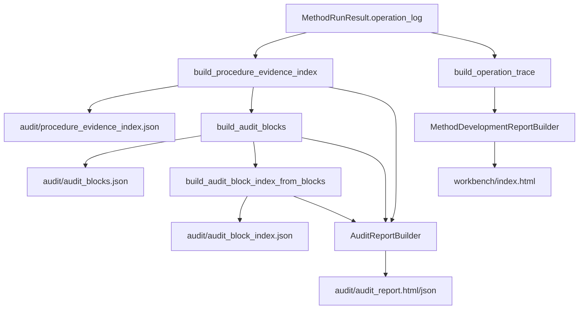
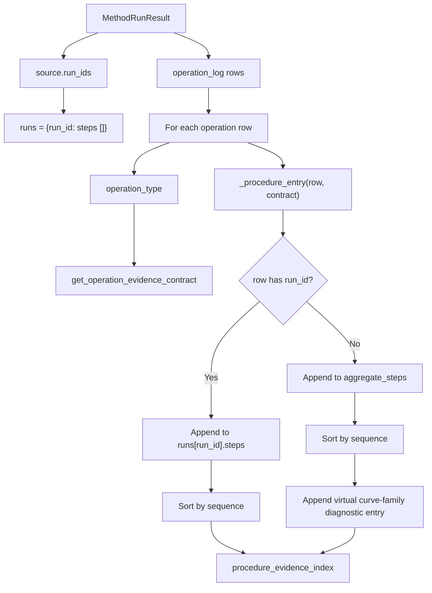
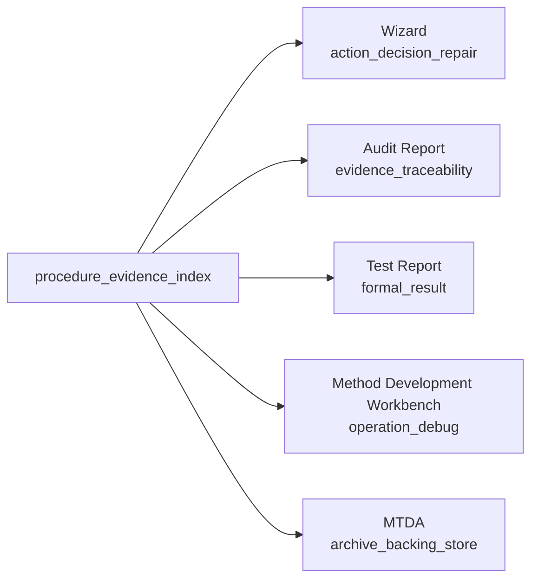
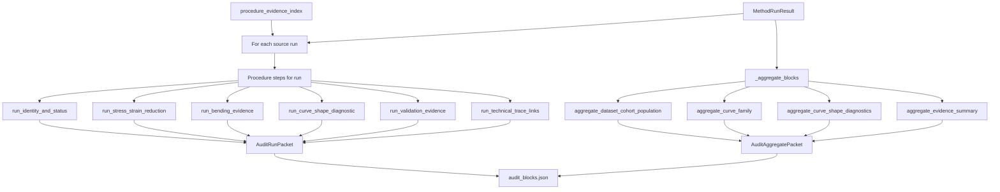
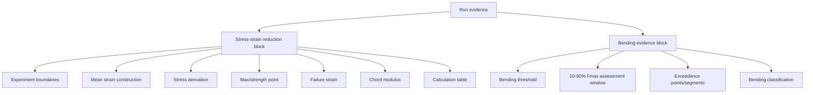
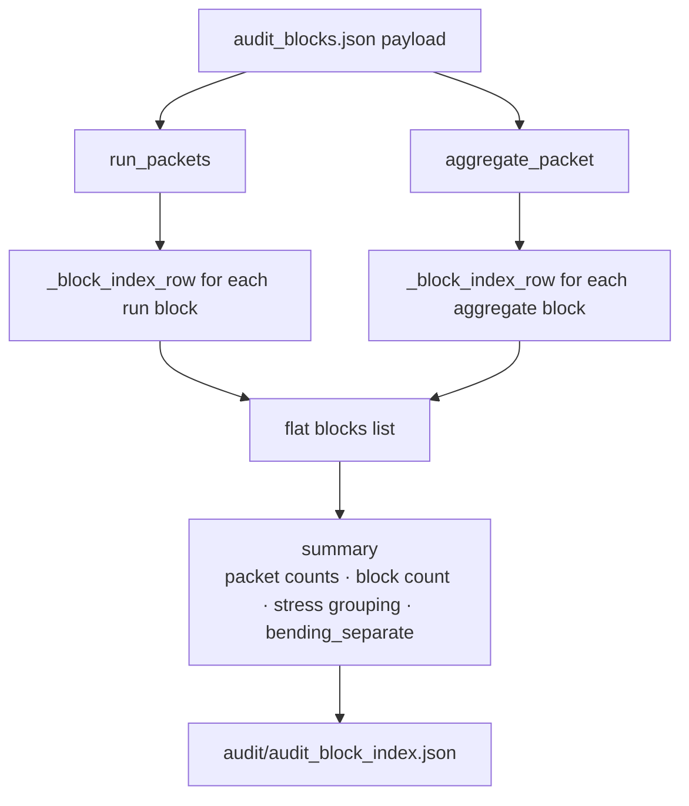

# Procedure Evidence Index and Audit Block Flow

## Scope

This document describes how operation-level evidence is reorganised into human-facing audit structures.

The key distinction is that operation logs preserve technical execution detail, while procedure evidence and audit blocks group that detail into evidence packets that can be consumed by the Audit Report, Method Development Workbench, Wizard, Test Report, and MTDA archive.

## Source anchors

| Flow area | Code anchor |
|---|---|
| Procedure evidence index | `src/audit/procedure_evidence_index.py` |
| Audit block builder | `src/audit/audit_block_builder.py` |
| Audit block models | `src/audit/audit_block_models.py` |
| Operation result record | `src/operations/core/operation_result.py` |
| Operation evidence contracts | `src/operations/core/operation_contract_registry.py` |
| MTDA writer | `src/archives/mtda/writer.py` |
| Audit report builder | `src/audit/audit_report_builder.py` |
| Workbench report builder | `src/audit/method_development_report_builder.py` |

---

## L2 — Evidence transformation overview

---

## L2 — Procedure evidence index construction

## Procedure entry contract

Each indexed procedure entry includes:

| Field group | Purpose |
|---|---|
| `procedure_step_id`, `step_id`, `step_label` | Link evidence to method procedure/recipe. |
| `phase`, `operation_type`, `operation_id`, `operation_sequence` | Identify where/when operation executed. |
| `operation_result_ref` | Pointer to the operation-log record. |
| `evidence_contract_id`, `evidence_role` | Semantic evidence contract. |
| `audit_block_id`, `default_audit_view`, `audit_view_type` | Audit grouping and visualisation hint. |
| `workbench_link`, `workbench_ref`, `workbench_view` | Workbench trace and view routing. |
| `report_roles`, `report_role` | Potential formal report relationship. |
| `evidence_refs`, `artifact_refs` | Archive artifacts backing the evidence. |
| `input_schema`, `output_schema` | Expected operation IO contract. |
| `surface_policy_snapshot` | Recipe/surface policy snapshot. |

---

## L2 — Surface role model

The procedure index explicitly records surface roles so the same evidence source can be consumed differently by different surfaces.

---

## L2 — Audit block packet construction

## Current audit block order

### Run blocks

1. `run_identity_and_status`
2. `run_stress_strain_reduction`
3. `run_bending_evidence`
4. `run_curve_shape_diagnostic`
5. `run_validation_evidence`
6. `run_technical_trace_links`

### Aggregate blocks

1. `aggregate_dataset_cohort_population`
2. `aggregate_curve_family`
3. `aggregate_curve_shape_diagnostics`
4. `aggregate_evidence_summary`

---

## L3 — Run block responsibilities

| Block | Main purpose | Typical evidence |
|---|---|---|
| `run_identity_and_status` | Specimen identity, geometry, failure/validity metadata before interpreting calculations. | `method_outputs/specimen_results.csv`; map/area operations. |
| `run_stress_strain_reduction` | Bounded stress-strain reduction and ISO 14126 derived values. | Bounded/full curves, boundary resolution, max point, failure strain, chord slope, calculation table. |
| `run_bending_evidence` | Bending diagnostics separate from stress-strain reduction. | Bending diagnostic operation, inspection record, threshold/window/segments. |
| `run_curve_shape_diagnostic` | Run comparison against comparable cohort curve. | Curve diagnostic scores, residuals, policy, reference curve. |
| `run_validation_evidence` | Validation checks, warnings, and deviations affecting the run. | Validation report and deviations. |
| `run_technical_trace_links` | Collapsed trace links for replay/debug. | Operation log, procedure evidence index, bounded/full curve members. |

---

## L3 — Stress-strain and bending separation

This separation is important: bending is a quality/acceptance diagnostic and should not be hidden inside the stress-strain reduction block.

---

## L3 — Audit block index construction

## Audit block index row contract

| Field | Meaning |
|---|---|
| `block_id` | Stable block identifier. |
| `block_type` / `block_role` | Audit block role. |
| `scope` | Run or aggregate. |
| `run_id` | Run id for run-scoped blocks. |
| `title` | Human-facing block title. |
| `status` | Block status. |
| `operation_types` | Operation types referenced by the block. |
| `operation_refs` | Operation evidence references. |
| `artifact_refs` | Artifact/member references. |
| `workbench_links` | Links to workbench views. |
| `summary_keys` | Keys available in block summary. |

---

## L4 — Evidence/audit data contract

| Source | Transformation | Destination | Failure/gate behaviour |
|---|---|---|---|
| Operation log rows | `build_procedure_evidence_index` | `audit/procedure_evidence_index.json` | Non-dict rows skipped; entries sorted by sequence. |
| Operation type | Evidence contract lookup | Procedure entry metadata | Unknown operation type uses fallback contract upstream. |
| Procedure index | `build_audit_blocks` | `audit/audit_blocks.json` | Missing entries still produce recorded blocks, but with fewer operation refs. |
| Audit blocks | `build_audit_block_index_from_blocks` | `audit/audit_block_index.json` | Blocks are flattened for dashboard/report navigation. |
| Audit blocks/index | `AuditReportBuilder` | Audit report HTML/JSON | Missing block data may reduce detail but should not remove archive evidence. |
| Operation trace | `MethodDevelopmentReportBuilder` | Workbench HTML | Provides operation-level replay/debug detail. |

## Open drill-downs

1. Audit report rendering and section layout.
2. Workbench operation-trace rendering.
3. Exact audit block JSON schema.
4. Plot/evidence adapter routing into audit views.
5. Completeness checks between operation contracts and audit/report surfaces.
6. Whether `run_selection_consequence` is intentionally replaced by or separate from current `run_technical_trace_links` ordering.
