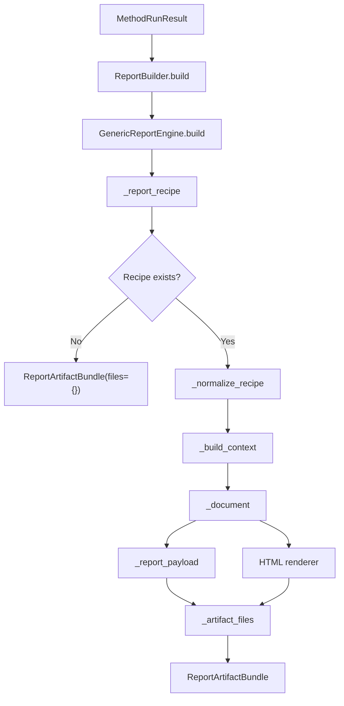
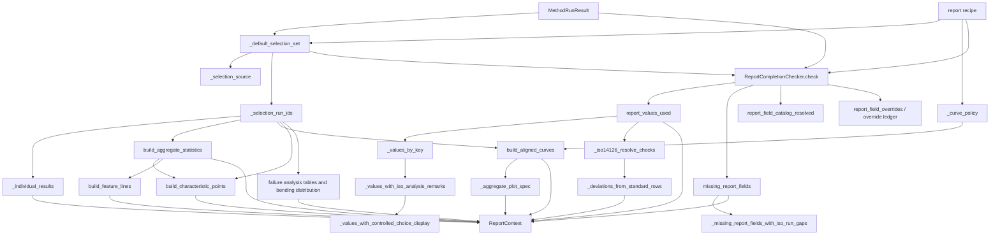
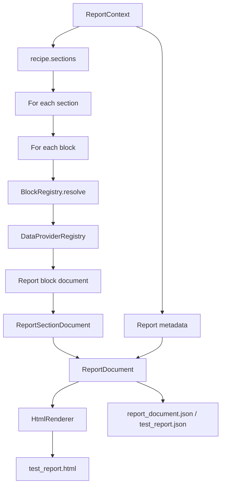
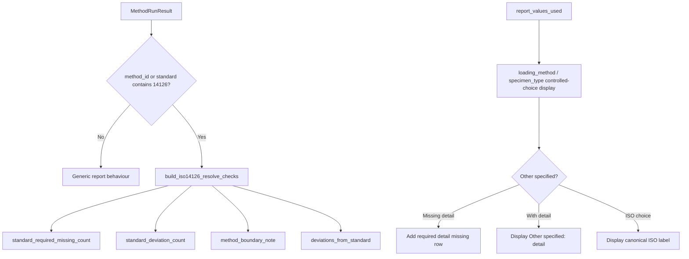
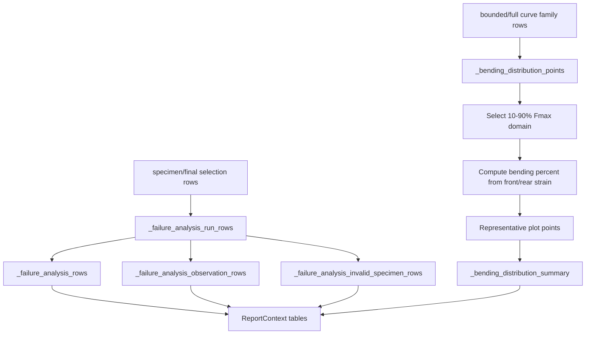
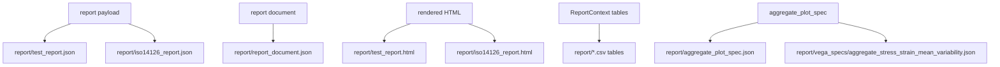

# Test Report Building Flow

## Scope

This document describes how the formal method test report is built from `MethodRunResult`.

The test report is separate from the audit report and the method-development workbench:

- **Test report**: formal result-facing report.
- **Audit report**: evidence traceability and compliance/review support.
- **Workbench**: technical operation/debug surface.

## Source anchors

| Flow area | Code anchor |
|---|---|
| Report builder facade | `src/reporting/report_builder.py` |
| Generic report engine | `src/reporting/core/report_engine.py` |
| Report context | `src/reporting/core/report_context.py` |
| Report document models | `src/reporting/core/report_document.py` |
| Block registry | `src/reporting/core/block_registry.py` |
| Data provider registry | `src/reporting/core/data_provider_registry.py` |
| Renderer registry / HTML renderer | `src/reporting/core/renderer_registry.py`, `src/reporting/renderers/html_renderer.py` |
| Report completion checker | `src/reporting/completion/` |
| Aggregate statistics | `src/reporting/aggregate_statistics.py` |
| Curve aggregation | `src/reporting/curve_aggregation.py` |
| ISO 14126 report compliance | `src/methods/iso14126/report_compliance.py` |
| MTDA writer | `src/archives/mtda/writer.py` |

---

## L2 — Report builder overview

## Report output contract

`ReportBuilder.build` returns a `ReportArtifactBundle` containing file payloads plus major report tables such as individual results, aggregate statistics, characteristic points, feature lines, aligned curves, and missing report fields.

---

## L2 — Report context construction

## Report context table groups

| Table | Purpose |
|---|---|
| `report_values_used` | Field values used in formal report. |
| `missing_report_fields` | Missing required/recommended report fields. |
| `report_field_catalog_resolved` | Resolved report field catalog from recipe/schema/completion checks. |
| `report_completion_status` | Missing-field counts and completion status. |
| `report_field_overrides` | Report-only finalization overrides. |
| `report_sections` | Section-level completion/status information. |
| `individual_results` | Per-run report rows scoped to selected/final run set. |
| `aggregate_statistics` | Aggregate formal statistics. |
| `characteristic_points` | Characteristic run/curve points. |
| `feature_lines` | Plot/report feature lines. |
| `aligned_curves` | Boundary-/policy-aligned curve family. |
| `failure_analysis` | Failure analysis summary section rows. |
| `failure_analysis_bending_distribution` | Bending distribution plot/table payload. |
| `iso14126_resolve_checks` | ISO-specific missing/deviation checks. |
| `deviations_from_standard` | Standard deviation table rows. |
| `aggregate_plot_spec` | Vega/plot specification payload. |

---

## L2 — Document rendering

## Report metadata includes

| Metadata | Meaning |
|---|---|
| `method_id`, `method_version`, `method_name` | Method identity. |
| `standard_reference` | Standard reference from method manifest. |
| `selection_set`, `selection_source` | Which run set drives formal results. |
| `selected_run_count` | Number of selected/final runs. |
| `missing_report_field_count` | Total missing report fields. |
| `report_completion_status` | Report completion status. |
| `required_missing_count`, `recommended_missing_count` | Missing-field severity counts. |
| `standard_required_missing_count` | ISO standard-required gap count. |
| `standard_deviation_count` | ISO deviation count. |
| `method_boundary_note` | ISO boundary/analysis interval note. |
| `report_quality_gate_status` | Derived report quality gate state. |
| `section_statuses` | Section-level status details. |

---

## L3 — ISO 14126 report-specific additions

## Important ISO-specific behaviours

- Failure mode and failure location can be treated as required for accepted/final-report runs.
- Controlled choices such as loading method and specimen type have ISO-compliant values and “Other specified” detail requirements.
- ISO analysis remarks can be injected into report remarks based on experiment boundary information.
- Standard-required missing fields and deviations are distinct from generic missing recommended report fields.

---

## L3 — Failure analysis and bending distribution

## Bending distribution role

The report currently constructs a bending distribution payload for the assessed domain, using the 10-90% Fmax window. It derives distribution summary statistics such as min, quartiles, median, p95, max, fraction above threshold, and points above threshold where pointwise bending values are available.

---

## L2 — Report artifact outputs

## Key formal report artifacts

| Artifact | Purpose |
|---|---|
| `report/test_report.html` | Main formal report surface. |
| `report/test_report.json` | Main report data payload. |
| `report/iso14126_report.html/json` | ISO-specific report aliases/payloads when applicable. |
| `report/report_document.json` | Rendered report document model. |
| `report/report_values_used.csv` | Values used by report. |
| `report/missing_report_fields.csv` | Missing report-field evidence. |
| `report/report_completion_status.json` | Report completion status. |
| `report/report_sections.json` | Section status data. |
| `report/aggregate_statistics.csv` | Formal aggregate values. |
| `report/individual_results.csv` | Per-run results. |
| `report/failure_analysis.csv` | Failure analysis summary. |
| `report/deviations_from_standard.csv` | Standard deviation table. |
| `report/vega_specs/aggregate_stress_strain_mean_variability.json` | Aggregate curve plot spec. |

---

## L4 — Report data contract

| Source | Transformation | Destination | Failure/gate behaviour |
|---|---|---|---|
| Method report recipe | `_report_recipe` / `_normalize_recipe` | Normalized sections and blocks | Missing recipe yields empty report bundle. |
| Final/machine selection | `_selection_run_ids` | Selected run set | Drives aggregate statistics and individual result inclusion. |
| Specimen results | Individual/aggregate/failure tables | Report tables | Missing values can become missing report fields or blank report cells. |
| Curve family | Alignment/plot builders | Aligned curves and plot spec | Alignment policy controls curve normalisation/domain. |
| Schema/method/report catalog | `ReportCompletionChecker` | Missing fields and values used | Required vs recommended gaps produce completion status. |
| ISO compliance helper | ISO resolve checks | Standard gaps/deviations | Only active for ISO 14126-like method/standard identifiers. |
| Report document | Renderer | HTML report | Rendering depends on resolved blocks/providers. |

## Open drill-downs

1. Report recipe schema.
2. Block registry and provider registry internals.
3. Report completion checker internals.
4. ISO 14126 compliance helper internals.
5. Failure analysis table and bending plot rendering details.
6. Report artifact writer mapping in MTDA writer.
7. Difference between report-only finalization override and calculation-changing rerun requirement.
