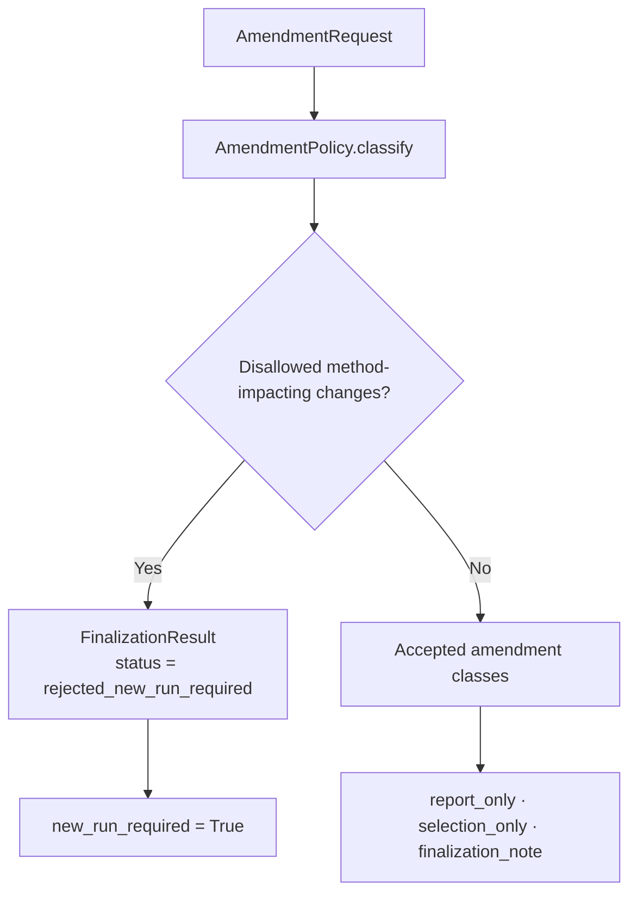
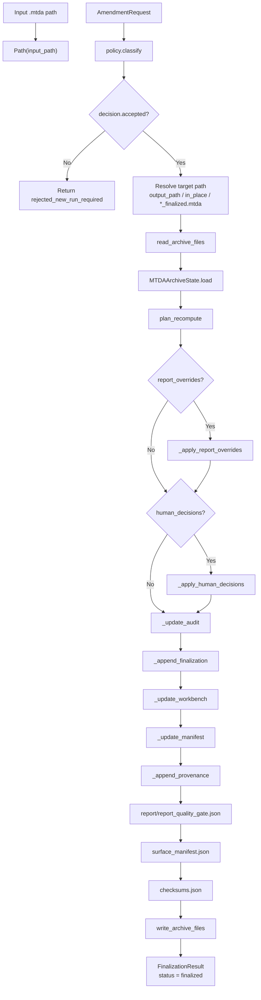
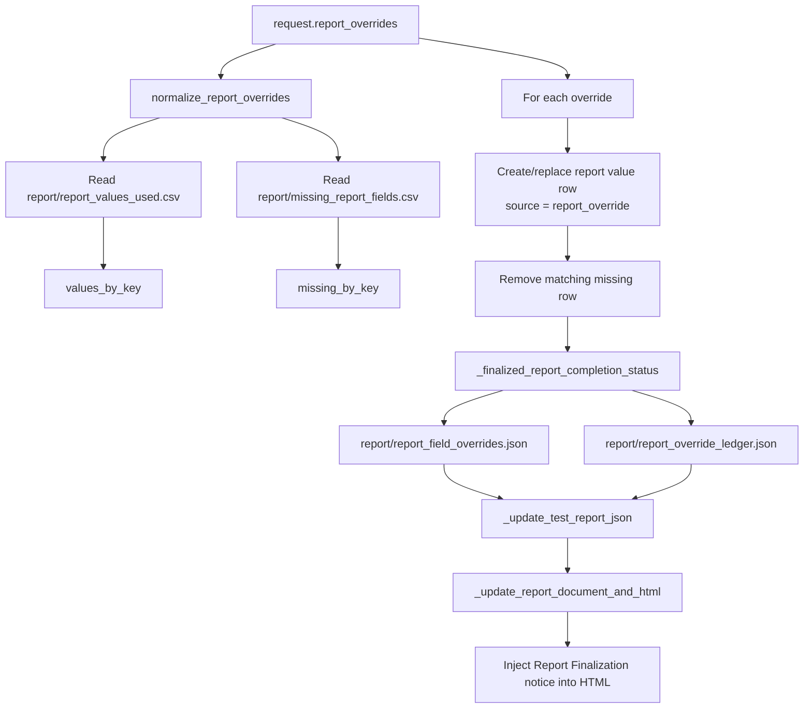
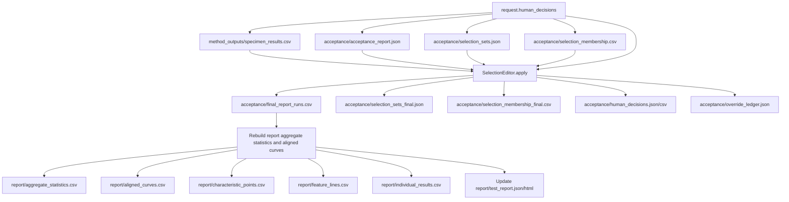
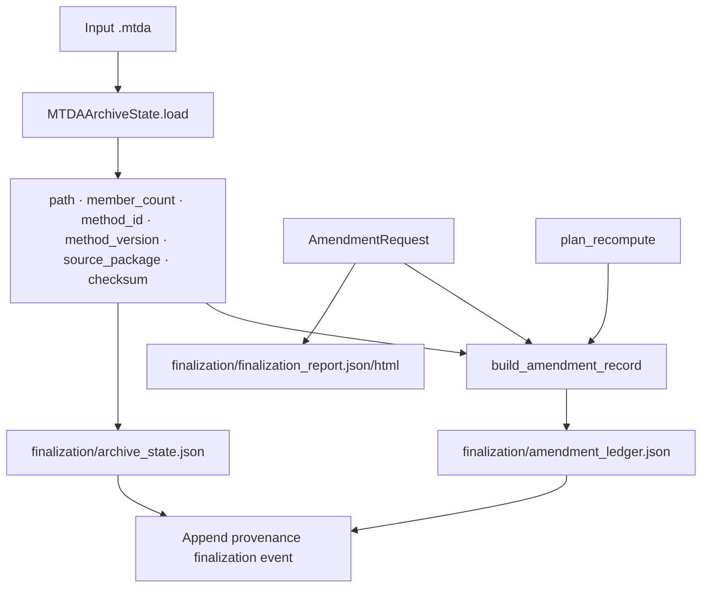
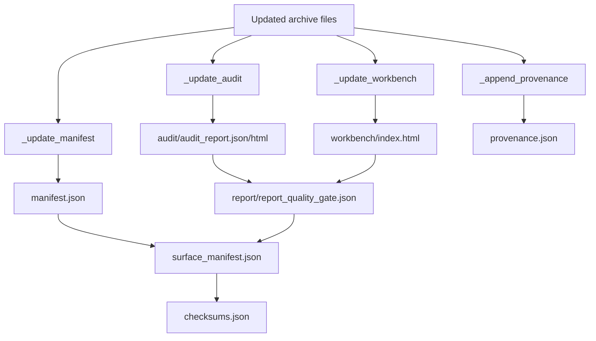

# MTDA Finalization and Amendment Flow

## Scope

This document describes the current MTDA finalization flow. Finalization applies allowed report-only and selection-only amendments to an existing `.mtda` archive without rerunning method calculations.

The key policy boundary is that finalization may update report fields, human selection decisions, finalization metadata, audit/report/workbench surfaces, manifests, provenance, checksums, and surface manifests. It must reject method-impacting changes that require a new method run.

## Source anchors

| Flow area | Code anchor |
|---|---|
| Finalization service | `src/mtda_finalization/finalization_service.py` |
| Amendment request | `src/mtda_finalization/amendment_request.py` |
| Amendment policy | `src/mtda_finalization/amendment_policy.py` |
| Archive state | `src/mtda_finalization/archive_state.py` |
| Amendment ledger | `src/mtda_finalization/amendment_ledger.py` |
| Recompute planner | `src/mtda_finalization/recompute_planner.py` |
| MTDA archive rewriter | `src/mtda_finalization/mtda_rewriter.py` |
| Selection editor | `src/acceptance/selection_editor.py` |
| Report override handling | `src/reporting/completion/report_override.py` |
| Surface manifest | `src/archives/mtda/surface_manifest.py` |
| Wizard finalization route | `src/ui/method_run_wizard/controller.py` |

---

## L2 — Finalization policy overview

## Allowed and disallowed amendment classes

| Amendment input | Current classification |
|---|---|
| `report_overrides` | Allowed as `report_only`. |
| `human_decisions` | Allowed as `selection_only`. |
| `reviewer`, `reason`, `reviewer_notes` | Allowed as `finalization_note`. |
| `method_package_changes` | Disallowed; new run required. |
| `mapping_profile_changes` | Disallowed; new run required. |
| `input_mtdp_changes` | Disallowed; new run required. |
| `calculation_input_changes` | Disallowed; new run required. |
| `operation_policy_changes` | Disallowed; new run required. |
| `validation_reference_changes` | Disallowed; new run required. |

---

## L2 — Finalization service route

---

## L3 — Report override flow

## Report override outputs

| Updated artifact | Meaning |
|---|---|
| `report/report_values_used.csv` | Report values after overrides. |
| `report/missing_report_fields.csv` | Remaining missing fields after overrides. |
| `report/report_completion_status.json` | Updated report completion status. |
| `report/report_field_overrides.json` | Normalized override payload. |
| `report/report_override_ledger.json` | Override ledger. |
| `report/report_document.json` | Updated report document model. |
| `report/test_report.json` | Updated report payload. |
| `report/test_report.html` | Updated report surface with finalization notice. |
| `report/iso14126_report.html/json` | Updated if present. |

---

## L3 — Human decision / final-selection flow

## Human-decision finalization outputs

| Updated artifact | Meaning |
|---|---|
| `acceptance/human_decisions.json/csv` | Human decisions applied. |
| `acceptance/override_ledger.json` | Decision ledger. |
| `acceptance/selection_sets_final.json` | Final selection-set payload. |
| `acceptance/selection_membership_final.csv` | Final per-run membership. |
| `acceptance/final_report_runs.csv` | Final run inclusion/exclusion table. |
| `report/aggregate_statistics.csv` | Recomputed for final report runs. |
| `report/aligned_curves.csv` | Recomputed for final report runs. |
| `report/characteristic_points.csv` | Recomputed for final report runs. |
| `report/feature_lines.csv` | Recomputed for final report runs. |
| `report/individual_results.csv` | Rewritten with final inclusion. |
| `report/test_report.json/html` | Updated selection set/source and selected-run count. |

---

## L3 — Archive state and provenance flow

---

## L2 — Finalization surface refresh

## Finalization principle

Finalization is a controlled archive rewrite. It updates surfaces and derived report/selection aggregates where allowed, but it does not mutate the source MTDP, method package, mapping profile, method calculation inputs, operation policies, or validation references.

---

## L4 — Finalization data contract

| Source | Transformation | Destination | Failure/gate behaviour |
|---|---|---|---|
| Amendment request | `AmendmentPolicy.classify` | Amendment decision | Disallowed method-impacting changes reject finalization and require new run. |
| Existing MTDA | `read_archive_files` | In-memory file map | Archive read failure would block finalization. |
| Existing MTDA | `MTDAArchiveState.load` | Before-state payload | Captures checksum and member count. |
| Report overrides | `_apply_report_overrides` | Report values/completion/report HTML/JSON | Only report field values are changed. |
| Human decisions | `_apply_human_decisions` | Final selections and selected-run report aggregates | Recomputes report-level aggregates from existing method outputs. |
| Updated file map | `_update_audit`, `_update_workbench`, `_update_manifest`, `_append_provenance` | Refreshed surfaces and provenance | Keeps finalization visible. |
| Updated file map | `build_surface_manifest`, `build_checksums` | Surface discovery and integrity metadata | Checksums updated after all changes. |
| Final file map | `write_archive_files` | Finalized MTDA archive | Writes to target path or in place. |

## Open drill-downs

1. Amendment ledger schema.
2. Recompute planner details.
3. Finalization report HTML/JSON contents.
4. Audit/workbench update internals.
5. Exact allowed report override field catalog.
6. UI finalization route and report-completion dialog interaction.
7. How finalized archive state should be displayed in launcher/analysis surfaces.
