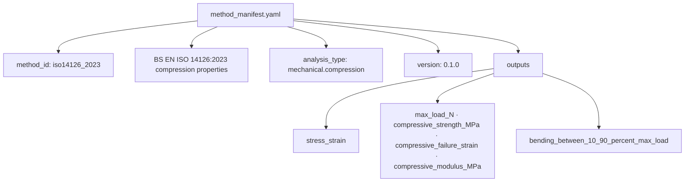
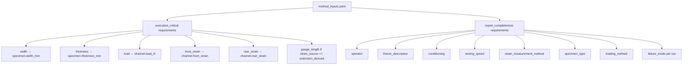
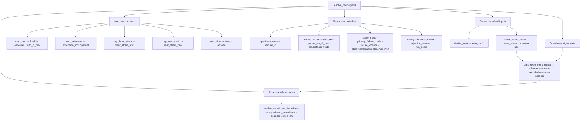
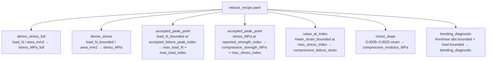
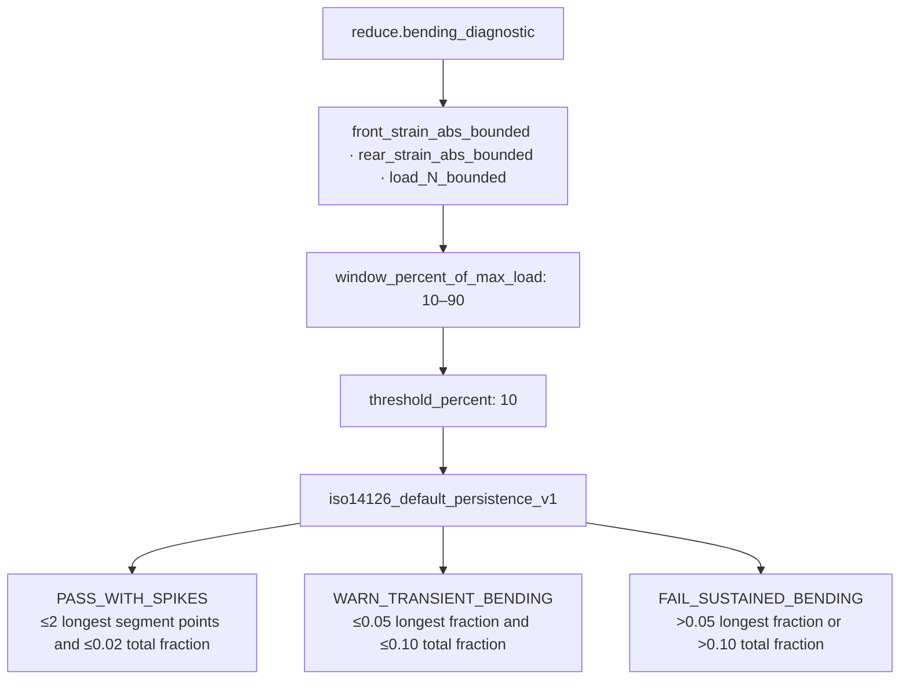
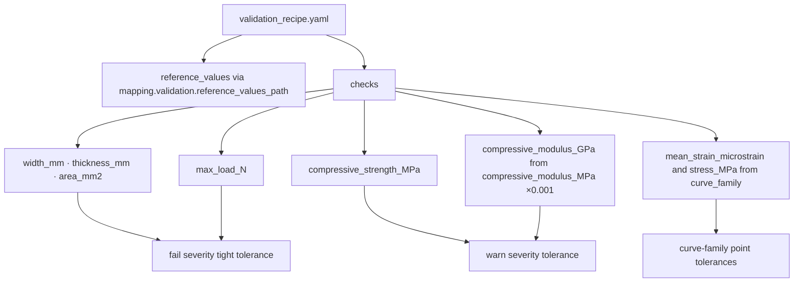

# ISO 14126 Method Recipe Flow

## Scope

This document connects the generic MTDA method execution machinery to the concrete `iso14126_2023` method package.

It covers method identity, declared readiness inputs, resolve recipe, reduce recipe, validation recipe, and acceptance recipe. It does not replace the individual operation internals documented elsewhere.

## Source anchors

| Flow area | Code anchor / method file |
|---|---|
| Method package loader | `src/methods/core/method_package.py` |
| Method executor | `src/methods/core/method_executor.py` |
| ISO 14126 method manifest | `src/methods/iso14126/method_manifest.yaml` |
| ISO 14126 method inputs | `src/methods/iso14126/method_inputs.yaml` |
| ISO 14126 resolve recipe | `src/methods/iso14126/resolve_recipe.yaml` |
| ISO 14126 reduce recipe | `src/methods/iso14126/reduce_recipe.yaml` |
| ISO 14126 validation recipe | `src/methods/iso14126/validation_recipe.yaml` |
| ISO 14126 acceptance recipe | `src/methods/iso14126/acceptance_recipe.yaml` |
| Compression schema | `src/mtdp_enrichment/schema_library/mechanical/compression/0.3.0.yaml` |

---

## L2 — Method package identity

## Method identity contract

The method package identifies itself as ISO 14126:2023 compression-property analysis over the `mechanical.compression` MTDP schema family. Its core formal outputs are stress-strain curves, maximum load, compressive strength, compressive failure strain, compressive modulus, and a bending diagnostic between 10% and 90% maximum load.

---

## L2 — Readiness inputs declared by ISO 14126

## Readiness split

| Group | Inputs | Consequence |
|---|---|---|
| Execution-critical | width, thickness, load, front strain, rear strain, conditional gauge length | Missing/failed inputs block execution. |
| Report completeness | operator, fixture, conditioning, speed, strain method, specimen type, loading method, failure mode | Missing inputs can allow execution with warnings but affect report completion. |

---

## L2 — ISO 14126 resolve recipe

## Resolve recipe sequence

| Stage | Step IDs / outputs |
|---|---|
| Channel mapping | `resolve.map_load`, `resolve.map_extension`, `resolve.map_front_strain`, `resolve.map_rear_strain`, `resolve.map_time`. |
| Identity and geometry mapping | `resolve.map_specimen_name`, `resolve.map_sample_id`, `resolve.map_width`, `resolve.map_thickness`, `resolve.map_gauge_length`, `resolve.map_distance_between_end_tabs`, `resolve.map_tab_length`, `resolve.map_tab_thickness`. |
| Failure/validity metadata | `resolve.map_failure_mode`, `resolve.map_primary_failure_mode`, `resolve.map_failure_location`, `resolve.map_failure_observed`, `resolve.map_invalid_specimen_reason`, `resolve.map_failure_analysis_notes`, `resolve.map_validity`, `resolve.map_requires_review`, etc. |
| Derived geometry | `resolve.derive_area`. |
| Mean strain construction | `resolve.derive_mean_strain`, using front/rear strain raw channels and `mean_absolute` mode. |
| Experiment signal gate | `resolve.gate_experiment_signal`, using load/time/mean-strain evidence to classify a conservative coherent experimental window before endpoint detection. The gate intentionally keeps `coherent_window.start_index` at raw index `0` for normal numeric series; loading onset is diagnostic-only evidence. End/tail validation can exclude strong blunt evidence such as persistent low-load/high-domain terminal tails, domain resets attached to independently malformed tails, non-numeric clusters, implausible jumps, artificial plateaus, disconnected high-load fragments, and late restart/spike patterns while preserving raw rows for audit. Short, borderline, or preload-scale low-load/high-domain discontinuities are review diagnostics and do not shorten the window by themselves. The gate emits scalar-friendly report-routing fields for acceptance/default-selection decisions. |
| Boundary resolution | `resolve.experiment_boundaries`, with start policy `first_point`, end policy `peak_decline_non_recovery`, endpoint included, and resolved endpoint-detection policy defaults for meaningful drop, low-state persistence, recovery amplitude/locality/continuity, later-higher tolerance, gated candidate load floor, full-run scale guard, and sign-state audit diagnostics. When `experiment_signal_gate` is present, boundary candidate generation and fallback maximum selection are constrained to the gate's coherent window while raw-vs-windowed load scale evidence is preserved for review routing. |

---

## L2 — ISO 14126 reduce recipe

## Reduce recipe outputs

| Step | Output | Formal/report role |
|---|---|---|
| `reduce.derive_stress_full` | `stress_MPa_full` | Audit context only. |
| `reduce.derive_stress` | `stress_MPa` | Bounded stress series for formal calculations. |
| `reduce.max_load` | `max_load_N`, `max_load_index` | Maximum load. |
| `reduce.max_stress` | `compressive_strength_MPa`, `max_stress_index` | Compressive strength. |
| `reduce.failure_strain` | `compressive_failure_strain` | Failure strain at maximum stress. |
| `reduce.chord_modulus` | `compressive_modulus_MPa` | Chord modulus between 0.0005 and 0.0025 strain. |
| `reduce.bending_diagnostic` | `bending_diagnostic` | Bending diagnostic and failure-analysis evidence. |

---

## L3 — Bending diagnostic recipe contract

## Bending diagnostic interpretation

The recipe assesses opposite-face bending inside the 10–90% maximum-load window with a 10% bending threshold. The configured policy distinguishes isolated spikes, transient clusters, and sustained bending.

---

## L2 — ISO 14126 validation recipe

## Validation check table

| Reference field | Computed field | Source | Tolerance | Severity | Step link |
|---|---|---|---|---|---|
| `width_mm` | `width_mm` | specimen_results | abs 0.0001 | fail | `resolve.map_width` |
| `thickness_mm` | `thickness_mm` | specimen_results | abs 0.0001 | fail | `resolve.map_thickness` |
| `area_mm2` | `area_mm2` | specimen_results | abs 0.0001 | fail | `resolve.derive_area` |
| `max_load_N` | `max_load_N` | specimen_results | abs 0.1 | fail | `reduce.max_load` |
| `compressive_strength_MPa` | `compressive_strength_MPa` | specimen_results | abs 0.5 | warn | `reduce.max_stress` |
| `compressive_modulus_GPa` | `compressive_modulus_MPa × 0.001` | specimen_results | abs 1.0 | warn | `reduce.chord_modulus` |
| `mean_strain_microstrain` | `mean_strain × 1000000` | curve_family | abs 0.01 | fail | `resolve.derive_mean_strain` |
| `stress_MPa` | `stress_MPa` | curve_family | abs 0.5 | warn | `reduce.derive_stress` |

---

## L2 — ISO 14126 acceptance recipe

```mermaid
flowchart TB
    Acceptance["acceptance_recipe.yaml"] --> Flags["Flags"]
    Flags --> UserInvalid["failure_mode equals zero/invalid → exclude"]
    Flags --> BendingFail["bending_pattern == FAIL_SUSTAINED_BENDING → review"]
    Flags --> BendingWarn["bending_pattern == WARN_TRANSIENT_BENDING → review"]
    Flags --> BendingInfo["bending_points_above_threshold > 0 → info"]
    Flags --> SignalWindow["signal-window routing == review → review"]
    Flags --> SignalScale["signal-window scale guard == review → review"]
    Flags --> ValidationFailed["validation check fail → review"]

    Acceptance --> SelectionSets["Selection sets"]
    SelectionSets --> All["all_runs"]
    SelectionSets --> UserValid["user_valid_runs"]
    SelectionSets --> Auto["auto_recommended_runs<br/>max severity below review"]
    SelectionSets --> Review["review_required_runs"]
    SelectionSets --> Excluded["excluded_runs"]
    SelectionSets --> Human["human_curated_runs empty placeholder"]
```

## Acceptance consequences

| Flag | Severity | Selection effect |
|---|---|---|
| `user_validity_invalid` | exclude | Excludes from default selection. |
| `bending_exceeds_review_threshold` | review | Requires review and excluded from auto-recommended default. |
| `bending_transient_review` | review | Requires review and excluded from auto-recommended default. |
| `bending_threshold_exceedance_evidence` | info | Preserves evidence but does not by itself remove from default. |
| `signal_window_requires_review` | review | Requires review and excluded from auto-recommended default when the gate emits review routing. |
| `signal_window_load_scale_review` | review | Requires review and excluded from auto-recommended default when a gated/windowed scale conflict is detected. |
| `validation_failed` | review | Requires review and excluded from auto-recommended default. |

---

## L4 — ISO 14126 method data contract

| Stage | Inputs | Outputs | Gate/risk |
|---|---|---|---|
| Readiness | MTDP width/thickness/load/front/rear strain plus conditional gauge length | READY / NOT_READY / warnings | Missing critical inputs block execution. |
| Resolve | Mapping profile channels/fields and MTDP package | Bound channels/scalars, area, mean strain, experiment signal gate, experiment boundaries, bounded series refs | Mapping wrongness propagates into all reductions; gate evidence constrains blunt invalid scan tails without deleting raw data. |
| Reduce | Resolved/bounded series and scalars | Stress, max load, strength, failure strain, modulus, bending diagnostic | Boundary/end-policy and bending policy are central scientific choices. |
| Validation | Reference CSV + validation recipe | Validation report and deviations | References are optional; missing reference file means little/no validation evidence. |
| Acceptance | Specimen results, validation report, curve family, signal-window routing, diagnostics | Flags, run states, selection sets, final default selection | Review/exclusion logic is policy-driven, not inherent to validation. |
| Report | Final/machine selection and report recipe | Formal test report and ISO-specific fields/deviations | Missing report fields and ISO controlled choices affect report quality/compliance. |

## Report plot coordinate contract

Aggregate stress-strain report plots use an explicit x-coordinate contract carried with the aligned-curve rows and plot specification. For boundary-aligned ISO 14126 runs, the canonical x field is `analysis_progress`: a 0-1 fraction through each run's resolved analysis window. Report views may display this as percent using `analysis_progress_percent` or the contract display scale, but they must not relabel it as actual strain.

`experiment_progress` and legacy `x_normalized` values remain compatibility aliases for boundary-aligned data. They are not the authoritative semantic field for new report consumers. Actual strain remains available through strain fields such as `mean_strain`, while failure-strain-normalised coordinates are a separate coordinate kind used only by the older failure-normalised aggregation path.

Rendered report and audit plots consume those plot-ready coordinates directly. The formal aggregate plot uses `analysis_progress_percent` for the aggregate mean/variability panel and actual bounded strain only for the individual replicate panel. If plot-ready coordinate data are missing, renderers must emit warning/unavailable evidence instead of deriving a different x-coordinate behind the presentation layer.

## Open residuals

1. Exact `report_recipe.yaml` section/block contract.
2. Exact `curve_aggregation_policy.yaml` and `curve_family_acceptance_recipe.yaml` contract.
3. Boundary resolution and signal-gate policies should be separately reviewed against the standard and empirical data.
4. Validation references are optional; decide if production runs should require explicit validation-reference absence rationale.
5. Acceptance rules should be checked against intended human review semantics, especially sustained bending as review rather than exclude.
