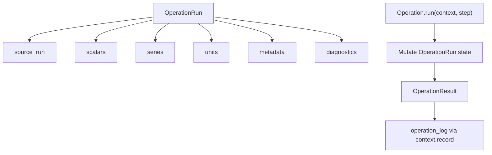
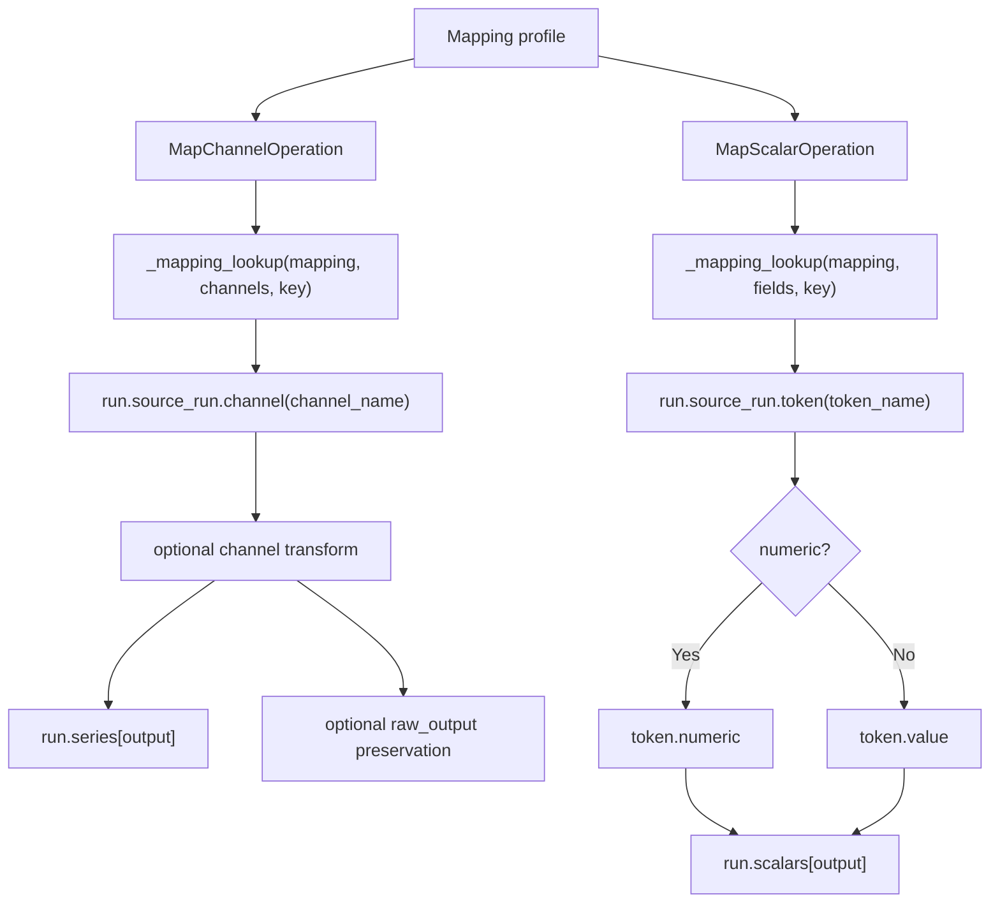
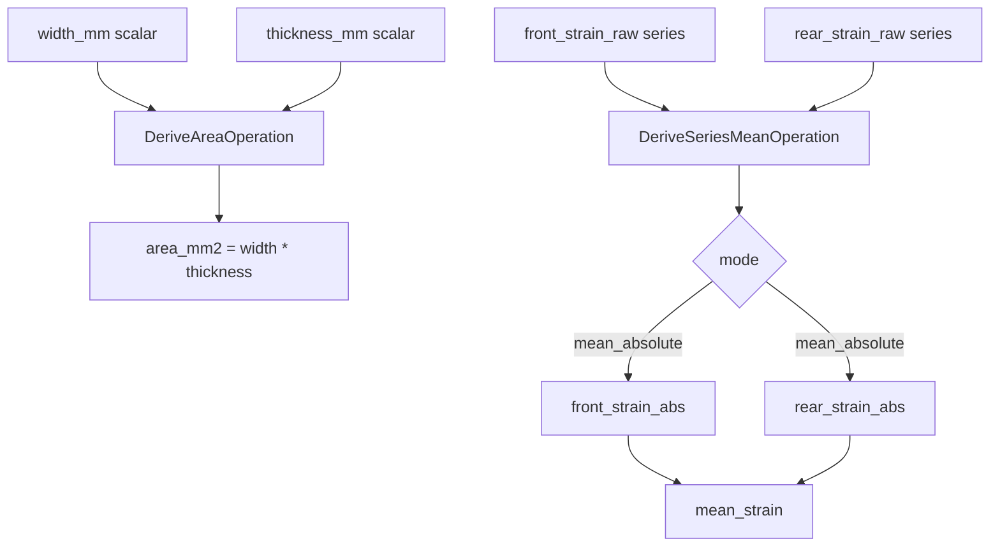
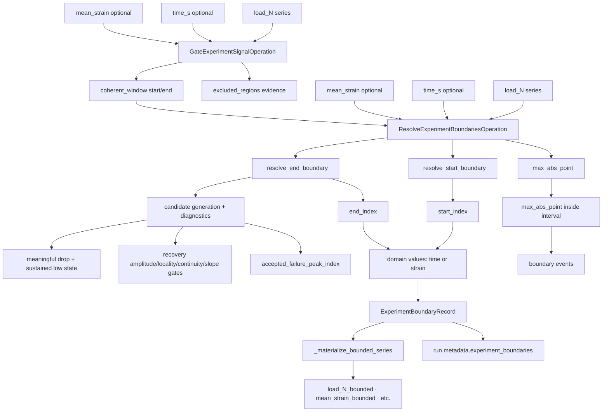
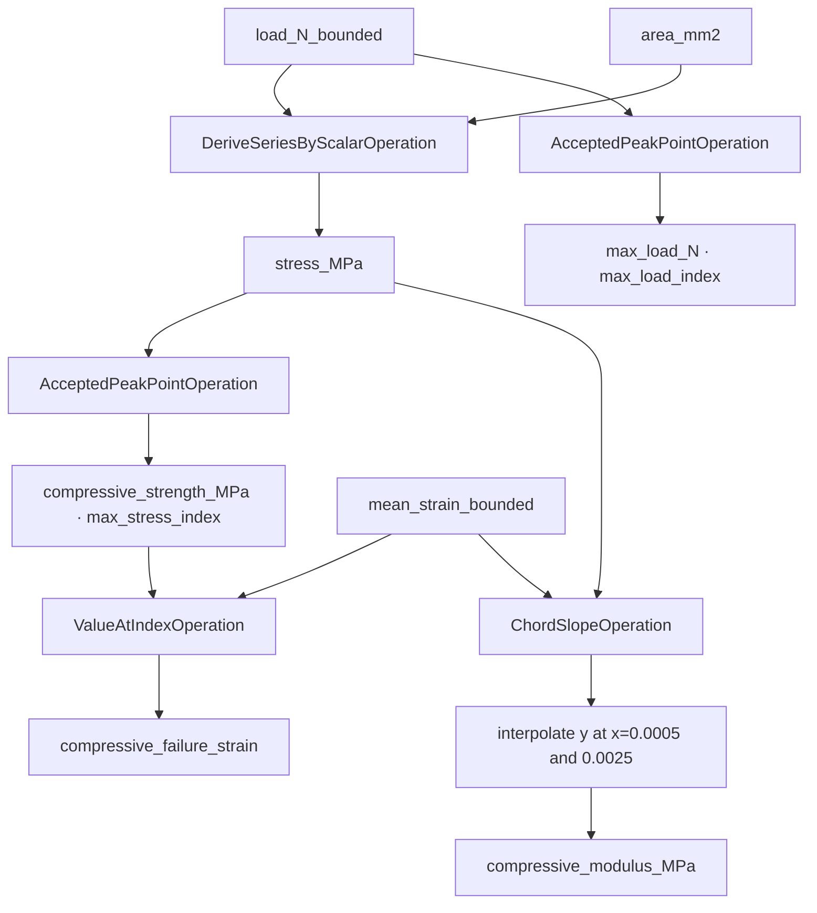
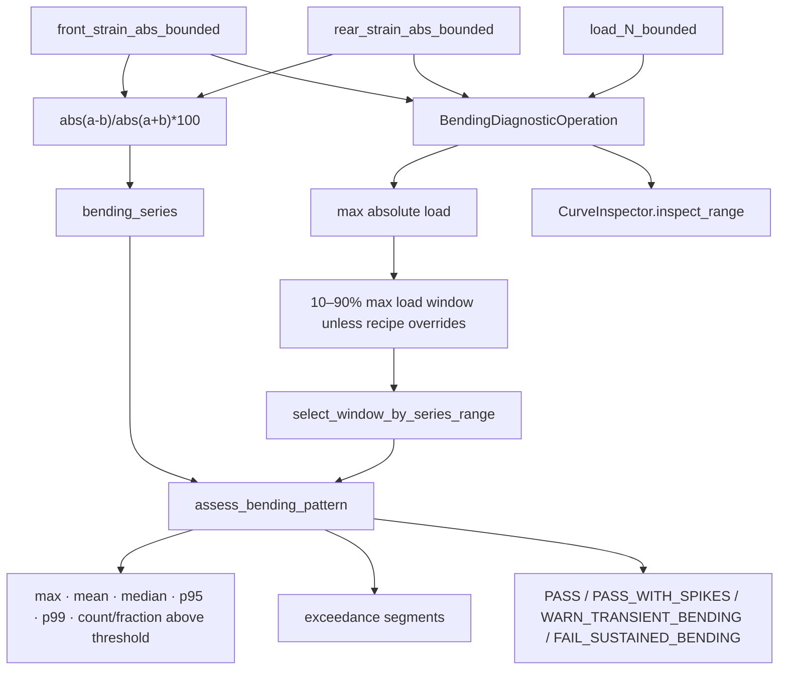

# Operation Internals Flow

## Scope

This document drills into the highest-impact operation internals for the ISO 14126 compression method: mapping, area derivation, mean strain construction, boundary resolution, stress derivation, peak/strength extraction, failure strain extraction, chord modulus, and bending diagnostic.

It complements `22_method_package_and_operation_execution.md` and `28_iso14126_method_recipe_flow.md`.

## Source anchors

| Operation area | Code anchor |
|---|---|
| Mapping, area, mean strain, stress | `src/operations/curve/derive_series.py` |
| Experiment signal gate | `src/operations/curve/gate_experiment_signal.py` |
| Boundary resolution | `src/operations/curve/boundary_resolution.py` |
| Max/accepted peak | `src/operations/curve/max_point.py` |
| Failure strain at index | `src/operations/curve/value_at.py` |
| Chord modulus | `src/operations/curve/chord_slope.py` |
| Bending diagnostic | `src/operations/diagnostics/bending.py` |
| Bending pattern classification | `src/operations/diagnostics/bending_pattern.py` |
| Operation context/result | `src/operations/core/operation_context.py`, `src/operations/core/operation_result.py` |

---

## L2 — Operation data-state model

Operations are stateful within a method run: each operation can add new scalars, series, units, metadata, diagnostics, warnings, and inspection references to the run context.

---

## L2 — Mapping operations

## Mapping operation risk points

| Risk | Behaviour |
|---|---|
| Missing channel mapping and required step | Warning result; downstream operations may lack series. |
| Optional channel missing | Emits OK result with output `None`. |
| Missing source token | Warning if required. |
| Numeric scalar requested but token is not numeric | Warning; value not set. |
| Channel transform incorrect | Propagates into all downstream derived series. |

---

## L2 — Area and mean strain operations

## Area/strain risks

| Operation | Key risk |
|---|---|
| `derive_area` | Width/thickness missing or wrong units invalidates stress/strength. |
| `derive_series_mean` | Front/rear channel orientation and absolute-value handling define the strain basis used for modulus, failure strain, and bending. |

---

## L2 — Experiment signal gate and boundary resolution internals

## Boundary output consequences

`gate_experiment_signal` runs before boundary resolution in the ISO 14126 resolve recipe. It classifies a conservative coherent experiment window and records excluded raw-scan regions such as post-experiment invalid tail, persistent low-load/high-domain tail, high-load domain reset before tail, domain reset/reversal, non-numeric cluster, implausible tail jump, and artificial plateau/saturation. The start side is intentionally weak: `coherent_window.start_index` remains raw index `0` for normal numeric runs, and loading onset markers are diagnostic-only evidence rather than trimming instructions. Borderline low-load/high-domain discontinuities that do not meet the minimum terminal persistence rule are emitted as `review` diagnostics and do not shorten the coherent window. The operation does not delete or rewrite raw imported rows.

The gate record can carry `status=ok`, `status=review`, or `status=fail` inside the evidence payload while the operation framework continues to report compatible operation statuses. Strong tail-only corrections normally lower confidence to `medium`; borderline discontinuities and late restart/spike evidence lower confidence to `low` and request review; disconnected high-load fragments after the selected window fail the gate as a malformed multi-fragment signal. These are signal-coherence diagnostics, not a final specimen-validity decision.

Boundary resolution defines the experiment interval used downstream. In ISO 14126 current recipe, the end policy is `peak_decline_non_recovery`, and bounded series are used for stress, peak load, strength, failure strain, modulus, and bending diagnostics. When a gate record is supplied, endpoint candidate generation, later-higher/recovery checks, preload-scale candidate filtering, and fallback maximum selection operate inside the coherent window while raw full-curve evidence remains available for audit. The boundary record also carries signal-window report routing and a raw-vs-windowed load-scale guard so an unexpectedly tiny gated window is review evidence rather than an unqualified formal result.

Low-load/high-domain tail detection uses two independent safeguards before it can shorten a coherent window: the terminal low-load state must persist for the configured point count, and the prefix reference peak must clear a floor derived from the full-run maximum load. If the discontinuity is real but only supported by preload-scale load evidence, the gate leaves the full scan available and emits `preload_scale_low_load_high_domain_discontinuity` with `report_routing.state=review`.

Report aggregation exposes the bounded interval on an explicit `analysis_progress` axis: 0 at the resolved start, 1 at the resolved end, and display percent derived from that fraction. This axis is analysis-window progress, not raw strain. Raw or reduced strain evidence remains in the strain series fields, and renderers should consume the coordinate contract instead of inferring semantics from legacy aliases.

Report renderers may scale fraction-to-percent for display, but they should not reconstruct strain from progress or relabel progress as strain. Audit curve-family and curve-shape plots therefore display analysis-window progress when using common-grid rows; actual strain remains reserved for bounded stress-strain replicate evidence.

The active endpoint detector keeps the `peak_decline_non_recovery` policy name for compatibility, but resolves candidates with an auditable predicate model:

- candidate peaks come from sign-regime transitions, start-of-interval drops, and local/plateau peaks;
- a candidate must show a meaningful post-peak amplitude drop and a sustained low-state window;
- real recovery requires return near the candidate peak plus locality and continuity from the same drop event;
- slope comparability and significant-later-higher tolerance are secondary recovery gates;
- strain-domain irregularity and load sign reversal are emitted as diagnostics rather than hidden vetoes.

Boundary records distinguish `analysis_interval_end_index`, `accepted_failure_peak_index`, `max_within_interval_index`, and `reported_strength_index`. The ISO reduce recipe currently reports endpoint-anchored accepted failure peak values through `accepted_failure_peak_index` / `reported_strength_index`, while preserving the max-within-interval index for audit.

## Boundary risk points

| Risk | Consequence |
|---|---|
| Missing or nonnumeric load | Boundary warnings and low-confidence interval. |
| End before start | Warning and bounded-series materialisation may fail. |
| Raw machine maximum outside method interval | Preserved as diagnostic-only event, not used for method reduction. |
| Gate too aggressive | Can hide legitimate endpoint evidence from boundary detection; gate policy is deliberately conservative, requires strong blunt-tail evidence before shortening the window, and emits review diagnostics for borderline cases. |
| Gate too weak | Blunt invalid scan tails, low-load/high-domain terminal jumps, or disconnected high-load fragments remain available to fallback endpoint selection; raw max diagnostic should expose the conflict. |
| Window scale mismatch | If the gated-window peak is below the configured fraction of the raw full-run peak, boundary output is routed to review through signal-window scale evidence. |
| Policy signature changes | Changes calculation interval and all downstream formal outputs. |
| Start/end detection near noisy data | Can move max/strength/failure strain and should be auditable. |

---

## L2 — Stress, peak, failure strain, and modulus operations

## Formal output operation risks

| Output | Main risk |
|---|---|
| `stress_MPa` | Depends on correct load sign/absolute transform and area. |
| `max_load_N` | Uses `accepted_failure_peak_index`, not always raw machine max or max-within-interval. |
| `compressive_strength_MPa` | Uses `reported_strength_index`; currently this is endpoint-anchored through the accepted failure peak policy. |
| `compressive_failure_strain` | Samples mean strain at max stress index. |
| `compressive_modulus_MPa` | Requires interpolation at both chord endpoints; fails if strain range does not cover 0.0005–0.0025. |

---

## L2 — Bending diagnostic internals

## Bending pattern classification

| Classification | Current condition |
|---|---|
| `PASS` | No bending values exceed threshold in the assessment window. |
| `PASS_WITH_SPIKES` | Longest segment within spike point limit and total exceedance fraction small enough. |
| `WARN_TRANSIENT_BENDING` | Exceedance clustered but not sustained according to transient thresholds. |
| `FAIL_SUSTAINED_BENDING` | Longest segment fraction or total exceedance fraction exceeds sustained-failure thresholds. |

## Bending risk points

| Risk | Consequence |
|---|---|
| Missing front/rear/load series | Warning and no diagnostic payload. |
| Zero denominator in bending formula | Point omitted as `None`. |
| No points in window | Warning and low confidence. |
| Policy threshold/segment settings | Directly changes classification and acceptance flags. |
| Bending output is diagnostic/acceptance evidence | Should remain separate from stress-strain reduction evidence. |

---

## L4 — Operation internals data contract

| Operation | Inputs | Outputs | Main downstream consumers |
|---|---|---|---|
| `map_channel` | Mapping role + source channel | run series + units | all downstream series operations. |
| `map_scalar` | Mapping role + token | run scalar + units | area, report/failure metadata, acceptance. |
| `derive_area` | width, thickness | `area_mm2` | stress/strength/report. |
| `derive_series_mean` | front/rear strain | `mean_strain`, abs strain series | boundary, modulus, failure strain, bending. |
| `gate_experiment_signal` | load/time/mean strain | coherent window, excluded-region evidence, report routing | boundary candidate scan, acceptance routing, and audit/workbench evidence. |
| `resolve_experiment_boundaries` | load/time/strain | interval, boundary events, bounded series, signal-window scale evidence | formal reduction, acceptance routing, and audit. |
| `derive_series_by_scalar` | load series + area | stress series | strength, modulus, curves. |
| `accepted_peak_point` | bounded load/stress + boundary anchor | max load/strength index/value | formal outputs. |
| `value_at_index` | mean strain + max stress index | failure strain | formal output. |
| `chord_slope` | mean strain + stress | modulus + chord anchors | formal output/audit. |
| `bending_diagnostic` | front/rear strain + load | bending diagnostic payload + inspection | failure analysis, acceptance, audit. |

## Open residuals

1. Boundary and signal-gate helper functions should be separately documented if boundary behaviour becomes the next major rework area.
2. Curve-family diagnostic internals remain separate from operation internals and should be documented from `diagnostics/curves.py` if needed.
3. Exact operation test fixtures should be listed per operation.
4. Failure modes for incomplete series length mismatch should be tested explicitly.
