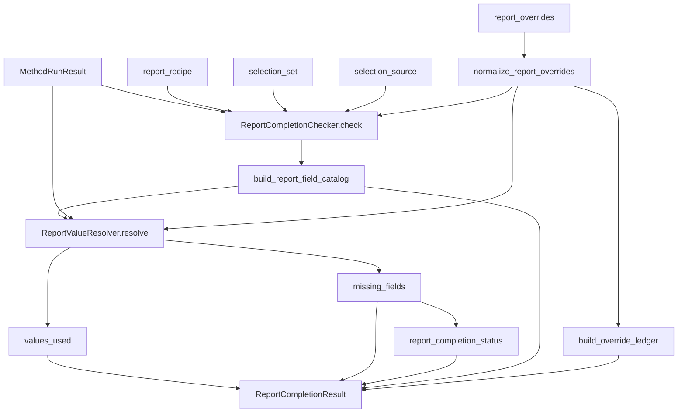
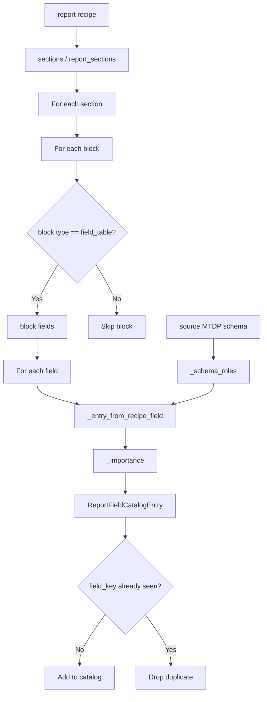
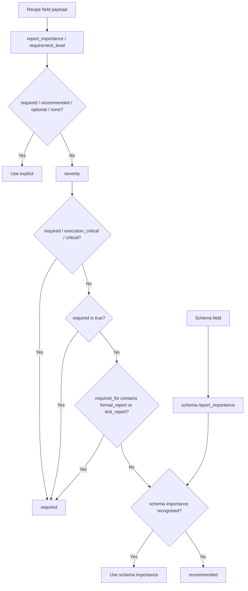
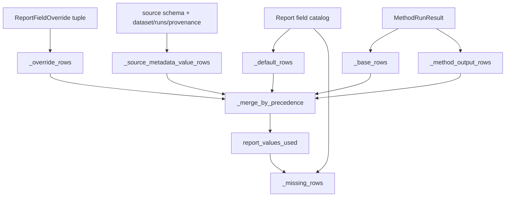
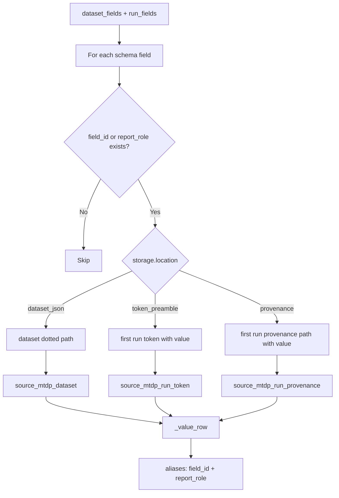
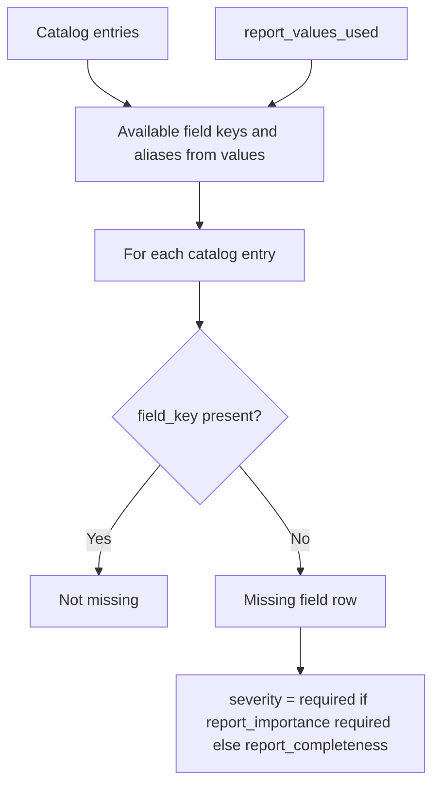
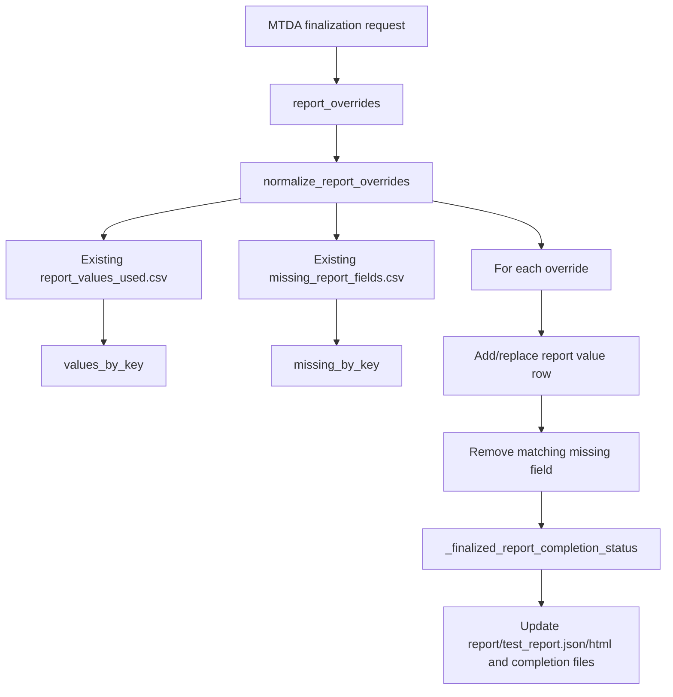

# Report Completion Flow

## Scope

This document drills into report-completion logic: how the formal report field catalog is built, how values are resolved, how missing fields are detected, and how report overrides alter completion without mutating method calculations.

This is separate from MTDP validation, MTDA readiness, validation checks against reference values, and acceptance/selection logic.

## Source anchors

| Flow area | Code anchor |
|---|---|
| Completion checker | `src/reporting/completion/report_completion_checker.py` |
| Field catalog | `src/reporting/completion/report_field_catalog.py` |
| Value resolver | `src/reporting/completion/report_value_resolver.py` |
| Override model/ledger | `src/reporting/completion/report_override.py` |
| Completion status | `src/reporting/completion/report_completion_status.py` |
| Report engine integration | `src/reporting/core/report_engine.py` |
| Finalization override application | `src/mtda_finalization/finalization_service.py` |

---

## L2 — Report completion checker overview

---

## L2 — Report field catalog construction

## Catalog entry contract

| Field | Meaning |
|---|---|
| `field_key` | Formal report field key. |
| `label` | Human-facing label. |
| `section_id` / `section_title` | Report section ownership. |
| `report_importance` | Required/recommended/optional/none. |
| `report_role` | Matched schema report role if available. |
| `source` | `recipe` or `recipe+schema`. |
| `required` | True when importance is required. |
| `default` | Optional default value from recipe/schema. |

---

## L3 — Report importance resolution

## Importance implication

Report importance is not identical to MTDP field `required`. A field can be optional for MTDP export but required for formal report completion or required only under ISO-specific accepted-run rules.

---

## L2 — Value resolution precedence

## Value precedence order

1. Report overrides.
2. Source MTDP metadata.
3. Base report rows.
4. Method outputs.
5. Report defaults.

This means a report-only override can intentionally fill a formal report value without recalculating method outputs or mutating the source MTDP.

---

## L3 — Source metadata value resolution

## Metadata resolution caution

For run-scoped metadata, the resolver currently uses the first run that has a non-empty value. That is useful for report-level metadata but should be reviewed for fields that differ per run or should be aggregated/report-scoped differently.

---

## L3 — Missing field detection

## Missing row contract

| Field | Meaning |
|---|---|
| `section_id`, `section_title` | Report section affected. |
| `field`, `field_key` | Missing formal report field. |
| `label` | Human label. |
| `severity` | `required` or `report_completeness`. |
| `requirement_level`, `report_importance` | Required/recommended/optional status. |
| `status` | `missing`. |
| `source_type` | `missing`. |
| `message` | Explanation that field was not found in overrides, package metadata, method outputs, or defaults. |

---

## L2 — Finalization override interaction

## Override principle

Report overrides are report-only amendments. They can change formal report values and completion status, but they are not allowed to change method package, mapping, MTDP input, calculation inputs, operation policies, or validation references.

---

## L4 — Report completion data contract

| Source | Transformation | Destination | Failure/gate behaviour |
|---|---|---|---|
| Report recipe sections/blocks | `build_report_field_catalog` | Field catalog | Non-field-table blocks do not create catalog entries. |
| Source schema report roles | `_schema_roles` | Catalog enrichment | Missing schema role falls back to recipe-only entry. |
| Overrides | `_override_rows` | Top-precedence value rows | Override wins over metadata/method/default rows. |
| Source MTDP metadata | `_source_metadata_value_rows` | Value rows with source provenance | First available run value used for run-scoped fields. |
| Method outputs | `_method_output_rows` | Value rows | First specimen/dataset-summary row used where matching field exists. |
| Defaults | `_default_rows` | Lowest-precedence value rows | Only used when no higher-precedence value exists. |
| Catalog + values | `_missing_rows` | Missing-field table | Missing required values affect quality/completion. |
| Missing fields | `report_completion_status` | Completion status | Used by report metadata, finalization, and quality gate. |

## Open residuals

1. Report completion status exact statuses should be documented from `report_completion_status.py`.
2. Report override schema/ledger should be separately documented.
3. Per-run report fields need policy review to avoid accidental first-run-only reporting where inappropriate.
4. `required_for_accepted_runs` fields need explicit integration matrix with ISO helpers.
