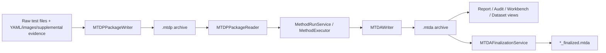
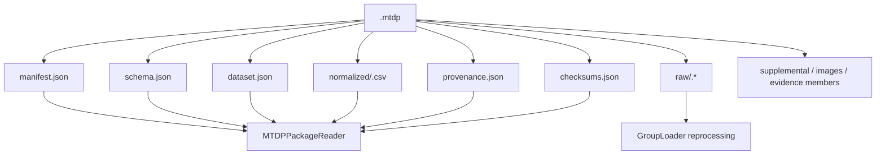
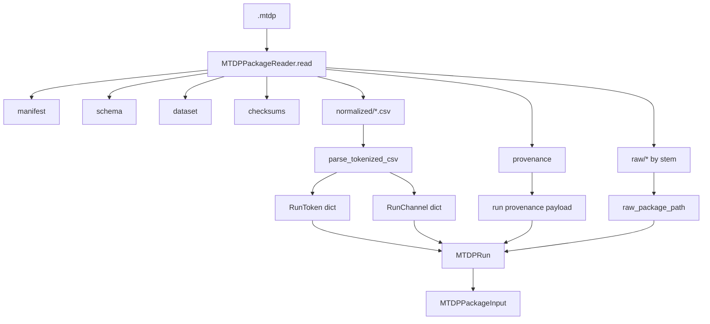
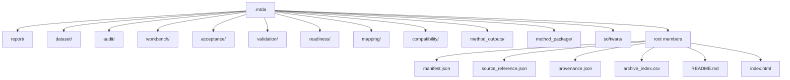
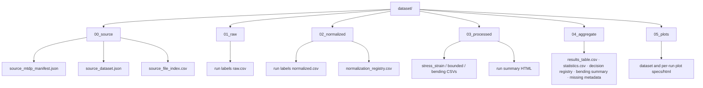
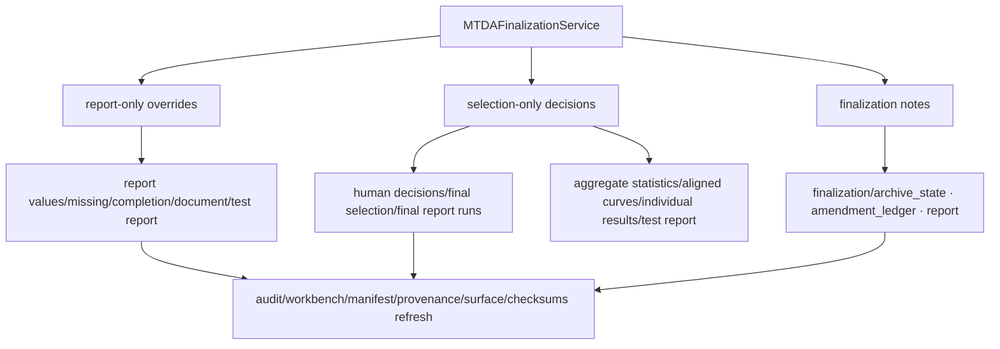

# MTDP and MTDA Archive Member Contracts

## Scope

This document captures the archive-member contracts for `.mtdp` and `.mtda` files. It is intended to make explicit which files are produced, what they mean, and which downstream processes consume them.

This document focuses on archive structure and producer/consumer responsibility, not on the internal computation that generates each member.

## Source anchors

| Archive area | Code anchor |
|---|---|
| MTDP writer | `src/mtdp_enrichment/package/mtdp_package.py` |
| MTDP reader | `src/archives/mtdp/reader.py` |
| MTDP downstream models | `src/archives/mtdp/models.py` |
| Group exporter | `src/mtdp_enrichment/services/group_exporter.py` |
| MTDA writer | `src/archives/mtda/writer.py` |
| MTDA manifest/surface manifest/checksums | `src/archives/core/manifest.py`, `src/archives/mtda/surface_manifest.py`, `src/archives/core/checksums.py` |
| MTDA finalization rewriter | `src/mtda_finalization/mtda_rewriter.py` |
| MTDA finalization service | `src/mtda_finalization/finalization_service.py` |

---

## L1 — Archive handoff model

---

## L2 — MTDP archive contract

## MTDP member matrix

| Member / pattern | Producer | Consumer | Purpose |
|---|---|---|---|
| `manifest.json` | MTDP writer | MTDP reader, package validator, method service | Package identity, schema id/version, package metadata. |
| `schema.json` | MTDP writer | MTDP reader, report/method tooling | Embedded schema snapshot for package interpretation. |
| `dataset.json` | MTDP writer | MTDP reader, readiness, report completion | Dataset-level metadata and run order. |
| `raw/<run_id>.*` | MTDP writer | Reprocessing loader, audit/source trace | Original raw source file preservation. |
| `normalized/<run_id>.csv` | MTDP writer | MTDP reader, method execution | Tokenized metadata and normalized channel table. |
| `provenance.json` | MTDP writer | MTDP reader, reprocessor, report completion | Source identities, grouping events, run provenance, supplemental records. |
| `checksums.json` | MTDP writer | Validator/integrity review | Archive integrity metadata. |
| Sidecar YAML members | MTDP writer | Reprocessor/audit | Preserved supplemental YAML source. |
| Image evidence members | MTDP writer | Audit/report/future metrology | Preserved run image evidence. |
| General supplemental members | MTDP writer | Audit/provenance | Calibration, mapping, equipment, or other support files. |

---

## L2 — MTDP reader contract

## Reader lookup semantics

| Lookup | Behaviour |
|---|---|
| `MTDPRun.token(name)` | Case-insensitive/normalised lookup with aliases such as failure mode / primary failure mode. |
| `MTDPRun.channel(name)` | Case-insensitive/normalised lookup with aliases such as load/force. |
| `RunToken.numeric` | Uses Python `float(str(value))`; metadata numeric parsing is separate from parser numeric ingestion. |
| `MTDPPackageInput.run_ids` | Ordered tuple from loaded runs. |

---

## L2 — MTDA archive major sections

---

## L2 — MTDA root/software contract

| Member | Producer | Purpose |
|---|---|---|
| `manifest.json` | `build_mtda_manifest` | MTDA archive identity, method version, source package, artifact surfaces. |
| `source_reference.json` | `_source_reference` | Links MTDA to source `.mtdp`. |
| `mapping_profile.json` | MTDA writer | Raw mapping used by result. |
| `provenance.json` | `_provenance` | Method run provenance, compatibility/candidate/resolution report references. |
| `archive_index.csv` | `_archive_index_rows` | Flat listing of archive members. |
| `README.md` | `_readme_text` | Human archive orientation. |
| `index.html` | `_index_html` | Root HTML index. |
| `software/surface_manifest.json` | `build_surface_manifest` | Surface discovery and entry-point manifest. |
| `software/checksums.json` | `build_checksums` | Integrity metadata for all archive members. |

---

## L2 — MTDA report contract

| Member | Producer | Purpose |
|---|---|---|
| `report/test_report.html` | Report engine | Formal human-readable report. |
| `report/test_report.json` | Report engine | Formal report data payload. |
| `report/test_report.pdf` | MTDA writer simple PDF generator | PDF companion for formal report. |
| `report/report_document.json` | Report engine | Rendered report document model. |
| `report/report_values_used.csv` | Report completion resolver | Values used by report. |
| `report/missing_report_fields.csv` | Report completion resolver / ISO gap enrichment | Missing report fields. |
| `report/report_completion_status.json` | Report completion status | Overall completion status. |
| `report/report_sections.json` | Report engine | Section-level status. |
| `report/report_completeness_summary.csv` | Report engine | Summary of report completion. |
| `report/individual_results.csv` | Report engine | Per-run selected results. |
| `report/aggregate_statistics.csv` | Report engine | Formal aggregate statistics. |
| `report/aligned_curves.csv` | Curve aggregation | Aligned curve family for report. |
| `report/characteristic_points.csv` | Curve aggregation | Characteristic points. |
| `report/feature_lines.csv` | Curve aggregation | Plot feature lines. |
| `report/failure_analysis.csv` | Report engine | Failure-analysis table. |
| `report/deviations_from_standard.csv` | ISO/report compliance helper | Deviations from standard. |
| `report/vega_specs/aggregate_stress_strain_mean_variability.json` | Report plot builder | Aggregate plot specification. |
| `report/report_field_overrides.json` | Report completion/finalization | Report-only override payload. |
| `report/report_override_ledger.json` | Report completion/finalization | Override ledger. |
| `report/report_quality_gate.json` | Finalization/service quality gate | Quality-gate status after report/finalization updates. |

---

## L2 — MTDA dataset contract

## Dataset section purpose

The `dataset/` branch is the user-facing, recommended archive layout. It re-expresses source, normalized, processed, aggregate, and plot artifacts in a more navigable form than the raw internal method outputs.

---

## L2 — MTDA method/audit/decision contract

| Section | Key members | Purpose |
|---|---|---|
| `readiness/` | readiness report, summary, resolved inputs, missing inputs | Pre-execution input sufficiency. |
| `mapping/` | mapping profile used, candidate report, resolution report | Mapping traceability. |
| `compatibility/` | schema-method compatibility report/summary/proposal stub | Schema/method compatibility gate evidence. |
| `method_outputs/` | specimen results, dataset summaries, curve family, boundaries | Computed method outputs before report/audit presentation. Boundary records include selected endpoint-candidate summaries, candidate diagnostics, resolved endpoint policy defaults, and distinct endpoint/accepted-peak/max/reported-strength indices. |
| `validation/` | validation report/summary/reference values/deviations | Reference-value validation. |
| `acceptance/` | acceptance report, flags, selection sets, final report runs, curve-family diagnostics | Acceptance and final run selection. |
| `audit/` | evidence, procedure index, audit blocks/index, boundary resolution/events, operation log, summaries, warnings, inspections, audit report | Evidence traceability and audit surface. Boundary-resolution JSON and operation evidence carry candidate-level endpoint diagnostics for audit. |
| `workbench/` | operation trace, index HTML | Operation-level method development/debug surface. |
| `method_package/` | method recipe YAML files copied into archive | Method package snapshot used for the run. |

---

## L2 — MTDA finalization impact on archive members

## L4 — Archive boundary risks

| Boundary | Risk | Mitigation/documentation requirement |
|---|---|---|
| Raw file → MTDP normalized CSV | Parser or unit conversion drift changes downstream method outputs. | Preserve raw, normalized, parser provenance, bad-cell diagnostics. |
| MTDP → MTDA source model | Token/channel aliases can hide naming mismatches. | Document mapping profile and readiness resolution. |
| Method outputs → report | Selection set determines aggregate values. | Preserve selection membership and final report runs. |
| Operation log → audit blocks | Poor evidence grouping hides method decisions. | Procedure evidence index and audit block index must remain current. |
| Finalization → finalized archive | Report-only edits might be mistaken for recalculation. | Amendment policy, provenance, report notices, checksums, and finalization namespace. |

## Open residuals

1. Generate an archive-member manifest from an actual sample MTDP/MTDA and compare against this contract.
2. Define which members are mandatory, optional, legacy-compatible, or recommended-layout only.
3. Define versioning rules for archive schema evolution.
4. Add tests that assert archive contract member presence for canonical fixture runs.
