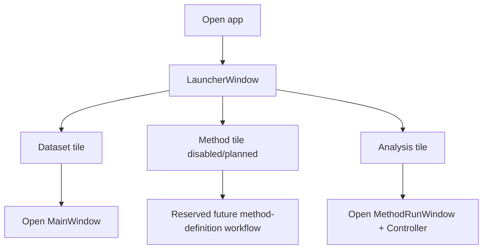
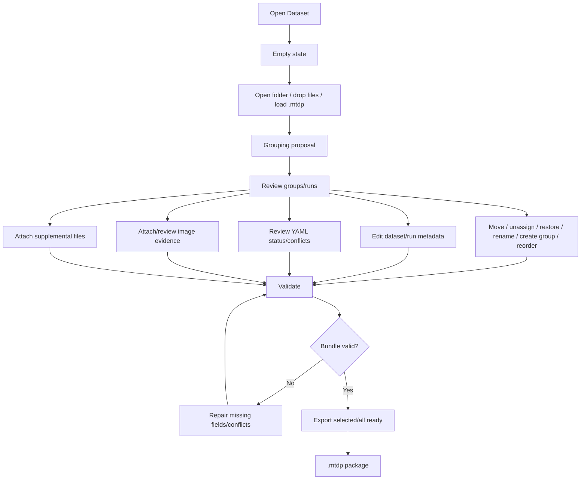
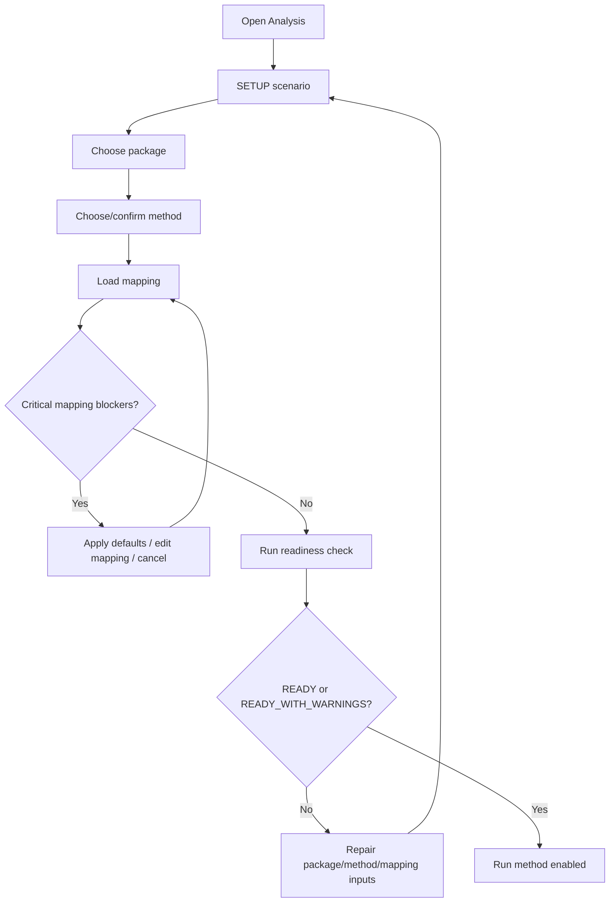
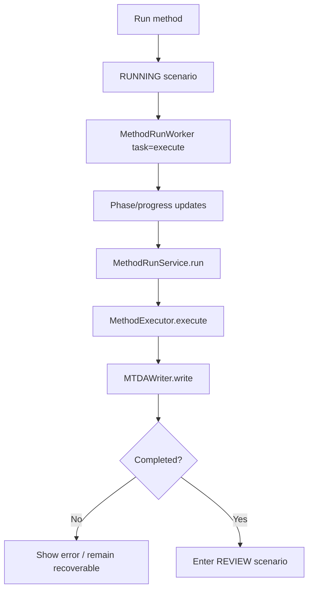
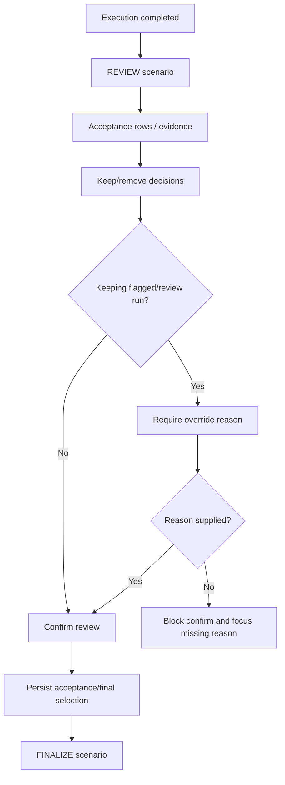
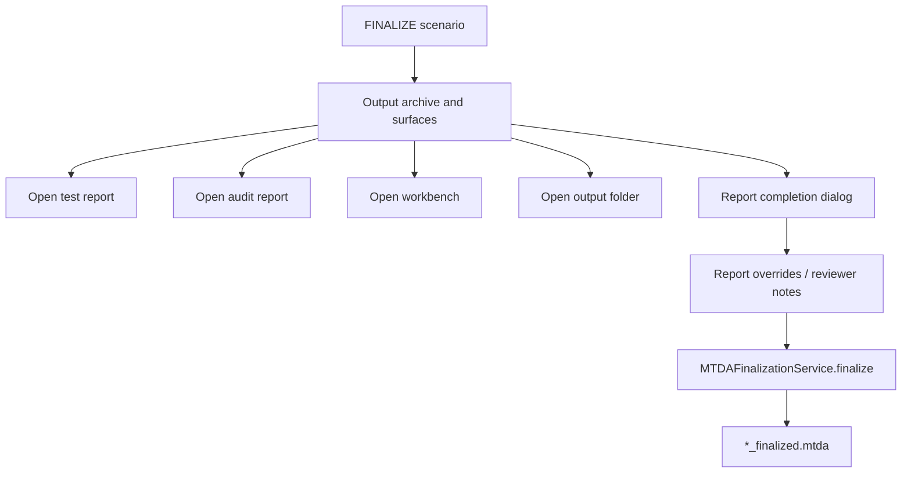
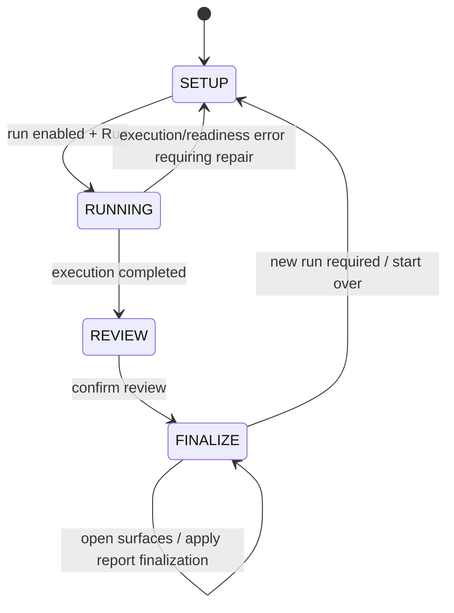

# UI Journey Maps

## Scope

This document captures operator-facing journeys for the two active UI chunks:

- Dataset / MTDP aggregation journey.
- Analysis / MTDA method-run journey.

The goal is to connect process flows to what the operator sees and does. This is intentionally complementary to Mermaid process diagrams.

## Source anchors

| UI area | Code anchor |
|---|---|
| Launcher | `src/mtdp_enrichment/ui/launcher_window.py` |
| MTDP aggregation window | `src/mtdp_enrichment/ui/main_window.py` |
| BundleBuilder tree/actions | `src/mtdp_enrichment/ui/bundle_builder.py` |
| Method wizard controller | `src/ui/method_run_wizard/controller.py` |
| Method wizard state | `src/ui/method_run_wizard/state.py` |
| Method wizard window | `src/ui/method_run_wizard/window.py` |
| Method wizard spotlights | `src/ui/method_run_wizard/spotlights/` |
| Method wizard components | `src/ui/method_run_wizard/components/` |
| Mapping dialog | `src/ui/method_run_wizard/mapping_dialog.py` |
| Report completion dialog | `src/ui/method_run_wizard/report_completion_dialog.py` |

---

## L1 — Launcher journey

## Launcher journey table

| Screen/state | Operator sees | Operator action | System response | Backend anchor |
|---|---|---|---|---|
| Launcher | Dataset, Method, Analysis tiles | Click Dataset | Opens MTDP package-preparation interface. | `LauncherWindow.open_packaging_interface` |
| Launcher | Method tile disabled/planned | None | No active method-definition workflow yet. | Launcher tile config/menu state |
| Launcher | Analysis tile | Click Analysis | Opens method-run wizard. | `LauncherWindow.open_method_wizard` |

---

## L2 — Dataset / MTDP aggregation journey

## MTDP journey table

| Screen/state | Operator sees | Operator action | System response | Error/recovery branch | Backend anchor |
|---|---|---|---|---|---|
| Empty Dataset window | Drop/open instructions | Drop folder/files or open folder | Parses files, detects sidecars, proposes grouping. | Unsupported file/drop message. | `MainWindow.process_dropped_paths`, `_load_grouping_inputs_as_proposal` |
| Grouping tree | Proposed bundles and unassigned runs | Select bundle/run | Loads corresponding forms/evidence panels. | Empty selection keeps forms disabled. | `BundleBuilder`, `MainWindow._sync_selection` style routes |
| Grouping tree | Bundle/run actions | Move, unassign, restore, rename, create, reorder | Updates bundle state and manual correction counts. | Invalid target/action no-ops. | `BundleBuilder` editing methods |
| Dataset/run forms | Metadata fields | Edit values/units | Saves into bundle/run enrichment. | Validation later reports missing/invalid values. | `SchemaForm`, `MainWindow._save_current_forms` |
| YAML review | YAML imported / needs review / mapping required | Review or rematch mapping | Applies imported fields/profile and updates conflicts/status. | Sidecar conflicts block validation/export. | `SidecarYamlImporter`, rematch handlers |
| Image/supplemental panels | Evidence attachment controls | Attach/review files | Adds image/supplemental evidence to run/dataset. | Missing file or invalid role should be surfaced by dialog. | image/supplemental dialogs |
| Validation/export | Validate/export buttons | Validate/export selected/all | Writes `.mtdp` if validation passes. | Missing fields, normalizer issues, sidecar conflicts prevent export. | `MainWindow._validate_bundle`, `GroupExporter.export_group` |

---

## L2 — Analysis / MTDA setup journey

## Analysis setup journey table

| Screen/state | Operator sees | Operator action | System response | Error/recovery branch | Backend anchor |
|---|---|---|---|---|---|
| Setup/package | Package task card | Choose `.mtdp`/`.mtda` | Loads package summary, schema, run count. | Missing/invalid package blocks next steps. | `_change_package`, `_load_package_context` |
| Setup/method | Method task card | Choose method | Loads method summary and default mapping path. | Missing method blocks readiness. | `_apply_method_entry` |
| Setup/mapping | Mapping summary/gaps | Confirm, apply defaults, edit mapping | Loads mapping, candidate report, resolution report. | Critical unresolved mapping blocks readiness/run. | `_load_mapping_context`, `_mapping_resolution_choice` |
| Setup/readiness | Readiness task card | Run readiness | Async readiness check updates setup state. | NOT_READY/MAPPING_REQUIRED prevents run. | `_check_readiness_from_setup`, service adapter readiness worker |
| Setup ready | Run-enabled action | Click Run | Enters running scenario. | Output exists without overwrite or service errors stop run. | `_run_from_setup`, `_enter_running` |

---

## L2 — Analysis running journey

## Running journey table

| Screen/state | Operator sees | Operator action | System response | Error/recovery branch | Backend anchor |
|---|---|---|---|---|---|
| Running | Phase/progress/log | Wait/observe | Worker emits progress, per-run status, phase labels. | Service/worker exception enters error state. | `_enter_running`, `_on_worker_progress`, `_on_worker_completed` |
| Running complete | Result available | None / automatic transition | Stores `service_result`, validation/acceptance summaries. | Incomplete result shows failure/error message. | `_on_worker_completed` |

---

## L2 — Analysis review journey

## Review journey table

| Screen/state | Operator sees | Operator action | System response | Error/recovery branch | Backend anchor |
|---|---|---|---|---|---|
| Review | Acceptance summary and run decisions | Keep/remove runs | Updates acceptance keep map and override reasons. | Missing reason blocks confirm for flagged kept runs. | `_enter_review`, review spotlight models |
| Review confirm | Confirm/open output action | Confirm review | Persists selection/final decision data and enters finalize. | Temporary persistence hook should be reviewed as architecture debt. | `_confirm_review`, `service_adapter.persist_acceptance` |

---

## L2 — Analysis finalize journey

## Finalize journey table

| Screen/state | Operator sees | Operator action | System response | Error/recovery branch | Backend anchor |
|---|---|---|---|---|---|
| Finalize | Output path and surface buttons | Open report/audit/workbench/folder | Opens generated surfaces. | Missing surface should show error. | `_open_report`, `_open_workbench`, `_open_archive_surface` |
| Report completion | Missing fields / completion state | Add overrides or notes | Builds amendment request. | Method-impacting changes should be rejected and require new run. | `ReportCompletionDialog`, `_finalize_mtda` |
| Finalized output | Finalized archive path | Open/save/archive | Writes finalized MTDA and refreshes surfaces/checksums. | Finalization errors shown in finalize state. | `MTDAFinalizationService.finalize` |

---

## L3 — Wizard state contract

## Wizard state fields

| State field | Meaning |
|---|---|
| `input_package_path`, `method_path`, `mapping_path`, `output_path` | Primary selected paths. |
| `package_summary`, `method_summary`, `mapping_summary` | Setup cards and status. |
| `readiness_report` | Determines `run_enabled`. |
| `service_result` | Completed execution result. |
| `execution_status`, `current_phase`, `running_progress_pct` | Running state. |
| `validation_summary`, `acceptance_summary` | Review/finalization summaries. |
| `acceptance_keep`, `acceptance_override_reason` | Review decisions. |
| `finalize_reviewer`, `finalize_note`, `finalized`, `finalize_error` | Finalization state. |

## Open residuals

1. Add screenshot-referenced UI journey docs using the local artifact screenshots.
2. Map each action-bar button to its exact controller method and enabled/disabled condition.
3. Review whether Dataset-side residual MTDA-opening helpers should stay in `MainWindow` or move fully to Analysis.
4. Document keyboard/menu navigation separately for accessibility.
