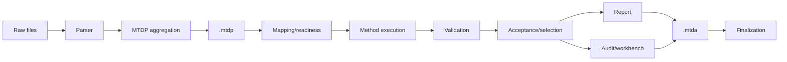

# Drill-Down Coverage Status

## Purpose

This document records the current coverage status of the process-flow documentation after the broad and deep drill-down passes.

The purpose is to distinguish between:

- **process-flow coverage**, which is now broadly complete for the current implementation spine; and
- **implementation/test-detail residuals**, which should be handled as targeted future documentation or development tasks rather than by adding more broad overview diagrams.

## Coverage position

The process-flow documentation now covers the complete active MTDP-to-MTDA backbone:

## Coverage matrix

| Area | Status | Primary files |
|---|---|---|
| Visualisation strategy | Documented | `00_visualisation_strategy.md` |
| System overview | Documented | `01_system_overview.md` |
| MTDP aggregation flow | Documented | `10_mtdp_aggregation_flows.md` |
| Parser contract and numeric risks | Documented | `11_parser_contract_and_numeric_risks.md` |
| MTDP schema field lifecycle | Documented | `12_mtdp_schema_field_lifecycle.md` |
| YAML sidecar reconciliation | Documented | `13_yaml_sidecar_reconciliation_flow.md` |
| Bundle editing and MTDP reprocessing | Documented | `14_bundle_editing_and_reprocessing_flow.md` |
| Schema/method/report field matrix | Documented | `15_schema_method_report_field_matrix.md` |
| Mapping/readiness object contracts | Documented | `16_mapping_readiness_schema_contracts.md` |
| MTDA analysis overview | Documented | `20_mtda_analysis_flows.md` |
| Mapping to readiness resolution | Documented | `21_mapping_to_readiness_resolution.md` |
| Method package and operation execution | Documented | `22_method_package_and_operation_execution.md` |
| Validation policy | Documented | `23_validation_policy_flow.md` |
| Acceptance and final selection | Documented | `24_acceptance_selection_flow.md` |
| Procedure evidence and audit blocks | Documented | `25_procedure_evidence_and_audit_blocks.md` |
| Formal report building | Documented | `26_report_building_flow.md` |
| MTDA finalization | Documented | `27_mtda_finalization_flow.md` |
| Concrete ISO 14126 method recipes | Documented | `28_iso14126_method_recipe_flow.md` |
| Operation internals | Documented | `29_operation_internals_flow.md` |
| Report completion | Documented | `30_report_completion_flow.md` |
| Archive member contracts | Documented | `31_archive_member_contracts.md` |
| UI journey maps | Documented | `32_ui_journey_maps.md` |
| Maintenance protocol | Documented | `99_flow_documentation_protocol.md` |
| Machine-readable inventory | Documented | `flow_inventory.yml` |

## Remaining residuals

The remaining residuals are not broad process-flow gaps. They are more specific implementation/detail layers:

| Residual class | Meaning | Recommended handling |
|---|---|---|
| Generated exhaustive tables | Full field-by-field CSV or Markdown tables generated from schema/method files. | Generate from code/schema when needed, not manually maintain. |
| Test/fixture cross-checks | Proof that documented archive members and flows are present in fixture outputs. | Add tests or generated contract reports. |
| Numerical policy deep dives | Boundary-resolution, curve-shape, statistical outlier, and bending threshold scientific tuning. | Document as scientific method notes or validation reports. |
| UI screenshot binding | Link current screenshots to UI journey states. | Add screenshot-index documentation if UI review resumes. |
| Exact dialog state machines | Mapping dialog, report completion dialog, and review spotlight state details. | Document only when these UI components are being refactored. |
| Operation-by-operation fixtures | Per-operation input/output examples and expected warnings. | Add as operation contract tests. |
| Archive versioning policy | Rules for evolving MTDP/MTDA member contracts. | Add when archive schema versioning is actively changed. |

## Current recommendation

Stop broad process documentation expansion here.

Future documentation should be created only when one of these is true:

1. A specific implementation branch is being refactored.
2. A test fixture exposes a mismatch with the documented flow.
3. A new archive member, report surface, operation, or wizard state is introduced.
4. A scientific/numerical policy needs to be justified independently of code structure.

This prevents the process-flow section from becoming bloated while preserving enough detail to support precise future development directives.
