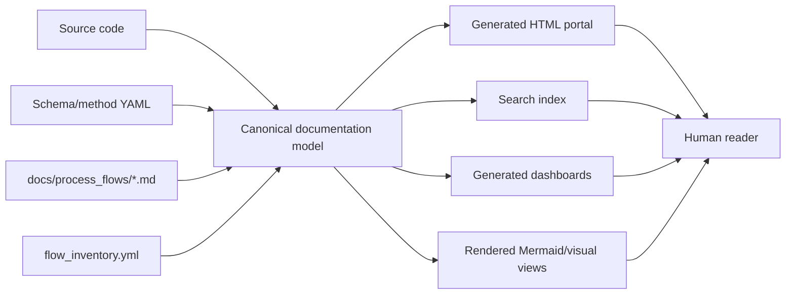
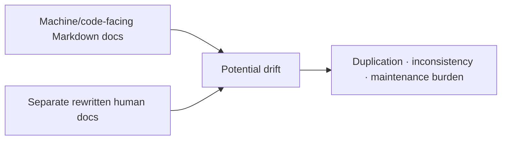

# Human Visualization Portal Strategy

## Purpose

The process-flow documentation is now structurally rich, but it is still primarily code-adjacent Markdown. That is good for version control and AI-directed development, but it is not the easiest interface for a human trying to understand the software quickly.

This document defines a **visualization layer** over the existing documentation.

It must not create a second documentation set.

## Core rule: one source, many views

The correct architecture is:

> **One canonical documentation/source layer; multiple generated views over it.**

The canonical truth remains:

- source code;
- method/schema YAML files;
- `docs/process_flows/*.md`;
- `docs/process_flows/flow_inventory.yml`;
- generated contract data produced from code/schema/archive fixtures.

The HTML layer is a reader interface. It renders, indexes, filters, links, and visualizes the existing source material. It must not rewrite the same process in a second human-only document set.



## What must not happen

Do not create this structure:



The portal must not contain manually rewritten equivalents of the process-flow files.

Examples of forbidden duplication:

- A second human-written MTDP aggregation explanation that repeats `10_mtdp_aggregation_flows.md`.
- A second human-written ISO 14126 recipe explanation that repeats `28_iso14126_method_recipe_flow.md`.
- A second manually maintained archive member table that repeats `31_archive_member_contracts.md`.
- A custom HTML page whose text restates the Markdown instead of rendering/linking it.

## What the HTML layer should do instead

The HTML layer should add interface affordances around the existing material:

| HTML function | Allowed? | Why |
|---|---:|---|
| Render existing Markdown as styled HTML | Yes | Same content, better readability. |
| Render Mermaid diagrams from existing Markdown | Yes | Same diagrams, better display. |
| Provide left navigation and search | Yes | Navigation metadata, not duplicate content. |
| Provide cards that link to existing docs | Yes | Navigation/summary only. |
| Generate a field table from schema YAML | Yes | Generated from source, not manually duplicated. |
| Generate an archive manifest from fixture archives | Yes | Generated evidence, not duplicated prose. |
| Provide filters over generated tables | Yes | View layer only. |
| Provide clickable graph nodes linking to source docs/code anchors | Yes | View layer only. |
| Manually rewrite each Markdown page into a nicer HTML page | No | Creates a parallel documentation set. |
| Maintain separate human and machine versions of the same flow | No | Causes drift and noise. |

## Recommended implementation direction

Use HTML as a **renderer and navigator**, not as a second authoring format.

Recommended first route:

1. Add a static-site configuration, preferably MkDocs Material or another Markdown-native renderer.
2. Point it directly at the existing `docs/process_flows/*.md` files.
3. Use `flow_inventory.yml` to define grouping/navigation where possible.
4. Add only minimal non-authoritative navigation pages if necessary.
5. Add generated dashboards only when they are produced from source files, not manually maintained.

## Human portal content policy

A portal page may contain:

- title and orientation text;
- links to canonical docs;
- a generated table/list from `flow_inventory.yml`;
- a generated graph from canonical docs or inventory;
- generated data extracted from schema/method/archive fixtures;
- UI affordances such as filters, tabs, cards, and collapsible sections.

A portal page must not contain:

- a manually rewritten copy of a canonical process flow;
- a second process explanation that must be kept in sync by hand;
- manually copied field tables from schema YAML;
- manually copied method recipe tables from method YAML;
- manually copied archive member manifests from produced archives.

## Preferred repository structure

Preferred low-duplication structure:

```text
docs/
  process_flows/                 # canonical Markdown source-of-truth
    00_visualisation_strategy.md
    01_system_overview.md
    ...
    34_human_visualization_portal_strategy.md
    flow_inventory.yml
mkdocs.yml                       # presentation/navigation config only
scripts/
  docs/
    generate_portal_index.py     # derives navigation/index data from flow_inventory.yml
    build_field_matrix.py        # derives table from schema YAML
    build_method_recipe_matrix.py# derives table from method YAML
    build_archive_manifest.py    # derives table from fixture MTDP/MTDA archive
site/                            # generated HTML output; not source-of-truth
```

Optional generated data/output structure:

```text
docs/generated/                  # generated, reproducible, not hand-authored
  field_matrix.md
  method_recipe_matrix.md
  archive_member_manifest.md
  flow_index.md
```

If generated files are committed, they must declare their source and generation command at the top. If they cannot be regenerated reproducibly, they should not be treated as source-of-truth.

## MkDocs role

MkDocs Material is appropriate if it is used only to render the current Markdown documentation and provide navigation/search.

Good MkDocs use:

- `mkdocs.yml` defines navigation over existing process-flow files.
- Existing Markdown files render directly into HTML.
- Mermaid diagrams are rendered by plugin or markdown extension.
- Search index is generated automatically.
- The built `site/` folder is disposable output.

Bad MkDocs use:

- Creating a parallel `docs/human_portal/` hierarchy that rewrites all process flows.
- Maintaining one Markdown for AI/development and another Markdown for human explanation.
- Copying tables manually from schema/method files into portal-only pages.

## Custom HTML role

Custom HTML should be reserved for interactive views that cannot be expressed well by static Markdown rendering.

Best custom views:

| View | Source | Content policy |
|---|---|---|
| Interactive process map | `flow_inventory.yml` + Mermaid/process docs | Nodes link to canonical docs; node descriptions generated/extracted, not rewritten. |
| Archive explorer | Archive contract doc + generated fixture manifest | Filter generated member metadata. |
| Field lifecycle explorer | Compression schema YAML + field lifecycle doc | Search fields; show generated storage/report/method links. |
| Operation evidence explorer | Operation registry + evidence contracts + operation docs | Link operation to canonical docs and code anchors. |
| UI journey explorer | UI journey doc + wizard state | Visualise existing journey states. |

Custom HTML should be a dashboard/view. It should not become a separate explanation corpus.

## Information architecture without duplication

The human portal can still have a strong user experience without duplicating content.

Recommended top navigation:

1. Start here → links to `01_system_overview.md` and `33_drilldown_coverage_status.md`.
2. MTDP aggregation → renders `10` through `16`.
3. MTDA analysis → renders `20` through `31`.
4. UI journeys → renders `32_ui_journey_maps.md`.
5. Coverage and maintenance → renders `33`, `34`, and `99`.
6. Generated dashboards → generated field/method/archive tables only.

The navigation labels can be human-friendly, but the pages remain the same canonical documents.

## Practical next step

The next implementation should be deliberately small:

1. Add `mkdocs.yml` that points directly to the existing `docs/process_flows/*.md` files.
2. Configure Mermaid rendering and search.
3. Build locally into `site/`.
4. Do not create a separate human-written portal folder yet.
5. After the static render is usable, add generated dashboard scripts one by one.

## Decision

HTML is the right human-facing visualization layer, but only as a **generated presentation layer**.

The project should avoid creating parallel human and machine documentation. The correct objective is to make the existing documentation visually navigable, searchable, and filterable without duplicating it.
