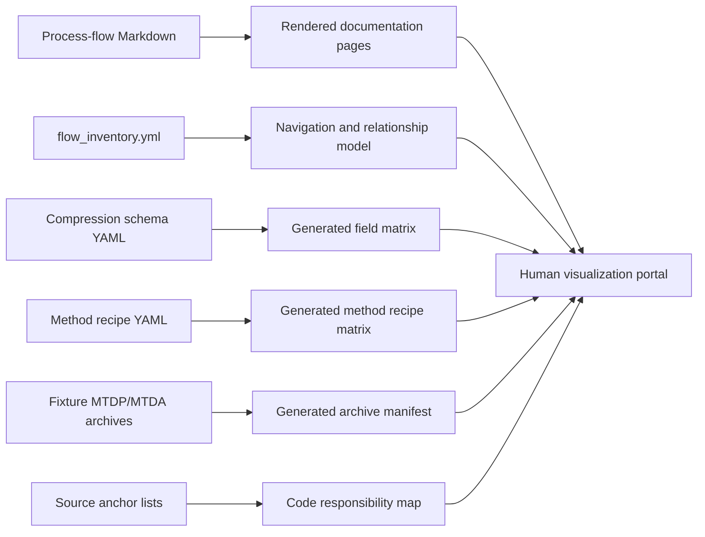
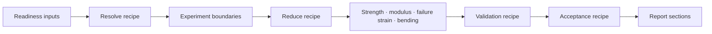
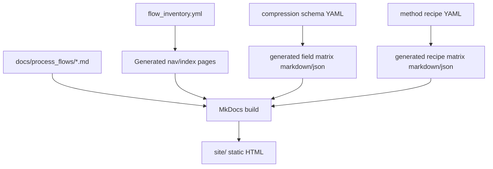

# Human Visualization Portal Blueprint

## Purpose

This document gives substance to the human visualization portal concept.

The objective is not to create a second set of human-written documents. The objective is to create a **human-facing interface over the existing documentation and source metadata**.

The result should feel like a structured documentation product, while remaining generated from the same canonical sources already present in the repository.

## Core product idea

The portal is a **documentation viewer and navigation surface** for the compression module.

It answers five human questions:

1. **What is this software doing?**
2. **Where am I in the MTDP/MTDA process?**
3. **Which code, schema, method recipe, archive member, or UI state is responsible for this step?**
4. **What can block or alter the route?**
5. **Where should I go next if I need to change, test, or debug this part?**

The existing Markdown files already contain the process truth. The portal makes that truth easier to navigate, inspect, and connect.

---

## Non-duplication principle

The portal must obey this rule:

> **Do not rewrite documentation. Render, index, link, filter, and visualize it.**

The portal should never maintain a separate human explanation of the same flow.

Instead, it should transform canonical inputs into views:



The portal may add navigation labels, filters, cards, and diagrams. It must not add duplicate process logic.

---

## What the user should experience

The user should not land on a flat folder of Markdown files.

The user should land on a structured interface that says:

> “This is the compression module. Start with the system map, then choose the route you care about: Dataset/MTDP, Analysis/MTDA, ISO 14126 method, Report/Audit/Archive, or UI journey.”

## Landing page concept

The landing page should have five large cards:

| Card | Purpose | Links to canonical docs |
|---|---|---|
| **System Map** | Understand the whole software in one page. | `01_system_overview.md`, `33_drilldown_coverage_status.md` |
| **Dataset / MTDP** | Follow raw files into an `.mtdp` package. | `10`–`16` |
| **Analysis / MTDA** | Follow an `.mtdp` through method execution into `.mtda`. | `20`–`27`, `30`–`31` |
| **ISO 14126 Method** | Understand the concrete scientific method route. | `28`, `29`, `23`, `24` |
| **Human Operator Journey** | Understand what the user sees and does. | `32_ui_journey_maps.md` |

Below the cards, a compact status strip should show:

- documented process areas;
- residual classes;
- last documentation inventory status;
- links to source anchors and generated dashboards.

---

## Portal information architecture

The portal should be organised by **reader intent**, not by file number.

```mermaid
flowchart TB
    Home["Portal Home"] --> System["System Map"]
    Home --> MTDP["Dataset / MTDP"]
    Home --> MTDA["Analysis / MTDA"]
    Home --> ISO["ISO 14126 Method"]
    Home --> Reports["Reports / Audit / Archive"]
    Home --> UI["UI Journeys"]
    Home --> Risk["Risks / Residuals"]
    Home --> Generated["Generated Dashboards"]

    MTDP --> Parser["Parser and numeric risks"]
    MTDP --> Schema["Schema and field lifecycle"]
    MTDP --> Sidecar["YAML sidecars"]
    MTDP --> Bundle["Bundle editing and reprocessing"]

    MTDA --> Mapping["Mapping and readiness"]
    MTDA --> Execution["Method execution"]
    MTDA --> Validation["Validation"]
    MTDA --> Acceptance["Acceptance and final selection"]

    ISO --> Recipe["ISO recipe path"]
    ISO --> Operations["Operation internals"]

    Reports --> ReportBuild["Report building"]
    Reports --> Completion["Report completion"]
    Reports --> Audit["Procedure evidence and audit blocks"]
    Reports --> Archive["Archive member contracts"]
    Reports --> Finalization["MTDA finalization"]
```



This is only navigation. Each page still renders or links to the canonical Markdown.

---

## Page types

The portal should have a small number of repeatable page types.

### 1. Rendered canonical document page

This is the default page type.

It renders an existing Markdown file with:

- table of contents;
- Mermaid diagrams rendered;
- source-anchor callout extracted from the document;
- previous/next navigation;
- links to related flows from `flow_inventory.yml`.

No duplicate prose is written.

### 2. Area overview page

An area overview is a generated navigation page for a workflow family such as MTDP or MTDA.

It contains:

- one generated card per canonical document;
- flow status from `flow_inventory.yml`;
- source-anchor list;
- residual items;
- links to generated dashboards relevant to that area.

The card text should be short and derived from inventory metadata, not manually rewritten.

### 3. Generated dashboard page

Generated dashboard pages are built from structured sources.

Examples:

| Dashboard | Source | View |
|---|---|---|
| Field lifecycle matrix | compression schema YAML | searchable table by field id, storage, report role, method role, UI group |
| ISO recipe matrix | ISO method recipe YAML | step sequence, operation, inputs, outputs, evidence role, report role |
| Archive member manifest | fixture `.mtdp` / `.mtda` | member path, producer, consumer, stage, required/optional status |
| Operation registry map | operation registry / operation docs | operation id, class, evidence contract, audit/report role |
| Readiness gate matrix | method inputs YAML | requirement, severity, scope, expected unit, required_for |

These dashboards are not new content; they are generated views of existing structured content.

### 4. Relationship graph page

This page visualizes links between process areas.

It can use `flow_inventory.yml` and source-anchor metadata to show:

- process flow nodes;
- code anchors;
- archive artifacts;
- method recipes;
- generated outputs;
- UI journey states.

The graph node should link back to canonical Markdown, not contain its own duplicate explanation.

---

## Visual grammar

The portal should use consistent visual language.

| Visual element | Meaning |
|---|---|
| Blue cards | MTDP aggregation / source package preparation. |
| Purple cards | MTDA analysis / method run. |
| Green cards | Formal report outputs. |
| Amber cards | Gates, warnings, review, missing fields. |
| Red cards | Blocking conditions or rerun-required changes. |
| Grey cards | Generated artifacts, optional evidence, or reference material. |

## Standard card structure

Each major process card should use the same structure:

```text
Title
One-line purpose

Inputs: ...
Outputs: ...
Code: ...
Docs: ...
Can block on: ...
```

This makes the portal scannable and predictable.

---

## Example page: MTDP area overview

The MTDP page should not rewrite all MTDP documentation.

It should show:

```text
Dataset / MTDP
Raw source files become a validated Mechanical Test Data Package.

[Parser Contract]
Inputs: raw files
Outputs: ParsedSampleRecord
Can block on: numeric parsing, delimiter/header layout, bad cells
Open doc: 11_parser_contract_and_numeric_risks.md

[Schema Field Lifecycle]
Inputs: schema YAML, parsed tokens, sidecar values
Outputs: dataset.json, provenance.json, normalized tokens
Can block on: required field validation, unit conversion, conditional fields
Open doc: 12_mtdp_schema_field_lifecycle.md

[YAML Sidecar Reconciliation]
Inputs: same-stem YAML
Outputs: imported fields, conflicts, mapping profile metadata
Can block on: missing unit, unknown key mapping, sidecar conflict
Open doc: 13_yaml_sidecar_reconciliation_flow.md
```

Every card points to canonical documents and generated tables. The overview itself remains a navigation layer.

---

## Example page: ISO method view

The ISO method page should provide a visual method route:



Below the diagram, the page should show a generated recipe table from YAML:

| Step | Operation | Inputs | Outputs | Evidence block | Report role |
|---|---|---|---|---|---|
| `resolve.map_load` | `map_channel` | `load` mapping | `load_N`, `load_N_raw` | mapped channel series | hidden/supporting |
| `resolve.derive_area` | `derive_area` | `width_mm`, `thickness_mm` | `area_mm2` | run identity/status | specimen geometry |
| `reduce.chord_modulus` | `chord_slope` | `mean_strain_bounded`, `stress_MPa` | `compressive_modulus_MPa` | stress-strain reduction | compressive modulus |

This table should be generated from the method YAML, not typed by hand.

---

## Example page: field lifecycle explorer

The field lifecycle explorer should let the user search a field such as `failure_location` and see:

```text
Field: failure_location
Scope: run
UI group: User Validity / Failure Observation
Storage: token_preamble → Failure location
Report role: failure_location
Report importance: required_for_accepted_runs
Method recipe step: resolve.map_failure_location
Report section: failure_analysis
Relevant docs:
- 15_schema_method_report_field_matrix.md
- 26_report_building_flow.md
- 30_report_completion_flow.md
```

This is a generated view from schema YAML + recipe YAML + inventory metadata.

---

## Example page: archive explorer

The archive explorer should let the user filter archive members:

```text
Filter: acceptance

acceptance/acceptance_report.json
Producer: AcceptanceEngine / MTDAWriter
Consumer: audit report, finalization service, report review
Stage: acceptance
Required: yes
Docs: 24_acceptance_selection_flow.md, 31_archive_member_contracts.md

acceptance/final_report_runs.csv
Producer: SelectionEditor / MTDAWriter / finalization service
Consumer: Report aggregate statistics, audit block index, final report
Stage: final selection
Required: yes after execution/finalization
Docs: 24_acceptance_selection_flow.md, 27_mtda_finalization_flow.md
```

The member list should be generated from archive contracts and fixture archives.

---

## Build architecture

The first implementation can be simple.



## Minimal first implementation

The first working version should include only:

1. `mkdocs.yml`.
2. Existing `docs/process_flows/*.md` rendered as pages.
3. Search.
4. Mermaid rendering.
5. A generated or manually minimal home page that links to the canonical docs but does not duplicate them.

This is enough to validate whether the human layer feels useful.

## Second implementation step

Add generated dashboards:

1. Field matrix from schema YAML.
2. Method recipe matrix from ISO method YAML.
3. Archive member manifest from fixture `.mtdp` and `.mtda` files.
4. Operation registry/evidence contract table.

## Third implementation step

Add custom interactive views only if static pages and generated tables are insufficient.

---

## Organic result criteria

The portal is successful if a human can:

1. Start from the home page and understand MTDP vs MTDA in less than a minute.
2. Click into a workflow area and see the relevant process docs in order.
3. Search for a field, operation, archive member, or UI state and find all relevant docs.
4. Move from a visual process node to the canonical Markdown and then to source anchors.
5. Understand what blocks a process stage without reading every file.
6. Review archive/report/method structure without opening raw YAML or code first.
7. Trust that the portal is a view over the canonical documentation, not a parallel source.

## Anti-goals

The portal should not:

- become a second documentation hierarchy;
- require manual updates whenever a canonical Markdown doc changes;
- hide source anchors;
- prioritise visual polish over traceability;
- generate static screenshots of diagrams that cannot be searched or linked;
- replace the detailed process-flow documents.

## Final vision

The final result should feel like a **map room** for the software.

The Markdown files are the detailed engineering documents. The portal is the wall map, index, search desk, and set of transparent overlays that let a human choose the level of detail they need.

It should make the documentation easier to enter, not split it into two competing documentation worlds.
