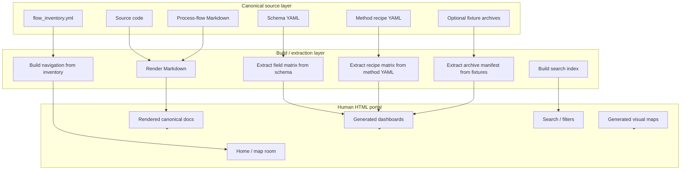

# Human Visualization Portal — Adversarial Concept Declaration

## Purpose

This document declares the concept for the human-facing visualization layer and stress-tests it with adversarial reasoning.

The objective is to clarify exactly what will be built, what will not be built, what must be generated, what may be hand-authored, and where the concept is still at risk of drifting into duplication or noise.

This document is part of the documentation architecture. It is not an implementation spec yet, but it defines the conceptual contract that future implementation specs must obey.

---

## Core declaration

The human visualization portal is a **generated HTML interface over the existing canonical documentation and structured repository metadata**.

It is not a second documentation system.

The source of truth remains:

1. repository source code;
2. method/schema YAML files;
3. canonical Markdown process-flow files under `docs/process_flows/`;
4. `flow_inventory.yml`;
5. generated tables/manifests produced reproducibly from code, schema, method YAML, or archive fixtures.

The portal exists to make the same knowledge easier for humans to enter, browse, search, filter, and understand.

---

## Final conceptual shape



---

## Blue-team position

The blue-team argument for the portal is:

1. The process-flow documentation is technically rich but cognitively heavy.
2. Humans need an entry layer that starts from intent, not file names.
3. HTML is the right rendered interface because it supports search, diagrams, tables, cards, filters, and offline/static hosting.
4. The portal can be implemented without duplication if it renders existing Markdown and generates tables from structured sources.
5. A portal improves maintainability because it gives reviewers a single place to inspect whether the process map, schema, recipes, archive contracts, and UI journeys connect coherently.
6. The portal can become a quality gate: broken links, stale generated tables, and missing docs become visible problems.

## Red-team position

The red-team objections are:

1. A human portal can easily become a second documentation corpus.
2. Landing pages and cards can silently rewrite concepts and diverge from the Markdown.
3. Generated dashboards can become stale if generation is not enforced.
4. MkDocs or custom HTML may introduce build dependencies and maintenance overhead.
5. A visually pleasant portal may hide source anchors and reduce auditability.
6. Over-investing in the portal may distract from code correctness and test coverage.
7. If the generated tables are committed without provenance, they become another source of drift.
8. If the portal is too abstract, it becomes decorative. If too detailed, it recreates the Markdown.

## Resolution

The red-team objections are valid. The portal is approved only under strict constraints:

1. **No duplicate prose**: process explanations must remain in canonical Markdown files.
2. **No manually copied tables**: field/method/archive tables must be generated from structured sources.
3. **No hidden source**: every generated dashboard must state its source file(s) and generation command.
4. **No portal-only truth**: if a statement changes process meaning, it belongs in the canonical Markdown, not only in the portal.
5. **No custom HTML first**: start with static rendering of canonical Markdown. Add custom views only where generated tables/graphs are insufficient.
6. **No unchecked generation**: generated outputs should be reproducible and eventually validated by tests or CI.

---

## Refined concept boundaries

## What the portal is

The portal is:

- a rendered version of existing Markdown documentation;
- a navigation model over the process-flow library;
- a search and filtering interface;
- a generated dashboard layer for field, method, archive, readiness, and operation tables;
- a visual map linking process stages to canonical docs, source anchors, and produced artifacts.

## What the portal is not

The portal is not:

- a parallel human documentation set;
- a manually rewritten version of the process-flow Markdown;
- a replacement for tests;
- a replacement for code comments or source anchors;
- a product UI for end users of the compression analysis software;
- a place where undocumented implementation behaviour is invented or normalized.

---

## Actual implementation concept

## Layer 1 — Static render of canonical Markdown

Use a Markdown-native static site generator, preferably MkDocs Material, to render the existing files directly.

This layer does not add new content. It improves the interface:

- left navigation;
- table of contents;
- search;
- Mermaid diagram rendering;
- improved table readability;
- previous/next links;
- anchors for headings.

## Layer 2 — Inventory-driven navigation

Use `flow_inventory.yml` to generate or validate the portal navigation.

The navigation should group canonical files by workflow area:

- Overview and governance;
- MTDP aggregation;
- Mapping and readiness;
- MTDA execution;
- Validation, acceptance, and audit;
- Reporting, archive, and finalization;
- UI journeys;
- Coverage and residuals.

If the navigation is hand-written in `mkdocs.yml`, it must mirror `flow_inventory.yml`, and a future validation script should check that every documented file appears in navigation.

## Layer 3 — Generated dashboard data

Generate dashboard tables from structured sources:

| Dashboard | Source | Output | Status |
|---|---|---|---|
| Field matrix | compression schema YAML | generated Markdown/JSON table | later phase |
| Method recipe matrix | ISO method YAML files | generated Markdown/JSON table | later phase |
| Readiness matrix | `method_inputs.yaml` | generated Markdown/JSON table | later phase |
| Archive member manifest | fixture `.mtdp` / `.mtda` archives | generated Markdown/CSV/JSON table | later phase |
| Operation registry/evidence matrix | operation registry + evidence contracts | generated Markdown/JSON table | later phase |

## Layer 4 — Optional interactive views

Only after Layers 1–3 are working, add custom HTML/JS views if they solve real navigation problems.

Candidate interactive views:

- searchable field lifecycle explorer;
- archive member explorer;
- operation evidence explorer;
- clickable process map;
- UI journey map.

Interactive views must consume generated JSON or inventory data. They must not contain manually duplicated explanations.

---

## Red-team / blue-team issue register

| Issue | Red-team challenge | Blue-team answer | Required refinement |
|---|---|---|---|
| Duplication | Landing pages can become rewritten docs. | Landing pages must be navigational, not explanatory. | Limit landing page prose to orientation and links. |
| Drift | Generated dashboards can go stale. | Generation scripts can be rerun and later checked by CI. | Every generated file must declare source and command. |
| Build complexity | MkDocs adds dependency overhead. | MkDocs is lower-risk than custom HTML and keeps Markdown canonical. | Keep initial config minimal. |
| Visual overreach | Fancy cards can hide traceability. | Cards must include links to source docs and source anchors. | Standard card structure must include docs/code/output/blockers. |
| Portal-only truth | A portal page might state something absent from canonical docs. | Any process claim must live in a canonical process-flow doc. | Portal pages should reference canonical doc ids instead of restating. |
| Dashboard trust | Generated tables might not match code. | Generated from schema/YAML/archive fixtures. | Add generator tests later. |
| Human usability | Raw rendered Markdown may still feel heavy. | Area pages, search, and generated tables improve entry. | Add minimal map-room home page generated from inventory. |
| Scope creep | Portal becomes a product UI project. | Portal is documentation infrastructure only. | Defer custom interactive HTML until static render proves insufficient. |
| Local/generated outputs | Generated `site/` may pollute repo. | Treat `site/` as disposable output. | Do not commit `site/` unless intentionally publishing static docs. |
| Security/private data | Archive fixtures may contain sensitive data. | Dashboards should use sanitized fixture archives only. | Define fixture selection policy before archive manifest generation. |

---

## Key conceptual refinements required before implementation

Before implementation, the following decisions must be explicit.

## Decision 1 — Is `site/` committed?

Recommended answer: **No**, not initially.

- Keep `site/` as build output.
- Add it to `.gitignore` unless GitHub Pages requires a committed static folder.
- If publishing is needed, use CI artifact or GitHub Pages deployment branch later.

## Decision 2 — Is `mkdocs.yml` hand-written or generated?

Recommended answer: **hand-written first, validated later**.

- Hand-write minimal nav for speed.
- Later add a check that every `docs/process_flows/*.md` file is listed or intentionally excluded.

## Decision 3 — Are dashboard Markdown files committed?

Recommended answer: **only if generated reproducibly and marked as generated**.

Generated files must include a header such as:

```text
<!-- GENERATED FILE. Do not edit manually.
Source: src/mtdp_enrichment/schema_library/mechanical/compression/0.3.0.yaml
Command: python scripts/docs/build_field_matrix.py
-->
```

## Decision 4 — Is the home page manually written?

Recommended answer: **minimal hand-authored shell allowed**.

The home page can contain orientation prose, but it must not rewrite process details. Its main body should be generated cards or links derived from `flow_inventory.yml`.

## Decision 5 — Are custom interactive pages allowed now?

Recommended answer: **No, not in phase 1**.

Phase 1 should prove that the existing docs render well and that navigation/search help. Interactive pages should wait until specific usability gaps are observed.

## Decision 6 — What is the first quality gate?

Recommended answer:

- Static site builds without errors.
- Mermaid diagrams render.
- Search works.
- Every canonical process-flow file is reachable from nav.
- No manually duplicated content is introduced.

---

## Proposed implementation stages

## Stage 0 — Declaration and guardrails

Deliverables:

- this adversarial concept declaration;
- update strategy/blueprint docs if needed;
- define no-duplication and generated-file rules.

Exit criteria:

- clear agreement that the portal is a visualization layer, not a second documentation corpus.

## Stage 1 — Minimal static portal

Deliverables:

- `mkdocs.yml`;
- optional minimal `docs/index.md` or `docs/process_flows/portal_home.md` that only links to canonical docs;
- Mermaid rendering configuration;
- local build instructions.

Exit criteria:

- existing process-flow docs render into a searchable HTML site;
- no duplicate process content introduced.

## Stage 2 — Navigation hardening

Deliverables:

- grouped navigation by workflow area;
- inventory-to-navigation check script;
- broken-link check if feasible.

Exit criteria:

- all canonical process-flow docs are reachable;
- navigation reflects `flow_inventory.yml`.

## Stage 3 — Generated dashboards

Deliverables:

- field matrix generator;
- method recipe matrix generator;
- readiness matrix generator;
- operation/evidence matrix generator;
- archive member manifest generator from sanitized fixtures.

Exit criteria:

- generated outputs declare their source and command;
- no manually copied schema/method/archive tables.

## Stage 4 — Optional interactive overlays

Deliverables only if justified:

- field lifecycle explorer;
- archive explorer;
- operation evidence explorer;
- clickable process map.

Exit criteria:

- interactive views consume generated data;
- no process truth exists only in JavaScript/HTML.

---

## Acceptance criteria for the concept

The concept is acceptable if all are true:

1. There is one canonical documentation source layer.
2. The portal can be deleted and rebuilt without losing process knowledge.
3. The portal improves human navigation without changing process meaning.
4. Every process claim in the portal points back to canonical Markdown, code, schema, method YAML, or generated fixture data.
5. Generated dashboards are reproducible.
6. The first implementation is small enough to avoid turning documentation into a separate product build.
7. Future custom HTML is treated as optional visualization, not a new authoring surface.

---

## Rejected alternatives

| Alternative | Reason rejected |
|---|---|
| Hand-written custom HTML portal first | Too easy to create duplicate human documentation and drift. |
| Separate `human_docs/` folder with rewritten pages | Directly violates no-duplication rule. |
| Screenshots/PDF of diagrams as primary interface | Not searchable, not linkable, poor source traceability. |
| Obsidian-style private vault as canonical interface | Useful personally, but not repository-native or reproducible. |
| Fully interactive React/Docusaurus app first | Too much product surface before static rendering proves needs. |

---

## Blue-team implementation narrative

The portal starts as a simple MkDocs site that renders the existing Markdown files. This immediately improves readability, search, and navigation without changing the documentation model.

Once the site works, generated dashboards are added for things that should not be hand-maintained: schema field matrices, method recipe matrices, readiness requirements, operation registries, and archive member manifests.

Only after those views exist should custom HTML/JS be considered, and only for genuine interaction needs.

## Red-team enforcement narrative

Every proposed portal addition must pass three questions:

1. Is this rendering/linking/filtering existing truth, or rewriting it?
2. Can this be regenerated from canonical sources?
3. If this page vanished, would any process knowledge be lost?

If the answer reveals duplication or portal-only truth, the addition is rejected or moved back into canonical Markdown/source YAML first.

---

## Final declaration

The human visualization portal will be a **generated, no-duplication, source-traceable HTML interface** over the existing process-flow documentation.

Its purpose is to make the documentation easier for humans to enter and navigate, while preserving the Markdown/YAML/codebase as the only source of truth.

The next implementation step is not custom HTML and not a new human-docs folder. The next implementation step is a minimal static documentation build that renders the current canonical process-flow docs and proves the navigation model.
