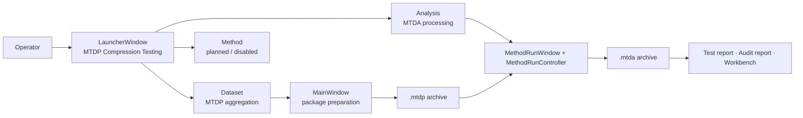

# Process Flow Documentation

This section is the living process map for the compression module. Its purpose is to make the current software behaviour explicit enough that future development directives can target the correct gear in the system rather than describing changes only at a conceptual level.

The documentation is organised around the two principal archive/process chunks:

- **Aggregation [MTDP]**: raw/source data are parsed, grouped, enriched, validated, and exported as a Mechanical Test Data Package.
- **Analysis [MTDA]**: an MTDP package is processed through method selection, mapping, readiness, execution, acceptance review, reporting, and MTDA archive generation.

The diagrams should be treated as code-adjacent documentation. They are not decorative diagrams. They are intended to be maintained whenever the implementation changes.

## Documentation map

| File | Purpose |
|---|---|
| `00_visualisation_strategy.md` | Defines when Mermaid is sufficient and when alternative diagram modes should be added. |
| `01_system_overview.md` | Provides repository-level and artifact-lifecycle maps across Dataset, Method, and Analysis workflows. |
| `10_mtdp_aggregation_flows.md` | Documents the MTDP aggregation/package-building flows from intake to export. |
| `11_parser_contract_and_numeric_risks.md` | Drills into parser passes, parsed-record contract, numeric ingestion behaviour, and remaining numeric-risk branches. |
| `12_mtdp_schema_field_lifecycle.md` | Documents schema fields from declaration to UI/editing, validation, storage, readiness/report reuse, and archive placement. |
| `13_yaml_sidecar_reconciliation_flow.md` | Documents same-stem YAML import, mapping-profile application, conflicts, unknown keys, image references, and export preservation. |
| `14_bundle_editing_and_reprocessing_flow.md` | Documents bundle editing, unassigned/restored runs, manual corrections, existing `.mtdp` reprocessing, and group export. |
| `15_schema_method_report_field_matrix.md` | Maps schema fields to MTDP storage, method-critical inputs, report roles, ISO choices, and failure-analysis fields. |
| `16_mapping_readiness_schema_contracts.md` | Documents mapping profile, method input declaration, resolved input, and readiness report object contracts. |
| `20_mtda_analysis_flows.md` | Documents the MTDA analysis flows from wizard setup to archive/report outputs. |
| `21_mapping_to_readiness_resolution.md` | Drills into mapping candidate discovery, mapping resolution, readiness evaluation, and wizard gating. |
| `22_method_package_and_operation_execution.md` | Drills into method package loading, resolve/reduce recipe execution, operation registry dispatch, operation logs, and evidence contracts. |
| `23_validation_policy_flow.md` | Documents reference-value validation, tolerance policy, validation rows, and validation archive outputs. |
| `24_acceptance_selection_flow.md` | Documents acceptance flags, run states, selection sets, discharge/final-selection behaviour, and human override outputs. |
| `25_procedure_evidence_and_audit_blocks.md` | Documents the operation-log to procedure-index to audit-block transformation and audit packet structure. |
| `26_report_building_flow.md` | Documents formal test-report construction, report context tables, ISO 14126 additions, failure analysis, and report artifacts. |
| `27_mtda_finalization_flow.md` | Documents finalization/amendment policy, report-only overrides, human decisions, archive refresh, provenance, and checksum updates. |
| `28_iso14126_method_recipe_flow.md` | Documents the concrete ISO 14126 method package inputs, resolve/reduce recipes, validation checks, and acceptance policy. |
| `29_operation_internals_flow.md` | Documents critical operation internals for mapping, area, strain, boundaries, stress, peak, modulus, failure strain, and bending. |
| `30_report_completion_flow.md` | Documents report field catalog, value precedence, missing-field detection, and report override interaction. |
| `31_archive_member_contracts.md` | Documents MTDP and MTDA archive member contracts, producer/consumer ownership, and archive boundary risks. |
| `32_ui_journey_maps.md` | Documents operator-facing Dataset and Analysis wizard journeys, including setup/running/review/finalization states. |
| `33_drilldown_coverage_status.md` | Records current drill-down coverage and distinguishes remaining implementation/test residuals from process-flow gaps. |
| `34_human_visualization_portal_strategy.md` | Defines the no-duplication rule: HTML is a generated visualization layer over canonical Markdown/YAML/code, not a second documentation corpus. |
| `35_human_visualization_portal_blueprint.md` | Substantiates the portal as a map-room interface with information architecture, page types, visual grammar, generated dashboards, and staged implementation. |
| `36_human_portal_adversarial_concept_declaration.md` | Red/blue-team concept declaration locking down boundaries, risks, decisions, implementation stages, and acceptance criteria for the human portal. |
| `99_flow_documentation_protocol.md` | Defines how to update, extend, and audit this process documentation over time. |
| `flow_inventory.yml` | Machine-readable index of documented flows, source anchors, and current coverage status. |

## Granularity ladder

The diagrams should grow through layered drill-downs rather than one oversized map.

| Level | Name | Use |
|---|---|---|
| L0 | System overview | Shows the broad application chunks and archive handoff. |
| L1 | Chunk overview | Shows the main MTDP or MTDA process at a high level. |
| L2 | Scoped flow | Shows one operational lane such as intake, grouping, readiness, or writing. |
| L3 | Decision drill-down | Shows branching, gate conditions, error paths, and operator choices. |
| L4 | Data/artifact contract | Shows input/output structures, archive members, and validation responsibilities. |
| L5 | Code-anchor map | Connects flow steps directly to files, classes, methods, and tests. |

## Maintenance rule

A process diagram is considered maintainable only if it includes:

1. A clear flow name and scope.
2. The source anchors used to derive the flow.
3. A Mermaid diagram or a justified alternative representation.
4. The main outputs/artifacts produced by the flow.
5. Known coverage limits or follow-up drill-downs.

## Current top-level process

## Expansion policy

When a new process is discussed, add it here as a new scoped flow instead of overwriting the existing overview. Existing diagrams should be refined only when the implementation has changed or when the current diagram is found to hide an important branch.

Prefer precise, code-anchored diagrams over broad conceptual summaries. The objective is to preserve how the software currently works, identify mismatches against the intended vision, and expose missing process branches before they become implementation debt.

## Human visualization portal policy

The human portal concept is documented in files `34`–`36`. The accepted direction is **one canonical documentation source with generated HTML views**, not parallel human and machine documentation.

The next implementation step for that concept is a minimal static documentation build that renders the existing process-flow Markdown with navigation, search, and Mermaid support. Custom interactive HTML is deferred until the static render and generated dashboard needs are proven.

## Local artifact tree note

The local repository tree contains many generated artifact, screenshot, workbench, extracted-MTDA, and stage-cycle folders. Those folders are useful as evidence/examples of produced outputs and UI states, but the process-flow documentation should continue to treat `src/`, `tests/`, `docs/`, schema/method packages, and formal archive writers as the source-of-truth structure for software behaviour.
