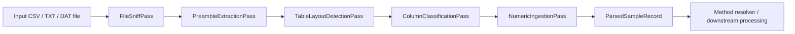

# `ParsedSampleRecord` data structure

**Module:** `src/parsing/models/parsed_sample_record.py`  
**Class:** `ParsedSampleRecord`  
**Kind:** `@dataclass(slots=True)`  
**Role:** complete parser-output contract for one mechanical test sample file.

> Note: the uploaded module defines `ParsedSampleRecord`, not `ParseSampleRecord`. This document uses the implemented class name.

---

## 1. Purpose

`ParsedSampleRecord` is the top-level object returned by the concrete parser. It aggregates all information recovered during parsing while preserving enough provenance for later audit, method binding, and downstream processing.

It is deliberately **parser-resolved**, not **method-reduced**:

- it preserves the original source file path;
- it preserves file-sniffing results;
- it preserves preamble metadata tokens;
- it preserves detected table layout;
- it preserves all detected numerical channels;
- it preserves raw header and raw units rows;
- it stores only a **validity hint**, not a final accept/reject decision.

This makes the object a suitable boundary between the generic parsing layer and later method-specific interpretation, for example ISO 14126-style channel binding or acceptance logic.

---

## 2. Pipeline position



The concrete `DelimitedMechanicalCsvParser.parse()` method builds the record from these passes:

1. `FileSniffPass` detects delimiter, encoding, likely header position, line count, and preamble presence.
2. `PreambleExtractionPass` converts pre-table metadata into `PreambleToken` records.
3. `TableLayoutDetectionPass` identifies header, units, and data-start rows.
4. `ColumnClassificationPass` classifies raw columns into channel descriptors.
5. `NumericIngestionPass` reads numeric data into channel records.
6. The parser wraps the complete result in `ParsedSampleRecord`.

---

## 3. Dataclass definition

```python
@dataclass(slots=True)
class ParsedSampleRecord:
    source_file: Path
    sample_id: Optional[str]
    file_sniff: FileSniffResult
    preamble_tokens: list[PreambleToken]
    table_layout: TableLayoutRecord
    channels: ChannelBundle
    raw_header: tuple[str, ...]
    raw_units_row: Optional[tuple[str, ...]]
    parse_warnings: tuple[str, ...] = ()
    validity_hint: Optional[bool] = None
    validity_hint_source: Optional[str] = None
```

---

## 4. Field contract

| Field | Type | Required | Default | Meaning |
|---|---:|---:|---:|---|
| `source_file` | `Path` | Yes | — | Provenance path for the parsed source file. |
| `sample_id` | `Optional[str]` | Yes | — | Parser-level sample/specimen identifier when recoverable from preamble metadata. May be `None`. |
| `file_sniff` | `FileSniffResult` | Yes | — | File-level sniffing result: delimiter, encoding, line count, likely header row, etc. |
| `preamble_tokens` | `list[PreambleToken]` | Yes | — | Structured metadata tokens extracted before the data table. |
| `table_layout` | `TableLayoutRecord` | Yes | — | Detected table structure: header row, units row, data-start row, and column count. |
| `channels` | `ChannelBundle` | Yes | — | Grouped numerical channels, preserving all detected channel families. |
| `raw_header` | `tuple[str, ...]` | Yes | — | Original parsed header row, preserved without downstream reinterpretation. |
| `raw_units_row` | `Optional[tuple[str, ...]]` | Yes | — | Original units row if detected; otherwise `None`. |
| `parse_warnings` | `tuple[str, ...]` | No | `()` | Parser warnings that should remain attached to the sample record. |
| `validity_hint` | `Optional[bool]` | No | `None` | Optional preamble-derived validity signal. It is not final acceptance logic. |
| `validity_hint_source` | `Optional[str]` | No | `None` | Raw preamble key that supplied the validity hint, when present. |

---

## 5. Nested data structures

### 5.1 `FileSniffResult`

`file_sniff` records file-level detection results.

| Field | Type | Meaning |
|---|---:|---|
| `file_path` | `Path` | Path inspected by the sniffing pass. |
| `delimiter` | `str` | Detected delimiter, for example `,`. |
| `encoding` | `str` | Detected or selected text encoding. |
| `has_preamble` | `bool` | Whether metadata/preamble lines appear before the table. |
| `likely_header_row_index` | `Optional[int]` | Zero-based likely header row. |
| `total_lines` | `int` | Number of lines in the file. |
| `quotechar` | `str` | CSV quote character; defaults to `"`. |
| `notes` | `tuple[str, ...]` | Additional sniffing notes. |

### 5.2 `PreambleToken`

`preamble_tokens` stores metadata extracted before the numeric table.

| Field | Type | Meaning |
|---|---:|---|
| `source_line_index` | `int` | Zero-based source line where the token was found. |
| `raw_key` | `str` | Original metadata key text. |
| `raw_value` | `str` | Original metadata value text. |
| `raw_unit` | `Optional[str]` | Unit parsed from the metadata field, when present. |
| `normalized_key` | `Optional[str]` | Normalized semantic key, for example `specimen_name`, `width`, `thickness`, `failure_mode`. |
| `coerced_value_text` | `Optional[str]` | Normalized/coerced value text when available. |
| `parse_warning` | `Optional[str]` | Token-level parse warning. |

### 5.3 `TableLayoutRecord`

`table_layout` records where the data table starts and how it is structured.

| Field | Type | Meaning |
|---|---:|---|
| `header_row_index` | `int` | Zero-based row index containing column names. |
| `units_row_index` | `Optional[int]` | Zero-based row index containing units, or `None`. |
| `data_start_row_index` | `int` | Zero-based first row of numeric data. |
| `detected_column_count` | `int` | Number of detected columns. |
| `notes` | `tuple[str, ...]` | Layout-detection notes. |

### 5.4 `ChannelBundle`

`channels` groups all numerical data columns by channel family.

| Field | Type | Meaning |
|---|---:|---|
| `load_channels` | `list[ChannelRecord]` | Load channels. |
| `extension_channels` | `list[ChannelRecord]` | Extension channels. |
| `strain_channels` | `list[ChannelRecord]` | Strain channels. Multiple strain channels are preserved. |
| `time_channels` | `list[ChannelRecord]` | Time channels. |
| `stress_channels` | `list[ChannelRecord]` | Stress channels. |
| `displacement_channels` | `list[ChannelRecord]` | Displacement channels. |
| `unknown_channels` | `list[ChannelRecord]` | Columns that could not be classified into a known family. |

`ChannelBundle.all_channels()` returns all channel records in grouped order:

```python
load + extension + strain + time + stress + displacement + unknown
```

### 5.5 `ChannelRecord`

Each channel record stores one numerical column plus its descriptor.

| Field | Type | Meaning |
|---|---:|---|
| `descriptor` | `ColumnDescriptor` | Column identity, family, canonical name, alias, and unit metadata. |
| `values` | `list[float | None]` | Numeric values from the source column. Missing/unparseable values remain `None`. |
| `source_column_index` | `int` | Original zero-based column index. |
| `non_null_count` | `int` | Count of numeric values. |
| `null_count` | `int` | Count of missing/unparseable values. |
| `original_unit_text` | `Optional[str]` | Original unit text for this channel. |
| `canonical_unit` | `Optional[str]` | Canonical unit assigned during parsing/classification. |
| `notes` | `tuple[str, ...]` | Channel-level notes. |

### 5.6 `ColumnDescriptor`

The descriptor gives semantic identity to a raw column.

| Field | Type | Meaning |
|---|---:|---|
| `column_index` | `int` | Original zero-based column index. |
| `original_name` | `str` | Raw column header text. |
| `original_unit_text` | `Optional[str]` | Raw unit text from the units row or header. |
| `family` | `str` | Channel family, for example `load`, `extension`, `strain`, `time`. |
| `ordinal` | `int` | Family-local ordinal, for example first strain channel = `1`, second = `2`. |
| `canonical_name` | `str` | Stable parser-generated name, for example `load_1`, `strain_2`. |
| `alias` | `Optional[str]` | Optional semantic alias, for example `front` or `rear` strain. |
| `canonical_unit` | `Optional[str]` | Canonical unit for the descriptor. |
| `source_notes` | `tuple[str, ...]` | Notes explaining classification/source assumptions. |

---

## 6. Metadata lookup helper

`ParsedSampleRecord` exposes one helper method:

```python
def get_metadata_value(self, normalized_key: str) -> Optional[str]:
    for token in self.preamble_tokens:
        if token.normalized_key == normalized_key:
            return token.coerced_value_text or token.raw_value
    return None
```

Behaviour:

- scans `preamble_tokens` in stored order;
- matches against `token.normalized_key`;
- returns `coerced_value_text` when available;
- falls back to `raw_value`;
- returns `None` if no matching token exists.

Example:

```python
record.get_metadata_value("sample_id")
record.get_metadata_value("width")
record.get_metadata_value("thickness")
```

---

## 7. Validity hint semantics

`validity_hint` is derived from preamble metadata when a token with normalized key `failure_mode` is present.

Current parser behaviour:

| Preamble value, normalized lowercase | `validity_hint` |
|---|---:|
| `valid` | `True` |
| `acceptable` | `True` |
| `accepted` | `True` |
| `pass` | `True` |
| `passed` | `True` |
| `invalid` | `False` |
| `not valid` | `False` |
| `failed` | `False` |
| `fail` | `False` |
| `rejected` | `False` |
| any other value | `None` |

`validity_hint_source` stores the raw key that supplied this information, for example `Failure mode`.

Important distinction:

> `validity_hint` is not final acceptance/rejection logic. It is a parser-level hint preserved for downstream audit and later method-specific decision-making.

---

## 8. Preservation rules

The parser-to-record contract requires the concrete parser to emit:

- all preamble tokens;
- the full channel bundle;
- raw header row;
- raw units row;
- warnings;
- validity hint when present.

The parser must not:

- average strain channels;
- discard extra strain channels;
- reinterpret channel meaning according to a specific standard;
- collapse parser output into method-level acceptance decisions.

These rules keep `ParsedSampleRecord` as a faithful parsing artefact rather than a prematurely interpreted mechanical-test result.

---

## 9. Plain-Python / JSON-compatible representation

The helper `to_standard_data_structure(record)` recursively converts the dataclass tree into plain containers:

| Input type | Output type |
|---|---|
| dataclass instance | `dict` keyed by dataclass field names |
| `Path` | `str` |
| `tuple`, `list`, `set`, `frozenset` | `list` |
| scalar values | preserved as-is |

This gives a faithful, inspection-friendly structure suitable for logging, JSON serialization, tests, or debugging in an IDE variable viewer.

Minimal shape:

```json
{
  "source_file": "example.csv",
  "sample_id": "A1",
  "file_sniff": {
    "file_path": "example.csv",
    "delimiter": ",",
    "encoding": "utf-8",
    "has_preamble": true,
    "likely_header_row_index": 5,
    "total_lines": 20,
    "quotechar": "\"",
    "notes": []
  },
  "preamble_tokens": [],
  "table_layout": {
    "header_row_index": 5,
    "units_row_index": 6,
    "data_start_row_index": 7,
    "detected_column_count": 5,
    "notes": []
  },
  "channels": {
    "load_channels": [],
    "extension_channels": [],
    "strain_channels": [],
    "time_channels": [],
    "stress_channels": [],
    "displacement_channels": [],
    "unknown_channels": []
  },
  "raw_header": ["Load", "Extension", "Front Strain", "Rear Strain", "Time"],
  "raw_units_row": ["(kN)", "(mm)", "(usn)", "(usn)", "(s)"],
  "parse_warnings": [],
  "validity_hint": true,
  "validity_hint_source": "Failure mode"
}
```

---

## 10. Inspection report view

`build_parser_inspection_report(record, head=5, tail=5)` produces a compact audit snapshot rather than the full dataclass tree.

It includes:

- `source_file`;
- `sample_id`;
- `validity_hint` and `validity_hint_source`;
- sniffing summary;
- layout summary;
- preamble-derived `header_flags`;
- raw header and units row;
- `channel_flags` with canonical names and counts;
- total row count;
- data head/tail preview;
- parse warnings.

This is useful for checking whether parsing behaved correctly without dumping every data point from every channel.

---

## 11. Example from the bundled fixture

For `tests/data/Specimen_RawData_1.csv`, the parser inspection sample shows this high-level structure:

```json
{
  "sample_id": "CAG-CF-ER-Comp-E1",
  "validity_hint": true,
  "validity_hint_source": "Failure mode",
  "raw_header": [
    "Load",
    "Extension",
    "Front Strain",
    "Rear Strain",
    "Time"
  ],
  "raw_units_row": [
    "(kN)",
    "(mm)",
    "(usn)",
    "(usn)",
    "(s)"
  ],
  "channel_families": {
    "load_channels": ["load_1"],
    "extension_channels": ["extension_1"],
    "strain_channels": ["strain_1", "strain_2"],
    "time_channels": ["time_1"]
  },
  "row_count": 7
}
```

Key observation: both `Front Strain` and `Rear Strain` remain separate strain channels. They are not averaged or discarded at parsing time.

---

## 12. Recommended mental model

Treat `ParsedSampleRecord` as the **canonical parser packet** for one sample:

```text
ParsedSampleRecord
├── source_file                  # provenance
├── sample_id                    # optional parsed identifier
├── file_sniff                   # file-level detection
├── preamble_tokens              # metadata records
├── table_layout                 # table geometry
├── channels                     # grouped numeric channel data
│   ├── load_channels
│   ├── extension_channels
│   ├── strain_channels
│   ├── time_channels
│   ├── stress_channels
│   ├── displacement_channels
│   └── unknown_channels
├── raw_header                   # preserved original header row
├── raw_units_row                # preserved original unit row, if any
├── parse_warnings               # parser warnings
├── validity_hint                # optional parser-level hint
└── validity_hint_source         # raw metadata key for the hint
```

The record is therefore the right object to inspect when debugging:

- whether the correct file was parsed;
- where the parser found the header and units rows;
- whether preamble metadata was recovered;
- whether the sample identifier was found;
- whether channel classification worked;
- whether units and canonical names were assigned as expected;
- whether missing values were retained as `None`;
- whether parser warnings or validity hints were generated.

---

## 13. Source files inspected

This document was prepared from the uploaded `compression_module.zip`, especially:

- `src/parsing/models/parsed_sample_record.py`
- `src/parsing/models/file_sniff_result.py`
- `src/parsing/models/preamble_token.py`
- `src/parsing/models/table_layout_record.py`
- `src/parsing/models/channel_bundle.py`
- `src/parsing/models/channel_record.py`
- `src/parsing/models/column_descriptor.py`
- `src/parsing/parsers/delimited_mechanical_csv_parser.py`
- `src/parsing/inspection.py`
- `docs/modules/MOD_007_PARSED_SAMPLE_RECORD.md`
- `docs/schemas/SCHEMA_007_PARSED_SAMPLE_RECORD.md`
- `docs/interfaces/IFACE_004_PARSER_TO_PARSED_SAMPLE.md`
- `tests/parsing/test_models.py`
- `tests/data/parser_inspection_report.sample.json`
